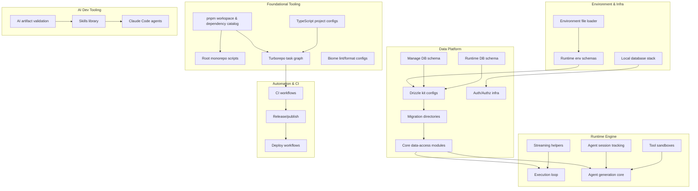

# Inkeep Internal Surface Area Inventory

## Overview
This is a consolidated inventory of internal “surface areas”: subsystems, infrastructure, tooling, and shared code that developers/operators interact with, but which are not directly customer-facing contracts. Use it during planning or PR review to understand internal dependency chains (what breaks when X changes) and to avoid accidental workflow/build/test/deploy regressions.

## Summary

| Category | Count |
|---|---|
| Build & Package Graph | 5 |
| Developer Workflow & Quality Gates | 6 |
| CI/CD Pipelines | 14 |
| Test Infrastructure | 4 |
| Environment & Configuration | 5 |
| Docker & Deployment Artifacts | 5 |
| Database Schemas & Migrations | 7 |
| Database Clients & Data Access Layer | 6 |
| Validation & Shared Runtime Types | 3 |
| Authentication & Authorization Infrastructure | 6 |
| Observability Infrastructure | 5 |
| Runtime Engine (Agent Execution & Streaming) | 14 |
| Tool Execution Sandboxes | 4 |
| AI Development Tooling | 7 |
| Package Publishing & Versioning | 3 |
| **Total** | **94** |

## Surface Catalog

### Build & Package Graph
Developer/operator goal: build, link, and resolve monorepo dependencies deterministically.

| Surface | Description | Depends On | Source Code |
|---|---|---|---|
| **pnpm workspace & dependency catalog** | Defines the workspace package set and the lockfile/patch behavior used by all installs and CI runs. | — | `pnpm-workspace.yaml`, `pnpm-lock.yaml`, `patches/` |
| **Root monorepo scripts** | Canonical `pnpm` script entry points that orchestrate Turbo tasks, linting, tests, DB tooling, and release flows. | pnpm workspace & dependency catalog | `package.json`, `scripts/` |
| **Turborepo task graph** | Cross-package task DAG (build/dev/test/lint/typecheck/db) including cache inputs/outputs and env propagation. | pnpm workspace & dependency catalog, Root monorepo scripts | `turbo.json` |
| **TypeScript project configs** | TypeScript compiler configuration boundaries and shared settings used across packages and tooling. | pnpm workspace & dependency catalog | `agents-api/tsconfig.json`, `agents-cli/tsconfig.json`, `agents-manage-ui/tsconfig.json`, `agents-docs/tsconfig.json`, `packages/agents-core/tsconfig.json`, `packages/agents-sdk/tsconfig.json` |
| **tsdown build configs** | Bundling configuration used to produce consistent package outputs (formats, externals, d.ts) in CI and local builds. | Turborepo task graph, TypeScript project configs | `tsdown.config.ts`, `agents-api/tsdown.config.ts`, `packages/agents-core/tsdown.config.ts` |

### Developer Workflow & Quality Gates
Developer/operator goal: enforce consistent style and catch regressions early during development.

| Surface | Description | Depends On | Source Code |
|---|---|---|---|
| **Biome lint/format configs** | Root Biome config (rules, formatting, ignores) extended by per-package overrides; enforced locally and in CI. | pnpm workspace & dependency catalog | `biome.jsonc`, `agents-cli/biome.json`, `agents-docs/biome.json`, `agents-manage-ui/biome.json`, `agents-ui/biome.json`, `packages/agents-core/biome.json`, `packages/agents-sdk/biome.json`, `packages/create-agents/biome.json` |
| **Husky git hooks** | Pre-commit and pre-push hooks that run staged checks and broader validation prior to pushing. | Root monorepo scripts, lint-staged checks | `.husky/pre-commit`, `.husky/pre-push` |
| **lint-staged checks** | Staged-file pipeline that runs Biome fixes, targeted tests, and AI artifact validation for fast feedback. | Biome lint/format configs, AI artifact validation script, Package-level Vitest configs & setup | `package.json` (lint-staged), `scripts/validate-ai-artifacts.ts` |
| **License sync automation** | Keeps `LICENSE` and supplemental terms consistent across packages and fails CI when drift is detected. | Root monorepo scripts, Turborepo task graph | `scripts/sync-licenses.mjs`, `turbo.json` |
| **Knip dependency/exports analysis** | Static analysis to detect unused dependencies/exports/files as part of the main check suite. | pnpm workspace & dependency catalog, TypeScript project configs, Root monorepo scripts | `agents-api/knip.config.ts`, `agents-manage-ui/knip.config.ts`, `agents-docs/knip.config.ts`, `agents-cookbook/knip.config.ts`, `packages/agents-sdk/knip.config.ts` |
| **Contributor guide (`CONTRIBUTING.md`)** | Human contributor guide that defers canonical code/AI rules to `AGENTS.md` and links to docs. | Repo agent instructions (`AGENTS.md`) | `CONTRIBUTING.md` |

### CI/CD Pipelines
Developer/operator goal: automate checks, publishing, and deployment reliably.

| Surface | Description | Depends On | Source Code |
|---|---|---|---|
| **GitHub Actions CI workflow** | Primary CI pipeline running build/lint/typecheck/tests, format checks, env schema validation, and Knip. | Turborepo task graph, Env schema documentation enforcement, Knip dependency/exports analysis, Vitest workspace configs, Package-level Vitest configs & setup | `.github/workflows/ci.yml`, `.github/composite-actions/install/action.yml` |
| **Cypress E2E workflow** | CI workflow for end-to-end UI tests that boots services and runs Cypress with artifacts on failure. | Local dev bootstrap (`pnpm setup-dev`), Local database stack (Docker Compose), Cypress E2E test harness | `.github/workflows/cypress.yml`, `.github/composite-actions/cypress-e2e/action.yml` |
| **Release & npm publish workflow** | Automates versioning and publishing via Changesets and creates GitHub releases. | Changesets configuration, Turborepo task graph, Root monorepo scripts | `.github/workflows/release.yml`, `.changeset/config.json` |
| **Vercel production deploy workflow** | Deploys `agents-api` and `agents-manage-ui` to Vercel on release or manual dispatch. | Release & npm publish workflow, Turborepo task graph | `.github/workflows/vercel-production.yml` |
| **Claude PR review workflow** | Automated PR review pipeline that assembles diff/context into skills and runs the `pr-review` agent suite. | PR review orchestrator agent (`pr-review`), Skills library (`.agents/skills`), AI artifact validation script | `.github/workflows/claude-code-review.yml`, `.claude/agents/pr-review.md` |
| **Publish skills workflow** | Builds and publishes generated skill collections to the external `inkeep/skills` repo. | Skills library (`.agents/skills`), Root monorepo scripts | `.github/workflows/publish-skills.yml`, `agents-docs/skills-collections/`, `agents-docs/scripts/` |
| **Coverage workflow (disabled)** | Disabled workflow showing coverage generation/merge/report mechanics for future re-enablement. | Coverage tooling & reporting | `.github/workflows/coverage.yml.disabled`, `coverage.config.ts`, `scripts/merge-coverage.mjs` |
| **CI maintenance workflow** | Scheduled workflow that analyzes CI failures and can create fix PRs using Claude Code Action. | pnpm workspace & dependency catalog, GitHub Actions CI workflow, Cypress E2E workflow | `.github/workflows/ci-maintenance.yml` |
| **Claude Code mention-trigger workflow** | Runs Claude Code Action when issues/PR comments include `@claude` for ad-hoc automation. | — | `.github/workflows/claude.yml` |
| **Closed PR review auto-improver workflow** | On merged PRs, analyzes reviewer feedback and can open draft PRs to improve internal review automation. | — | `.github/workflows/closed-pr-review-auto-improver.yml` |
| **Inkeep agent content writer workflow** | Triggers an Inkeep agent action on PR open or `@inkeep` comment events (content-writing automation). | — | `.github/workflows/inkeep-content-writer.yml` |
| **Inkeep docs source sync workflow** | Syncs `agents-docs/**` changes to Inkeep via GitHub Actions automation on pushes to main. | — | `.github/workflows/inkeep-sync.yml` |
| **Speakeasy SDK generation workflow** | Scheduled/manual automation that generates an SDK for `packages/agents-mcp` using Speakeasy’s SDK generation action. | — | `.github/workflows/speakeasy-sdk.yml` |
| **Stale PR automation workflow** | Scheduled workflow that labels/closes stale PRs to keep the queue healthy. | — | `.github/workflows/stale.yml` |

### Test Infrastructure
Developer/operator goal: run reliable, isolated, and fast automated tests locally and in CI.

| Surface | Description | Depends On | Source Code |
|---|---|---|---|
| **Vitest workspace configs** | Root-level Vitest configuration for running tests across packages, with CI-specific overrides. | TypeScript project configs, pnpm workspace & dependency catalog | `vitest.config.ts`, `vitest.config.ci.ts` |
| **Package-level Vitest configs & setup** | Per-package Vitest configs (and setup files) defining environment, shims, and package-specific behavior. | Vitest workspace configs, TypeScript project configs | `agents-api/vitest.config.ts`, `agents-cli/vitest.config.ts`, `agents-cli/vitest.config.ci.ts`, `agents-manage-ui/vitest.config.ts`, `packages/agents-core/vitest.config.ts`, `packages/agents-sdk/vitest.config.ts`, `packages/create-agents/vitest.config.ts`, `packages/ai-sdk-provider/vitest.config.ts`, `packages/agents-work-apps/vitest.config.ts`, `agents-cli/vitest.setup.ts` |
| **Coverage tooling & reporting** | Coverage configuration and scripts to merge reports, diff changes, and generate badges. | Package-level Vitest configs & setup, Root monorepo scripts | `coverage.config.ts`, `scripts/merge-coverage.mjs`, `scripts/enforce-coverage-change.mjs`, `scripts/coverage-diff.mjs`, `scripts/generate-badges.mjs` |
| **Cypress E2E test harness** | Cypress configuration and test harness for `agents-manage-ui` end-to-end flows. | Full local stack (Docker Compose), Local dev bootstrap (`pnpm setup-dev`) | `agents-manage-ui/cypress/` |

### Environment & Configuration
Developer/operator goal: configure the system safely for dev/test/prod and keep configuration documented.

| Surface | Description | Depends On | Source Code |
|---|---|---|---|
| **Environment file loader (`loadEnvironmentFiles`)** | Shared loader that resolves `.env` files up the directory tree and merges in `~/.inkeep/config`. | — | `packages/agents-core/src/env.ts` |
| **Environment templates (`.env.example`, `.env.docker.example`)** | Canonical environment variable templates used for local dev and containerized runs. | — | `.env.example`, `.env.docker.example` |
| **Runtime env schemas (API/CLI/Core)** | Zod schemas that validate and type environment variables per package at startup. | Environment file loader (`loadEnvironmentFiles`), Environment templates (`.env.example`, `.env.docker.example`) | `agents-api/src/env.ts`, `agents-cli/src/env.ts`, `packages/agents-core/src/env.ts` |
| **Env schema documentation enforcement** | Checks ensuring each env var is documented via `.describe()` in the Zod schema (kept in sync with templates). | Runtime env schemas (API/CLI/Core), Environment templates (`.env.example`, `.env.docker.example`) | `scripts/check-env-descriptions.mjs` |
| **Local dev bootstrap (`pnpm setup-dev`)** | One-command developer setup that provisions env files, starts Docker services, runs migrations, and applies the SpiceDB schema. | Environment templates (`.env.example`, `.env.docker.example`), Local database stack (Docker Compose), Drizzle kit configs (manage + runtime), Migration directories (Drizzle SQL), SpiceDB schema (Zed) | `scripts/setup.sh`, `docker-compose.dbs.yml`, `packages/agents-core/spicedb/schema.zed` |

### Docker & Deployment Artifacts
Developer/operator goal: run the system in containers for local development and integration testing.

| Surface | Description | Depends On | Source Code |
|---|---|---|---|
| **Local database stack (Docker Compose)** | Compose definition for Doltgres (manage), Postgres (run), and SpiceDB services used in dev and CI. | Environment templates (`.env.example`, `.env.docker.example`) | `docker-compose.dbs.yml` |
| **Full local stack (Docker Compose)** | Compose definition running UI + APIs + migration job alongside the database stack for local integration testing. | Local database stack (Docker Compose), Runtime env schemas (API/CLI/Core) | `docker-compose.yml` |
| **Doltgres container init** | Doltgres container config and entrypoint that initializes the `inkeep_agents` database on first boot. | Local database stack (Docker Compose) | `doltgres-config.yml`, `docker-doltgres-entrypoint.sh`, `init-dolt.sql` |
| **Test Dockerfiles (Playwright/Manage API)** | Docker images used to run manage API tests and UI snapshot tests in a consistent environment. | pnpm workspace & dependency catalog, Turborepo task graph | `Dockerfile.manage-api-test`, `Dockerfile.manage-ui-test` |
| **AI dev containers (`.ai-dev`)** | Internal Docker-based harness for AI automation (proxy, Claude container, ralph scripts) used by maintainers. | Environment templates (`.env.example`, `.env.docker.example`) | `.ai-dev/docker-compose.yml`, `.ai-dev/Dockerfile.claude`, `.ai-dev/Dockerfile.proxy` |

### Database Schemas & Migrations
Developer/operator goal: evolve data models safely and reproducibly via migration tooling.

| Surface | Description | Depends On | Source Code |
|---|---|---|---|
| **Manage DB schema (Doltgres, versioned)** | Drizzle schema for configuration state stored in Doltgres (projects, agents, tools, components, eval configs). | Zod validation schema library | `packages/agents-core/src/db/manage/manage-schema.ts` |
| **Runtime DB schema (Postgres, unversioned)** | Drizzle schema for runtime state stored in Postgres (conversations, messages, tasks, API keys, runs), including Better Auth tables. | Better Auth schema tables, Zod validation schema library | `packages/agents-core/src/db/runtime/runtime-schema.ts` |
| **Drizzle kit configs (manage + runtime)** | Drizzle-kit configuration wiring schema files to migration outputs and DB URLs. | Manage DB schema (Doltgres, versioned), Runtime DB schema (Postgres, unversioned), Runtime env schemas (API/CLI/Core) | `packages/agents-core/drizzle.manage.config.ts`, `packages/agents-core/drizzle.run.config.ts` |
| **Migration directories (Drizzle SQL)** | Generated SQL migrations and meta journals applied during dev, CI, and tests. | Drizzle kit configs (manage + runtime) | `packages/agents-core/drizzle/manage/`, `packages/agents-core/drizzle/runtime/` |
| **Dolt migration runner (commit-on-migrate)** | Applies manage DB migrations and commits resulting schema changes into Dolt history. | Migration directories (Drizzle SQL), Manage DB client & pool factories, DB migration safety guard (`confirmMigration`) | `packages/agents-core/src/dolt/migrate-dolt.ts`, `packages/agents-core/src/dolt/commit.ts` |
| **Dolt branch schema sync** | Automation to keep non-main Dolt branches in sync with main’s schema. | Dolt migration runner (commit-on-migrate), Manage DB client & pool factories | `packages/agents-core/src/dolt/migrate-all-branches.ts` |
| **DB migration safety guard (`confirmMigration`)** | Interactive safeguard requiring confirmation before running migrations against non-localhost DB URLs. | — | `packages/agents-core/src/db/utils.ts` |

### Database Clients & Data Access Layer
Developer/operator goal: query and mutate data through typed abstractions with consistent safety checks.

| Surface | Description | Depends On | Source Code |
|---|---|---|---|
| **Manage DB client & pool factories** | Creates Drizzle clients and `pg` pools for Doltgres-backed manage DB access in services and scripts. | Runtime env schemas (API/CLI/Core), Manage DB schema (Doltgres, versioned) | `packages/agents-core/src/db/manage/manage-client.ts` |
| **Runtime DB client factory** | Creates Drizzle clients for Postgres-backed runtime DB access (including test-time PGlite support). | Runtime env schemas (API/CLI/Core), Runtime DB schema (Postgres, unversioned) | `packages/agents-core/src/db/runtime/runtime-client.ts` |
| **Test DB clients (PGlite)** | In-memory PGlite-backed DB clients that apply migrations and provide cleanup helpers for deterministic tests. | Migration directories (Drizzle SQL), Drizzle kit configs (manage + runtime) | `packages/agents-core/src/db/manage/test-manage-client.ts`, `packages/agents-core/src/db/runtime/test-runtime-client.ts` |
| **Core data-access modules** | Typed query/mutation helpers encapsulating SQL for manage/runtime operations (projects, tools, tasks, messages, etc.). | Manage DB client & pool factories, Runtime DB client factory, Zod validation schema library | `packages/agents-core/src/data-access/`, `packages/agents-core/src/data-access/index.ts` |
| **Project existence validation wrapper** | Runtime guard utilities enforcing cross-database referential integrity before executing operations. | Core data-access modules | `packages/agents-core/src/data-access/validation.ts` |
| **agents-api DB wiring (manage/run)** | Service-level DB wiring for the API runtime: manage pool and run DB client singletons. | Manage DB client & pool factories, Runtime DB client factory, Runtime env schemas (API/CLI/Core) | `agents-api/src/data/db/manageDbPool.ts`, `agents-api/src/data/db/runDbClient.ts` |

### Validation & Shared Runtime Types
Developer/operator goal: enforce runtime correctness through shared schemas and typed validators.

| Surface | Description | Depends On | Source Code |
|---|---|---|---|
| **Zod validation schema library** | Canonical runtime validation schemas for domain entities, event payloads, and structured parts used across packages. | — | `packages/agents-core/src/validation/`, `packages/agents-core/src/validation/index.ts` |
| **Component/props/render validation utilities** | Utilities validating component schemas, props, and render payloads to enforce structured output constraints. | Zod validation schema library | `packages/agents-core/src/validation/props-validation.ts`, `packages/agents-core/src/validation/render-validation.ts`, `packages/agents-core/src/validation/drizzle-schema-helpers.ts` |
| **Stream event schemas** | Shared Zod schemas for streaming event envelopes (SSE and Vercel AI data streams) and internal operation parts. | Zod validation schema library | `packages/agents-core/src/validation/stream-event-schemas.ts` |

### Authentication & Authorization Infrastructure
Developer/operator goal: authenticate users and enforce fine-grained permissions consistently across services.

| Surface | Description | Depends On | Source Code |
|---|---|---|---|
| **Better Auth schema tables** | Drizzle table definitions for users, sessions, orgs, and membership used by Better Auth and the runtime schema. | — | `packages/agents-core/src/auth/auth-schema.ts` |
| **Better Auth configuration & plugins** | Better Auth instance configuration (providers, cookies, org plugin) and hooks integrating with platform data/authz layers. | Runtime env schemas (API/CLI/Core), Better Auth schema tables, Runtime DB client factory, SpiceDB client & sync utilities | `packages/agents-core/src/auth/auth.ts` |
| **SpiceDB schema (Zed)** | Authorization model definition (resource types, relations, permissions) applied to SpiceDB. | — | `packages/agents-core/spicedb/schema.zed` |
| **SpiceDB client & sync utilities** | Wrappers to connect to SpiceDB and keep relationships/roles in sync with runtime organizations/projects. | Runtime env schemas (API/CLI/Core), SpiceDB schema (Zed), Runtime DB client factory | `packages/agents-core/src/auth/authz/client.ts`, `packages/agents-core/src/auth/authz/config.ts`, `packages/agents-core/src/auth/authz/sync.ts`, `packages/agents-core/src/auth/authz/permissions.ts` |
| **SpiceDB one-time migration script** | Script to backfill SpiceDB relationships from existing runtime DB rows using `psql` + `zed`. | SpiceDB schema (Zed), SpiceDB client & sync utilities, Runtime DB schema (Postgres, unversioned) | `scripts/sync-spicedb.sh` |
| **Local SpiceDB services (Docker)** | Docker Compose services for SpiceDB and its Postgres datastore used in local dev and CI. | Local database stack (Docker Compose) | `docker-compose.dbs.yml`, `docker-compose.yml` |

### Observability Infrastructure
Developer/operator goal: emit, export, and query traces/logs for debugging and monitoring.

| Surface | Description | Depends On | Source Code |
|---|---|---|---|
| **Logger framework (Pino wrapper)** | Shared Pino-based logger factory with redaction and transport configuration used across services. | Runtime env schemas (API/CLI/Core) | `packages/agents-core/src/utils/logger.ts` |
| **Service logger adapters** | Thin package-level wrappers and re-exports standardizing logger usage per service. | Logger framework (Pino wrapper) | `agents-api/src/logger.ts` |
| **OpenTelemetry SDK init (agents-api)** | OpenTelemetry Node SDK configuration (exporter, span processor, auto-instrumentations) for the API service. | Runtime env schemas (API/CLI/Core), Logger framework (Pino wrapper) | `agents-api/src/instrumentation.ts` |
| **Run-domain tracer wrapper** | Domain-scoped tracer instances and helpers to set errors consistently on spans. | OpenTelemetry SDK init (agents-api) | `agents-api/src/domains/run/utils/tracer.ts` |
| **SigNoz query helpers** | Prebuilt SigNoz/ClickHouse query strings used internally for trace analytics. | OpenTelemetry SDK init (agents-api), Run-domain tracer wrapper | `packages/agents-core/src/constants/signoz-queries.ts` |

### Runtime Engine (Agent Execution & Streaming)
Developer/operator goal: execute agent runs end-to-end (history, prompts, tool calls, streaming, persistence) safely and observably.

| Surface | Description | Depends On | Source Code |
|---|---|---|---|
| **Execution loop & task lifecycle** | Orchestrates a run: task creation/updates, transfers, error handling, message persistence, and response streaming. | agents-api DB wiring (manage/run), Core data-access modules, Agent session tracking & status updates, Streaming helpers (SSE/Vercel/buffering), Stream helper registry, Run-domain tracer wrapper | `agents-api/src/domains/run/handlers/executionHandler.ts` |
| **Sub-agent task handler factory** | Builds an A2A task handler that instantiates an `Agent` and returns structured task results (buffered for delegated agents). | Agent generation core (LLM + tools), Tool session manager, Streaming helpers (SSE/Vercel/buffering), agents-api DB wiring (manage/run) | `agents-api/src/domains/run/agents/generateTaskHandler.ts` |
| **Agent generation core (LLM + tools)** | Core `Agent` abstraction orchestrating prompts, context, tool execution, streaming, compression, and final response formatting. | System prompt builder (run v1), Context resolution subsystem, Conversation history + compression pipeline, Streaming helpers (SSE/Vercel/buffering), Incremental stream parser, Artifact pipeline (parse/format/save), Tool approval workflow, Sandbox executor factory, Tool session manager, Run-domain tracer wrapper, Logger framework (Pino wrapper) | `agents-api/src/domains/run/agents/Agent.ts` |
| **System prompt builder (run v1)** | Versioned template assembly for system prompts with basic validation and token breakdown logging. | Logger framework (Pino wrapper) | `agents-api/src/domains/run/agents/SystemPromptBuilder.ts` |
| **Tool session manager** | Per-request session store that coordinates tool execution state and bridges context across transfers/delegation. | Stream helper registry | `agents-api/src/domains/run/agents/ToolSessionManager.ts` |
| **Context resolution subsystem** | Fetches, validates, and caches context values (including project/credential-derived context) for prompt assembly. | Core data-access modules, agents-api DB wiring (manage/run), Zod validation schema library | `agents-api/src/domains/run/context/ContextResolver.ts`, `agents-api/src/domains/run/context/ContextFetcher.ts`, `agents-api/src/domains/run/context/contextCache.ts`, `agents-api/src/domains/run/context/validation.ts` |
| **Conversation history + compression pipeline** | Retrieves conversation history from the runtime DB and applies summarization/compression strategies to fit model context windows. | Core data-access modules, agents-api DB wiring (manage/run), Zod validation schema library, Logger framework (Pino wrapper) | `agents-api/src/domains/run/data/conversations.ts`, `agents-api/src/domains/run/services/ConversationCompressor.ts`, `agents-api/src/domains/run/services/MidGenerationCompressor.ts` |
| **Agent session tracking & status updates** | Session-scoped event capture (tools/transfers/compression), artifact processing, status updates, and cleanup. | Artifact pipeline (parse/format/save), Streaming helpers (SSE/Vercel/buffering), Stream helper registry, Sandbox executor factory, Run-domain tracer wrapper, Logger framework (Pino wrapper), agents-api DB wiring (manage/run) | `agents-api/src/domains/run/services/AgentSession.ts` |
| **Streaming helpers (SSE/Vercel/buffering)** | Implements streaming transports and envelopes (SSE + OpenAI-compatible tool streaming, Vercel AI data stream, buffering). | Stream event schemas, Logger framework (Pino wrapper) | `agents-api/src/domains/run/utils/stream-helpers.ts` |
| **Stream helper registry** | Global requestId → StreamHelper registry used to route stream writes across internal boundaries. | Streaming helpers (SSE/Vercel/buffering) | `agents-api/src/domains/run/utils/stream-registry.ts` |
| **Incremental stream parser** | Parses text/object deltas into stable streamed parts, extracting artifacts/components incrementally. | Artifact pipeline (parse/format/save), Streaming helpers (SSE/Vercel/buffering), Logger framework (Pino wrapper) | `agents-api/src/domains/run/services/IncrementalStreamParser.ts` |
| **Artifact pipeline (parse/format/save)** | Parses artifacts from model output/tool results, persists ledger artifacts, and formats final responses consistently. | Core data-access modules, agents-api DB wiring (manage/run), Zod validation schema library, Logger framework (Pino wrapper) | `agents-api/src/domains/run/services/ArtifactParser.ts`, `agents-api/src/domains/run/services/ArtifactService.ts`, `agents-api/src/domains/run/services/ResponseFormatter.ts` |
| **Tool approval workflow** | In-memory pending approvals and UI event propagation for tool calls requiring human approval, including delegation-safe UI bridging. | Streaming helpers (SSE/Vercel/buffering), Stream helper registry, Logger framework (Pino wrapper) | `agents-api/src/domains/run/services/PendingToolApprovalManager.ts`, `agents-api/src/domains/run/services/ToolApprovalUiBus.ts` |
| **Workflow compilation script (evals)** | Build-time script that generates/compiles evaluation workflows used by the eval runtime. | Turborepo task graph, TypeScript project configs | `agents-api/src/domains/evals/scripts/build-workflow.ts`, `agents-api/package.json` |

### Tool Execution Sandboxes
Developer/operator goal: execute function tools in isolated environments with predictable limits and cleanup.

| Surface | Description | Depends On | Source Code |
|---|---|---|---|
| **Sandbox executor factory** | Factory and lifecycle manager selecting sandbox providers per session and handling cleanup. | Runtime env schemas (API/CLI/Core), Logger framework (Pino wrapper) | `agents-api/src/domains/run/tools/SandboxExecutorFactory.ts` |
| **Native sandbox executor** | Executes tool code in isolated Node.js child processes with concurrency limits and dependency caching. | Sandbox executor factory, Sandbox execution utilities | `agents-api/src/domains/run/tools/NativeSandboxExecutor.ts` |
| **Vercel sandbox executor** | Executes tool code in Vercel Sandbox MicroVMs with dependency hashing, pooling, and expiration-based cleanup. | Sandbox executor factory, Sandbox execution utilities | `agents-api/src/domains/run/tools/VercelSandboxExecutor.ts` |
| **Sandbox execution utilities** | Shared utilities for wrapping tool code, writing files, parsing results, and enforcing output/timeout constraints. | — | `agents-api/src/domains/run/tools/sandbox-utils.ts` |

### AI Development Tooling
Developer/operator goal: guide AI coding agents and automate AI-assisted workflows without breaking discovery/validation.

| Surface | Description | Depends On | Source Code |
|---|---|---|---|
| **Repo agent instructions (`AGENTS.md`)** | Repository-wide conventions and required workflows for AI agents and contributors (mirrored for harness compatibility). | — | `AGENTS.md`, `CLAUDE.md` |
| **Skills library (`.agents/skills`)** | Skill catalog used by multiple agent runners (Cursor, Claude Code, Codex) to provide reusable guidance and checklists. | — | `.agents/skills/` |
| **Claude Code agents (`.claude/agents`)** | Claude Code agent definitions (reviewers, coordinators) used in local runs and GitHub workflows. | Skills library (`.agents/skills`) | `.claude/agents/` |
| **PR review orchestrator agent (`pr-review`)** | Multi-phase PR review coordinator that dispatches domain reviewers and aggregates findings. | Skills library (`.agents/skills`), Claude Code agents (`.claude/agents`) | `.claude/agents/pr-review.md`, `.claude/agents/` |
| **AI artifact validation script** | Validates agent/skill YAML frontmatter for discovery and blocks invalid artifacts via pre-commit checks. | — | `scripts/validate-ai-artifacts.ts` |
| **Cursor automation commands (`.cursor/commands`)** | Lightweight operational playbooks for common git/CI workflows (PR creation, rebase, flaky test fixes). | — | `.cursor/commands/`, `.cursor/worktrees.json` |
| **Internal spec & AI-dev scaffolding** | Maintainer-only Docker sandbox and legacy automation scaffolding. The standalone ralph loop (`.ai-dev/ralph.sh`) and PRD template are **superseded** by the `/ralph`, `/prd`, and `/feature-dev` skills in `inkeep/team-skills`. The Docker sandbox (proxy, container) remains useful for network-isolated AI development. | — | `.ai-dev/docker-compose.yml`, `.ai-dev/Dockerfile.claude`, `.ai-dev/Dockerfile.proxy`, `.ai-dev/squid.conf` |

### Package Publishing & Versioning
Developer/operator goal: version packages consistently and publish safely to npm and internal registries.

| Surface | Description | Depends On | Source Code |
|---|---|---|---|
| **Changesets configuration** | Defines versioning policy, package scope, and release behavior for the monorepo. | pnpm workspace & dependency catalog | `.changeset/config.json`, `.changeset/` |
| **Changeset authoring helpers** | Scripts to generate changesets quickly and enforce message quality/consistency for published packages. | Changesets configuration, Root monorepo scripts | `scripts/quick-changeset.mjs`, `package.json` (script: `bump`) |
| **Private publish helper scripts** | Helper scripts for publishing internal/private artifacts in a controlled way. | Changesets configuration, Root monorepo scripts | `scripts/publish-private.sh` |

## Breaking Change Impact Matrix

| If This Changes... | These Surfaces Break |
|---|---|
| **pnpm workspace & dependency catalog** | **Root monorepo scripts**, **Turborepo task graph**, **TypeScript project configs**, **tsdown build configs**, **Biome lint/format configs**, **Knip dependency/exports analysis**, **GitHub Actions CI workflow**, **Release & npm publish workflow**, **CI maintenance workflow** |
| **Turborepo task graph** | **Root monorepo scripts**, **GitHub Actions CI workflow**, **Release & npm publish workflow**, **Vercel production deploy workflow**, **License sync automation**, **Workflow compilation script (evals)** |
| **TypeScript project configs** | **tsdown build configs**, **Vitest workspace configs**, **Package-level Vitest configs & setup**, **Knip dependency/exports analysis**, **Workflow compilation script (evals)** |
| **Runtime env schemas (API/CLI/Core)** | **agents-api DB wiring (manage/run)**, **Drizzle kit configs (manage + runtime)**, **OpenTelemetry SDK init (agents-api)**, **Logger framework (Pino wrapper)**, **Better Auth configuration & plugins**, **SpiceDB client & sync utilities**, **Local dev bootstrap (`pnpm setup-dev`)**, **Sandbox executor factory** |
| **Environment file loader (`loadEnvironmentFiles`)** | **Runtime env schemas (API/CLI/Core)**, **OpenTelemetry SDK init (agents-api)**, **agents-api DB wiring (manage/run)** |
| **Drizzle kit configs (manage + runtime)** | **Migration directories (Drizzle SQL)**, **Dolt migration runner (commit-on-migrate)**, **Dolt branch schema sync**, **Test DB clients (PGlite)**, **Local dev bootstrap (`pnpm setup-dev`)** |
| **Manage DB schema (Doltgres, versioned)** | **Drizzle kit configs (manage + runtime)**, **Migration directories (Drizzle SQL)**, **Manage DB client & pool factories**, **Core data-access modules**, **Dolt migration runner (commit-on-migrate)**, **Dolt branch schema sync**, **Local dev bootstrap (`pnpm setup-dev`)** |
| **Runtime DB schema (Postgres, unversioned)** | **Drizzle kit configs (manage + runtime)**, **Migration directories (Drizzle SQL)**, **Runtime DB client factory**, **Core data-access modules**, **Better Auth configuration & plugins**, **SpiceDB one-time migration script**, **Execution loop & task lifecycle** |
| **Core data-access modules** | **Project existence validation wrapper**, **Context resolution subsystem**, **Conversation history + compression pipeline**, **Artifact pipeline (parse/format/save)**, **Agent generation core (LLM + tools)**, **Execution loop & task lifecycle** |
| **SpiceDB schema (Zed)** | **SpiceDB client & sync utilities**, **SpiceDB one-time migration script**, **Better Auth configuration & plugins**, **Local dev bootstrap (`pnpm setup-dev`)** |
| **Logger framework (Pino wrapper)** | **Service logger adapters**, **System prompt builder (run v1)**, **OpenTelemetry SDK init (agents-api)**, **Execution loop & task lifecycle**, **Agent generation core (LLM + tools)**, **Sandbox executor factory** |
| **OpenTelemetry SDK init (agents-api)** | **Run-domain tracer wrapper**, **Execution loop & task lifecycle**, **Agent generation core (LLM + tools)**, **SigNoz query helpers** |
| **Streaming helpers (SSE/Vercel/buffering)** | **Stream helper registry**, **Incremental stream parser**, **Tool approval workflow**, **Agent session tracking & status updates**, **Agent generation core (LLM + tools)**, **Execution loop & task lifecycle**, **Sub-agent task handler factory** |
| **Sandbox executor factory** | **Native sandbox executor**, **Vercel sandbox executor**, **Agent session tracking & status updates**, **Agent generation core (LLM + tools)** |
| **AI artifact validation script** | **lint-staged checks**, **Skills library (`.agents/skills`)**, **Claude Code agents (`.claude/agents`)**, **Claude PR review workflow** |
| **PR review orchestrator agent (`pr-review`)** | **Claude PR review workflow** |

## Transitive Chain Tracing

Use this methodology to trace what a change touches and what it **should** touch but may not have:

### Step 1: Map changed files → directly modified surfaces

For each changed file in the PR, find the matching row in the Surface Catalog tables above. These are **directly modified** surfaces.

### Step 2: Trace one hop out via the Breaking Change Impact Matrix

For each directly modified surface, look it up in the left column of the Breaking Change Impact Matrix. The right column lists surfaces that **break when this surface changes** — these are **transitively impacted**.

### Step 3: Identify potentially unaccounted surfaces

Compare the transitively impacted set against the PR's changed files. Any surface that appears in the transitive chain but whose source files were **not** updated by the PR is **potentially unaccounted** — it may need updating, testing, or at minimum a conscious acknowledgment that no change is needed.

### Example

If a PR modifies `packages/agents-core/src/db/manage/manage-schema.ts`:

1. **Directly modified:** Manage DB schema (Doltgres, versioned)
2. **Transitively impacted** (from the matrix): Drizzle kit configs, Migration directories, Manage DB client & pool factories, Core data-access modules, Dolt migration runner, Dolt branch schema sync, Local dev bootstrap
3. **Potentially unaccounted:** If the PR updated the schema and generated migrations but did not touch `AGENTS.md` (which documents the migration workflow) or `Local dev bootstrap` (which runs migrations on setup), flag those as potentially unaccounted

### When to apply

- **PR review (via `pr-tldr`):** The orchestrator fills in the internal surfaces section using this methodology
- **Planning/refactoring:** Before starting work, trace the chain to understand the full blast radius
- **Post-change audit:** After implementation, verify nothing in the transitive chain was missed

## Not Internal

| Item | Why Not Internal |
|---|---|
| Customer-facing APIs & protocols | These are explicit external contracts (e.g. Management API, Run API, Chat API, A2A Protocol, MCP Protocol) and are cataloged in `.agents/skills/product-surface-areas/SKILL.md`. |
| Customer-facing UIs & experiences | Management UI, chat widget, Copilot, docs site, and template scaffolding are direct user surfaces; use `product-surface-areas`. |
| `inkeep.config.ts` format | Although implemented in the repo, this is a customer-facing config contract consumed by the CLI and is tracked in `product-surface-areas`. |
| OpenTelemetry schema (span names/attributes) | Treated as a stable contract for traces and dashboards; it is cataloged in `product-surface-areas` as customer-facing. |
| Environment variable names (contract) | The list of required env var names and formats is a customer-facing dependency; this document focuses on the internal loaders/schemas/templates that implement it. |

## Dependency Graph

