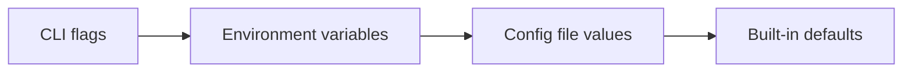

# Write Docs

Create clear, consistent documentation for the Inkeep docs site following established patterns and structure.

---

## Use when

- Any customer-facing feature, API, SDK, CLI, UI, config, or behavior change needs documenting
- Creating or updating pages in `agents-docs/content/`, snippets, or public-facing READMEs or reference artifacts (like .env.example files)
- Restructuring or reorganizing docs (moves, renames, redirects)

## Do NOT use when

- Writing code comments or inline documentation (not MDX docs)
- Working on internal-only changes with no customer-facing surface area
- Updating internal tooling docs (e.g. `AGENTS.md`, `.agents/skills/`, `.agents/rules/`, `CONTRIBUTING.md`, `.github/workflows/`)

---

## Philosophy

**Every feature must be documented fully** across all surfaces: how it's used, interacted with, depended on, or perceived by end-users. Documentation is the audited source of truth for the product.
- **Every Surface Area Needs Documentation**: Anything that an engineering change touches that involves a customer-facing change in any product surface area[s] need to be documented.
- **Keep docs current**: Documentation is a living artifact. When code changes, existing docs must be updated in the same change. Stale docs are misleading docs.
- **Accuracy over speed**: Incorrect documentation erodes trust faster than missing documentation. Cross-reference source code to verify that types, parameter names, and described behavior match the actual implementation.
- **Consistency**: Use the same terminology, structure, and formatting patterns across all docs. If we call it a "project" in one place, don't call it a "workspace" in another.
- **For the right audience**: Tailor voice, depth, and framing to who will read the page. A developer integrating an SDK needs different context than an admin configuring a project.
- **Good information architecture**: The right audiences find the right content.
- **Clarity over assumption**: Don't assume prior knowledge. Be explicit about prerequisites and context.
- **Direct and practical**: Get to the point. Documentation exists to help users accomplish goals, not to showcase everything we know.
- **Progressive disclosure**: Build up concepts before diving into details.
- **Scoped and targeted**: Each doc has a clear outcome. Provide the context needed—nothing more, nothing less.
- **Right detail, right place**: Avoid duplication. If something is explained elsewhere, link to it or reuse it in some way as appropriate.

---

## Workflow

1. **Understand context** - Fully map out the scope of what needs to be changed. **Consider all procuct surface areas plausibly affected**, and identify existing documentation or documentation sections that may need updating or new articles.
2. **Identify documentation type** — Determine if this is reference, tutorial, integration, or overview content (see Step 1)
3. **Write frontmatter** — Add required `title` and optional fields like `sidebarTitle`, `description`, `keywords` (see Step 2)
4. **Structure content** — Use the appropriate pattern template for your doc type (see Step 3)
5. **Use components correctly** — Apply `<Steps>`, `<Tabs>`, `<Cards>`, callouts as needed (see Step 4)
6. **Write code examples** — Ensure examples are runnable with language tags and realistic values (see Step 5)
7. **Handle navigation** — Update `meta.json` if needed; add redirects for moves/renames (see File Organization)
8. **Verify** — Check against the verification checklist before completing


## Step 0: Identify Relevant Surface Areas

Before writing anything, map out which surface areas the change touches. Review the engineering or product changes (staged files, PR diff, or task description) and ask:

1. **What changed?** — Identify the modified packages, APIs, schemas, or UI components
2. **Who is affected?** — Determine which user-facing surfaces consume or expose this change. For example (not exhaustive!):
   - SDK/CLI users (types, builder APIs, commands)
   - Dashboard users (UI forms, views, workflows)
   - API consumers (endpoints, request/response shapes, streaming formats)
   - Widget/chat users (runtime behavior, rendering)
   - Self-hosting users (env vars, deployment config)
3. **What docs already exist?** — Search `agents-docs/content/` for pages that reference the affected feature; these may need updates
4. **What's new vs. changed?** — New surface areas need new pages; changed behavior needs existing page updates

If a change touches multiple surface areas, create or update a doc for each. Don't bundle unrelated surfaces into one page unless it's a natural fit with the existing document or similar analogous docs.

---

## Step 1: Identify Documentation Type

| Pattern | When to use | Focus | Title style |
|---------|-------------|-------|-------------|
| **Overview** | Conceptual explanation ("what is X?") | Mental models, "why", terminology, key definitions, relationships | Noun |
| **Reference** | New SDK feature, API, or configuration options | Exhaustive, scannable, precise specs | Noun |
| **Tutorial** | Step-by-step instructions to accomplish something | Goal-oriented, sequential, minimal tangents | Verb |
| **Integration** | Connecting a third-party service | Installation-focused, platform-aware | Verb |

---

## Step 2: Write Frontmatter

Every `.mdx` file **must** have frontmatter with at least a `title`.

### Required

```yaml
---
title: Full Descriptive Title with Context
---
```

### Optional (add when relevant)

```yaml
---
title: Add Chat Button to Next.js
sidebarTitle: Chat Button
description: Integrate Inkeep's chat button into your Next.js application.
icon: LuMessageSquare
keywords: Next.js integration, chat button, React
---
```

### When to add each field

| Field | Add when |
|-------|----------|
| `sidebarTitle` | Title is long/sentence-like, or breadcrumb provides context so sidebar can be short |
| `description` | Page is important for SEO or is a top-level entry point |
| `keywords` | Page targets common search intents ("authentication", "vercel", "docker") |
| `icon` | Landing/overview page or frequently linked in cards |

### Title rules

- Sentence case: capitalize first word + proper nouns (e.g., "Deploy to Vercel")
- Use breadcrumb context—don't repeat the section name in the title
- Include the action for how-to content: "Configure authentication" not "Authentication"
- Use **verbs/phrases** for task pages; **nouns** for references/concepts

### SidebarTitle rules

- 1-3 words when possible
- Leverage parent context (don't repeat parent name)
- Action words for how-to content: "Install", "Configure", "Setup"

### Examples

✅ **Good: descriptive title + short sidebarTitle**
```yaml
---
title: Live Debugger, Traces, and OTEL Telemetry
sidebarTitle: Traces
---
```

❌ **Avoid: redundant title repeating breadcrumb**
```yaml
---
# Breadcrumb already includes "TypeScript SDK"
title: TypeScript SDK Model Configuration
---
```

❌ **Avoid: sidebarTitle repeating parent context**
```yaml
# Parent folder: "Slack Integration"
title: Set up Inkeep in Slack
sidebarTitle: Set up Inkeep in Slack  # BAD
```

✅ **Good: context-aware sidebarTitle**
```yaml
# Parent folder: "Slack Integration"
title: Set up Inkeep in Slack
sidebarTitle: Installation  # Parent provides context
```

---

## Step 3: Structure Content

These templates are **examples**. Mix and match as appropriate for your use case.

### Reference Pattern (APIs, SDKs, Configuration)

```markdown
# Feature Name

Brief one-sentence description of what this feature does.

## Quick Start (recommended)

Minimal working example (< 10 lines).

## Parameters / Options (recommended)

| Parameter | Type | Required | Description |
|-----------|------|----------|-------------|
| `apiKey` | string | Yes | Your API key |

## Examples

### Basic Usage
[code example]

### Advanced Usage
[code example with options]

## Related
- [Link to related feature]
```

### Tutorial Pattern (How-to Guides)

```markdown
# How to [Accomplish Task]

Brief description of what you'll build/achieve.

## Prerequisites

- Requirement 1
- Requirement 2

## Steps

<Steps>
  <Step>
    ### Step Title

    Explanation and code.
  </Step>
  <Step>
    ### Next Step

    More explanation.
  </Step>
</Steps>

## What's Next

- [Link to next tutorial]
- [Link to reference docs]
```

### Integration Pattern (Third-party Services)

```markdown
# [Service Name] Integration

Brief description of what this integration enables.

## Prerequisites

- Service account
- API key from service

## Installation

<Steps>
  <Step>
    Install the package
    ```bash
    pnpm add @inkeep/[package]
    ```
  </Step>
  <Step>
    Configure credentials
    [code]
  </Step>
</Steps>

## Configuration Options

| Option | Description | Default |
|--------|-------------|---------|
| `option1` | What it does | `value` |

## Platform-Specific Notes

<Tabs>
  <Tab title="Next.js">
    [Next.js specific instructions]
  </Tab>
  <Tab title="Node.js">
    [Node.js specific instructions]
  </Tab>
</Tabs>
```

### Overview Pattern (Conceptual Docs)

```markdown
# [Concept Name]

Opening paragraph explaining what this is and why it matters.

## Key Features

- Feature 1: Brief explanation
- Feature 2: Brief explanation

## How It Works

Conceptual explanation, optionally with diagram.

## Use Cases

When to use this:
- Use case 1
- Use case 2

## Getting Started

<Cards>
  <Card title="Quick Start" href="/path/to/quickstart">
    Get up and running in 5 minutes
  </Card>
  <Card title="API Reference" href="/path/to/reference">
    Detailed API documentation
  </Card>
</Cards>
```

---

## Step 4: Use Components Correctly

### Component Selection

```
What are you presenting?
│
├─ Multiple code variants (languages, frameworks)?
│  └─ Use <Tabs>
│
├─ Sequential instructions?
│  └─ Use <Steps>
│
├─ Navigation to other docs?
│  └─ Use <Cards>
│
├─ Content that's helpful but not essential?
│  └─ Use <Accordions>
│
├─ Important callout?
│  ├─ Helpful tip → <Tip>
│  ├─ Important note → <Note>
│  └─ Critical warning → <Warning>
│
└─ Regular content
   └─ Use plain markdown
```

### Component Syntax Reference

**Tabs** (multi-language/multi-framework):
````mdx
<Tabs>
  <Tab title="TypeScript">

```typescript
const config = { apiKey: 'key' };
```

  </Tab>
  <Tab title="JavaScript">

```javascript
const config = { apiKey: 'key' };
```

  </Tab>
</Tabs>
````

**Steps** (sequential instructions):
```mdx
<Steps>
  <Step>
    First step with explanation
  </Step>
  <Step>
    Second step
  </Step>
</Steps>
```

**Cards** (navigation):
```mdx
<Cards>
  <Card title="Feature Name" icon="IconName" href="/path">
    Brief description
  </Card>
</Cards>
```

**Callouts** (important information):
```mdx
<Tip>Helpful best practice</Tip>
<Note>Important information</Note>
<Warning>Critical warning - user might break something</Warning>
```

**Accordions** (collapsible detail):
```mdx
<Accordions>
  <Accordion title="Advanced Options">
    Detailed content here
  </Accordion>
</Accordions>
```

### Additional Global Components

These are registered for all docs pages (no `import` needed):

| Component | Use for |
|-----------|---------|
| `<Image src="..." alt="..." />` | Consistent image styling (full-width + rounded) |
| `<Video src="..." title="..." />` | YouTube or video embeds |
| `<BigVideo src="..." />` | Large MP4 player for `/public/videos/` assets |
| `<CodeGroup>` | Tabbed code variants (use `title="..."` on fences) |
| `<Snippet file="..." />` | Reusable content from `_snippets/` |
| `<AutoTypeTable path="..." name="..." />` | TypeScript reference tables that stay in sync |
| `<SkillRule id="..." skills="..." title="...">` | Mark sections extractable as agent skills |
| `<ComparisonTable competitor="..." sectionTitle="..." />` | Competitor comparison tables |

---

## Step 5: Write Code Examples

### Rules

1. **Always specify language**: ` ```typescript ` not ` ``` `
2. **Make it runnable**: Users will copy-paste. Test your examples.
3. **Include comments for non-obvious parts**: But don't over-comment
4. **Show realistic values**: `apiKey: 'YOUR_API_KEY'` not `apiKey: 'xxx'`

### Language Tags

| Content Type | Tag |
|--------------|-----|
| TypeScript | `typescript` |
| JavaScript | `javascript` |
| Shell commands | `bash` |
| .env content | `dotenv` |
| Configuration | `yaml` or `json` |
| MDX examples | `mdx` |

### Code fence titles

Use `title="..."` when the filename or location matters:

````ts title="inkeep.config.ts"
export default defineConfig({ /* ... */ });
````

Common titles: `inkeep.config.ts`, `.env`, `sandbox.ts`, `index.ts`, `package.json`

### Example quality

❌ **Bad:**
```javascript
// This sets up the config
const c = {k: 'x'}; // key
doThing(c); // do it
```

✅ **Good:**
```typescript
const config = {
  apiKey: 'YOUR_API_KEY',
  organizationDisplayName: 'Acme Inc',
};

const client = createClient(config);
```

### Mermaid diagrams

Use ` ```mermaid ` for flows that are clearer as visuals than prose:



Keep diagrams simple (5-10 nodes max).

---

## Step 6: Tables and Structured Data

### Parameter Tables

Always use this format for API parameters or configuration options:

```markdown
| Parameter | Type | Required | Description |
|-----------|------|----------|-------------|
| `apiKey` | string | Yes | Your Inkeep API key |
| `baseURL` | string | No | Custom API endpoint. Default: `https://api.inkeep.com` |
```

### When to Use Tables vs Lists

- **Tables**: Data comparing multiple items with shared attributes (type/required/default)
- **Lists**: Narrative or irregular items

---

## Step 7: Links and Navigation

### Internal Links

Use relative paths, omit `.mdx`:
```markdown
See [Project Management](/typescript-sdk/project-management)
```

### External Links

Descriptive text, never "click here":
```markdown
Check our [cookbook templates](https://github.com/inkeep/agents/tree/main/agents-cookbook/template-projects)
```

### When to link

- **Inline links**: When reader needs a prerequisite immediately or you're referencing a concept defined elsewhere
- **"Next steps" links**: When reader is done with this page and should continue a journey (1-3 links, Cards work well)

---

## Writing Style Rules

### Do

- **Be concise**: Get to the point in the first sentence
- **Use active voice**: "Configure the agent" not "The agent can be configured"
- **Be directive**: "Run this command" not "You might want to run"
- **Include examples**: Every concept needs a code example
- **Explain why**: "Use connection pooling to avoid exhausting connections"

### Don't

- Don't use "simply" or "just"
- Don't assume prior knowledge without stating prerequisites
- Don't write walls of text without code examples
- Don't use jargon without explanation on first use

### Formatting conventions

- **Paragraphs**: 1-2 sentences typical before a visual break
- **Steps**: One action per step, imperative mood
- **Contractions**: Use "don't", "you'll", etc.
- **Person**: Address reader as "you"; use "we" when speaking as Inkeep
- **Bullets**: Capital letter start, no trailing period unless full sentence, bold lead keywords for scannability
- **UI references**: Bold labels (`**Save**`), use `→` between hierarchy levels

---

## File Organization

### Directory structure

- `agents-docs/content/` — main docs pages (`.mdx`)
- `agents-docs/_snippets/` — reusable snippet content (`.mdx`)
- `agents-docs/public/images/` — screenshots/diagrams
- `agents-docs/public/videos/` — MP4 demos
- `agents-docs/public/gifs/` — short UI walkthroughs

### File Renames, Moves, and Redirects

When you rename or move a file, **add a redirect** to `agents-docs/redirects.json`:

```json
{
  "source": "/old-path/old-page",
  "destination": "/new-path/new-page",
  "permanent": true
}
```

Also update any internal links referencing the old path.

### Navigation (meta.json)

Edit the nearest parent `meta.json` when you:
- Add a page and need it in the sidebar
- Control ordering or group pages
- Set a folder-level icon

Common patterns:
- Explicit list: `["project-management", "agent-settings", ...]`
- Group markers: `"(observability)"`
- Remainder marker: `"..."` to include remaining pages
- Section headers: `"---TUTORIALS---"` (visual separators)

### Where should a new page go?

```
Is it about shipping/hosting/running infra?
├─ Yes → deployment/
│
Is it a code-first SDK/API usage guide?
├─ Yes → typescript-sdk/
│
Is it a Visual Builder UI workflow?
├─ Yes → visual-builder/
│
Is it about embedding chat / chat UI components?
├─ Yes → talk-to-your-agents/(chat-components)/
│
Is it connecting external data sources?
└─ Yes → connect-your-data/
```

Top-level buckets: `get-started/`, `tutorials/`, `typescript-sdk/`, `visual-builder/`, `talk-to-your-agents/`, `connect-your-data/`, `deployment/`, `api-reference/`, `community/`, `comparisons/`

### When to create a new folder

Create a folder when:
- Adding 3+ pages that should be navigated together
- You need folder-level ordering (`meta.json`)
- You want a folder-level icon/title in sidebar

Use parentheses folders like `(docker)` to group pages without changing the URL.

---

## Images and Media

### Image Usage

```mdx
<Image
  src="/images/live-traces.png"
  alt="Live traces interface showing real-time agent execution"
/>
```

**Alt text**: Describe what the image shows; include key details; don't start with "Image of..."

### Videos

```mdx
<Video
  src="https://www.youtube.com/watch?v=..."
  title="What the user will learn"
/>
```

---

## Icons

Icons resolve as `Lu...` (Lucide), `Tb...` (react-icons/tb), or `brand/...` (custom in `brand-icons.tsx`).

- **Section icon** (folder `meta.json`): When whole section needs nav identity
- **Page icon** (frontmatter): For landing/overview pages or frequently linked cards

To add a brand icon: export a component in `agents-docs/src/components/brand-icons.tsx`, reference as `icon: "brand/<ExportName>"`

---

## Snippets

Use `<Snippet>` when content must stay identical across pages:

```mdx
<Snippet file="pull-prereq.mdx" />
```

Paths resolve relative to `agents-docs/_snippets/`. Use this to prevent duplication and divergence.

---

## Source-derived docs

Use `AutoTypeTable` for TypeScript types that change:

```mdx
<AutoTypeTable
  path="./content/typescript-sdk/types.ts"
  name="NestedInkeepConfig"
/>
```

This keeps reference tables accurate as code evolves.

---

## SkillRule — extracting skills from docs

Use `<SkillRule>` when a page is mostly narrative but contains a checklist, table, or decision framework valuable for AI agents. Avoid extracting purely narrative or marketing sections.

**Why:** Skills should be high-signal and procedural. Extract only the parts that help an agent make correct decisions or produce correct code.

### Examples

✅ **Good: extract a checklist from a longer narrative**

```mdx
<SkillRule id="setup" skills="typescript-sdk" title="Setup checklist">

## Before you begin
1. Install dependencies
2. Configure `inkeep.config.ts`

</SkillRule>
```

❌ **Avoid: wrapping the whole page in SkillRule**

```mdx
<!-- Don't do this - too much content, not high-signal -->
<SkillRule id="overview" skills="typescript-sdk" title="SDK Overview">
  [entire page content...]
</SkillRule>
```

---

## API Reference (OpenAPI-driven)

Recognize by `full: true` and `_openapi:` frontmatter. Edit only to adjust presentation; change endpoints/schemas at the OpenAPI source.

---

## Verification Checklist

Before completing any documentation, verify:

### Frontmatter
- [ ] Has `title` (descriptive, sentence case)
- [ ] Has `sidebarTitle` if title is long or redundant in nav
- [ ] Description added if page is important for SEO

### Content
- [ ] Opens with what this page covers (not "In this guide...")
- [ ] Code examples are complete and runnable
- [ ] All code blocks have language specified
- [ ] Prerequisites listed (if applicable)
- [ ] Links to related docs included

### Structure
- [ ] Appropriate pattern used (reference/tutorial/integration/overview)
- [ ] Components used correctly (Tabs for variants, Steps for sequences)
- [ ] Tables used for parameters/options
- [ ] Headings are scannable and descriptive

### Quality
- [ ] No "click here" links
- [ ] No assumed knowledge without prerequisites
- [ ] Active voice throughout
- [ ] Examples show realistic values

### Navigation (if applicable)
- [ ] `meta.json` updated to include new page
- [ ] Redirects added for any moves/renames
