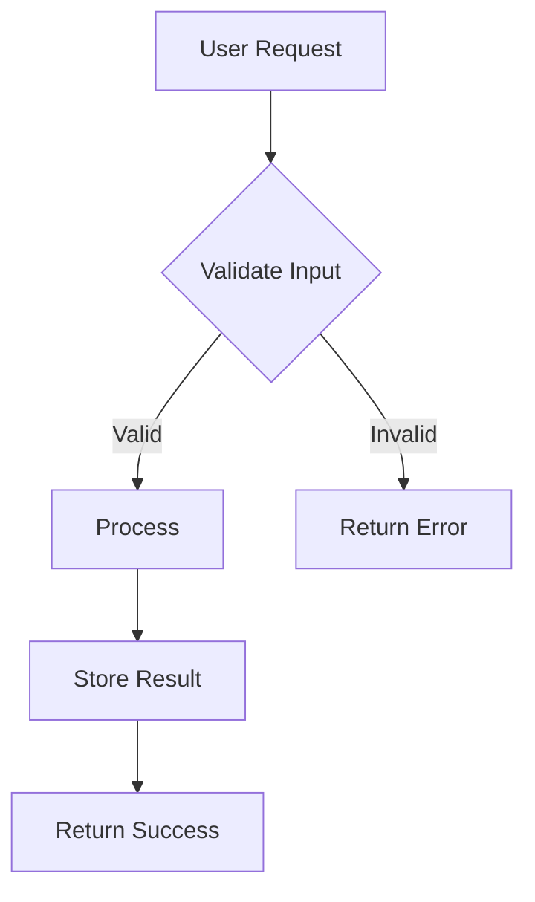

# PRD Generator

Create detailed Product Requirements Documents that are clear, actionable, and suitable for implementation.

---

## The Job

**Workflows** (pick one based on what the user provides):
- **Draft**: no PRD yet → create one from a feature idea.
- **Iterate**: unclear scope/trade-offs → converge on a spec together.
- **Improve**: existing PRD provided → tighten it, identify gaps, make it implementable.

**Important:** Do NOT start implementing. Focus on clarifying → writing the PRD → saving it.

**Steps:**
1. Ask high-leverage questions (see Step 1) until you can write an implementable PRD.
2. Produce the PRD using the template (Step 2), capturing uncertainty in "Open Questions".
3. Save to `tasks/prd-[feature-name].md`.

---

## Step 1: Clarifying Questions

Ask only critical questions where the initial prompt is ambiguous. Focus on:

- **Problem/Goal:** What problem does this solve?
- **Core Functionality:** What are the key actions?
- **Scope/Boundaries:** What should it NOT do?
- **Success Criteria:** How do we know it's done?
- **Consumption / Side Effects:** Where will this be consumed/surface area impacted (only if likely)?

**When to stop asking:** You can write the PRD when acceptance criteria are verifiable and non-goals are explicit. Capture remaining unknowns in "Open Questions"—don't over-ask.

### When improving an existing PRD

Start by asking:
- What parts are **non-negotiable** vs **flexible**?
- What decisions are already made (and why)?
- What's missing or unclear for implementation?
- What's the desired scope reduction (MVP vs full)?

Then iterate: ask only the questions required to make acceptance criteria verifiable and boundaries explicit.

### Format Questions Like This:

```
1. What is the primary goal of this feature?
   A. Improve user onboarding experience
   B. Increase user retention
   C. Reduce support burden
   D. Other: [please specify]

2. Who is the target user?
   A. New users only
   B. Existing users only
   C. All users
   D. Admin users only

3. What type of user?
   A. No-code user
   B. Developer
   C. Admin
   D. All of the above


4. What is the scope?
   A. Minimal viable version
   B. Full-featured implementation

5. What are the surface areas impacted?
   A. SDK
   B. API
   C. Manage UI
   D. CLI
   E. Agent runtime
   F. All of the above
   G. Other: [please specify]

```

This lets users respond with "1A, 2C, 3B" for quick iteration.

---

## Step 2: PRD Structure

Generate the PRD with these sections:

### 1. Introduction/Overview
Brief description of the feature and the problem it solves.

### 2. Goals
Specific, measurable objectives (bullet list).

### 3. User Stories
Each story needs:
- **Title:** Short descriptive name
- **Description:** "As a [user], I want [feature] so that [benefit]"
- **Acceptance Criteria:** Verifiable checklist of what "done" means

Each story should be small enough to implement in one focused session.

**Format:**
```markdown
### US-001: [Title]
**Description:** As a [user], I want [feature] so that [benefit].

**Acceptance Criteria:**
- [ ] Specific verifiable criterion
- [ ] Another criterion
- [ ] Tests: Update/add tests for new functionality
- [ ] Typecheck/lint passes
- [ ] **[UI stories only]** Verify in browser using dev-browser skill
- [ ] CI: Run test suite and local CI checks pass
```

**Important:** 
- Acceptance criteria must be verifiable, not vague. "Works correctly" is bad. "Button shows confirmation dialog before deleting" is good.
- **For any story with UI changes:** Always include "Verify in browser using dev-browser skill" as acceptance criteria. This ensures visual verification of frontend work.
- **Testing is mandatory:** Every story must include test-related acceptance criteria. This includes updating existing tests affected by changes, adding new tests for new functionality, and fixing any tests broken by the implementation.
- **Final verification:** The last acceptance criterion for any story should always be running the test suite (`pnpm test --run`) and local CI checks (`pnpm typecheck`, `pnpm lint`, `pnpm build`) to ensure the implementation is complete and doesn't break existing functionality.

### 4. Functional Requirements
Numbered list of specific functionalities:
- "FR-1: The system must allow users to..."
- "FR-2: When a user clicks X, the system must..."

Be explicit and unambiguous.

### 5. Non-Goals (Out of Scope)
What this feature will NOT include. Critical for managing scope.

### 6. Design Considerations (Optional)
- UI/UX requirements
- Link to mockups if available
- Relevant existing components to reuse

### 6.1 Diagrams (Optional)

Include diagrams only when they genuinely clarify relationships that are hard to express in prose.

**When diagrams help**: Complex data flows, component relationships, state machines, entity relationships, architecture overviews.

**When to skip diagrams**: Simple linear processes, obvious hierarchies, anything easily described in a sentence or two.

**Use Mermaid syntax**. Avoid ASCII diagrams—LLMs struggle with spatial pattern recognition since tokenization breaks ASCII art into meaningless fragments. Mermaid's structured DSL parses well for both AI agents and renders nicely for human review.

**Diagram best practices**:
- Keep diagrams focused—break large systems into smaller diagrams
- Place diagram code before textual explanation
- Use appropriate diagram types: `flowchart` for flows, `sequenceDiagram` for interactions, `erDiagram` for data models

**Example**:


### 7. Technical Considerations (Optional)
- Known constraints or dependencies
- Integration points with existing systems
- Performance requirements

### 7.1 Surface area & side-effects scan (REQUIRED)
Avoid siloed development by explicitly calling out where this feature may be **consumed**, **surfaced**, **interacted with** or could **break shared contracts** or dependencies a developer or customer may have taken on existing functionality.

This section should help a human or AI agent quickly answer: "If we change this, who/what else needs to know?"

**How to write this section:**
- Keep it short and concrete (1–2 sentences per impacted item).
- Only list what's impacted (omit everything else).
- Describe *why* a surface is impacted, not implementation details.

**High-signal triggers (when you should include an item):**
- You change **definition shapes / shared types / validation rules** (agent/project/tool/credential/etc.).
- You change **runtime behavior or streaming formats** (responses, tool calls, artifacts/components).
- You change **tracing / telemetry** (span names, attribute keys, correlation IDs, exporter config).
- You add/modify **resources, endpoints, or actions** (create/update/delete, new capabilities).
- You change **permission boundaries** (view/use/edit), auth flows, or tenant scoping.

**Surfaces & contracts to consider (product-level):**
- **Templates & onboarding**: `@inkeep/create-agents`, cookbook template projects
- **Inkeep CLI workflows**: onboarding (`init`), sync (`push`/`pull`), template import (`add`)
- **TypeScript SDK**: builder APIs, types, ergonomics, examples
- **APIs**: configuration layer (manage), runtime layer (run), evaluation layer (evals)
- **Manage UI dashboard**: forms, builders, serialization, permissions gating, traces views
- **Widgets UX** (`agents-ui`): runtime chat + stream parsing compatibility
- **Auth / permissions / tenancy**: authentication, RBAC, optional fine-grained authz, cross-tenant isolation
- **Observability**: traces UX expectations, SigNoz queries, OTEL attribute stability
- **Protocols / data formats**: OpenAI-compatible SSE, Vercel AI SDK data streams, A2A JSON-RPC

**Format (copy into PRD):**
```markdown
### Surface area & side-effects scan

#### Impacted surfaces (only list what applies)
- **<Surface>**: <what changes and why it matters to users or downstream systems>

#### Shared contracts to preserve (if any)
- **<Contract>**: <what must remain compatible; what must be versioned or coordinated>

#### "How it shows up" (if runtime-facing)
- **Traces**: <what should appear in traces UX and how it can be correlated>
- **Streaming**: <which protocol(s) are involved and what must remain stable>

#### Security / permissions (if applicable)
- **Auth / authz**: <new permission checks, roles, tenant scoping implications>
```

### 8. Success Metrics
How will success be measured?
- "Reduce time to complete X by 50%"
- "Increase conversion rate by 10%"

### 9. Open Questions
Remaining questions or areas needing clarification.

---

## Writing for Junior Developers

The PRD reader may be a junior developer or AI agent. Therefore:

- Be explicit and unambiguous
- Avoid jargon or explain it
- Provide enough detail to understand purpose and core logic
- Number requirements for easy reference
- Use concrete examples where helpful

---

## Output

- **Format:** Markdown (`.md`)
- **Location:** `tasks/`
- **Filename:** `prd-[feature-name].md` (kebab-case)

**Reference existing PRDs** in `tasks/` for patterns and conventions. Current examples include:
- `prd-jmespath-utils-consolidation.md` - Good example of refactoring/consolidation work
- `prd-schema-driven-code-generation.md` - Good example of complex architectural work
- `prd-api-reference-docs-automation.md` - Good example of documentation/tooling work

---

## Writing Tips

- **Reference file paths**: When discussing implementation, point to source files (e.g., `packages/agents-core/src/utils/foo.ts`)
- **Be concrete**: "The button displays 'Save'" is better than "The button has appropriate text"
- **Link related PRDs**: If this PRD depends on or relates to another, reference it in a "Related Tasks" section

---

## Example PRD

```markdown
# PRD: Task Priority System

## Introduction

Add priority levels to tasks so users can focus on what matters most. Tasks can be marked as high, medium, or low priority, with visual indicators and filtering to help users manage their workload effectively.

## Goals

- Allow assigning priority (high/medium/low) to any task
- Provide clear visual differentiation between priority levels
- Enable filtering and sorting by priority
- Default new tasks to medium priority

## User Stories

### US-001: Add priority field to database
**Description:** As a developer, I need to store task priority so it persists across sessions.

**Acceptance Criteria:**
- [ ] Add priority column to tasks table: 'high' | 'medium' | 'low' (default 'medium')
- [ ] Generate and run migration successfully
- [ ] Tests: Add unit tests for priority field validation and default value
- [ ] Typecheck passes
- [ ] CI: Run test suite and local CI checks pass

### US-002: Display priority indicator on task cards
**Description:** As a user, I want to see task priority at a glance so I know what needs attention first.

**Acceptance Criteria:**
- [ ] Each task card shows colored priority badge (red=high, yellow=medium, gray=low)
- [ ] Priority visible without hovering or clicking
- [ ] Tests: Add component tests for priority badge rendering
- [ ] Typecheck passes
- [ ] Verify in browser using dev-browser skill
- [ ] CI: Run test suite and local CI checks pass

### US-003: Add priority selector to task edit
**Description:** As a user, I want to change a task's priority when editing it.

**Acceptance Criteria:**
- [ ] Priority dropdown in task edit modal
- [ ] Shows current priority as selected
- [ ] Saves immediately on selection change
- [ ] Tests: Add tests for priority selection and persistence
- [ ] Typecheck passes
- [ ] Verify in browser using dev-browser skill
- [ ] CI: Run test suite and local CI checks pass

### US-004: Filter tasks by priority
**Description:** As a user, I want to filter the task list to see only high-priority items when I'm focused.

**Acceptance Criteria:**
- [ ] Filter dropdown with options: All | High | Medium | Low
- [ ] Filter persists in URL params
- [ ] Empty state message when no tasks match filter
- [ ] Tests: Add tests for filter logic and URL param persistence
- [ ] Typecheck passes
- [ ] Verify in browser using dev-browser skill
- [ ] CI: Run test suite and local CI checks pass

## Functional Requirements

- FR-1: Add `priority` field to tasks table ('high' | 'medium' | 'low', default 'medium')
- FR-2: Display colored priority badge on each task card
- FR-3: Include priority selector in task edit modal
- FR-4: Add priority filter dropdown to task list header
- FR-5: Sort by priority within each status column (high to medium to low)

## Non-Goals

- No priority-based notifications or reminders
- No automatic priority assignment based on due date
- No priority inheritance for subtasks

## Technical Considerations

- Reuse existing badge component with color variants
- Filter state managed via URL search params
- Priority stored in database, not computed

## Success Metrics

- Users can change priority in under 2 clicks
- High-priority tasks immediately visible at top of lists
- No regression in task list performance

## Open Questions

- Should priority affect task ordering within a column?
- Should we add keyboard shortcuts for priority changes?
```

---

## Checklist

Before saving the PRD:

- [ ] Asked clarifying questions with lettered options
- [ ] Incorporated user's answers
- [ ] User stories are small and specific
- [ ] Functional requirements are numbered and unambiguous
- [ ] Non-goals section defines clear boundaries
- [ ] Saved to `tasks/prd-[feature-name].md`
