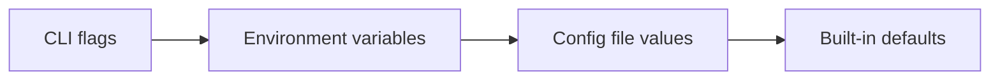

# Write Docs

Create clear, consistent documentation for the Inkeep docs site following established patterns and structure.

---

## Philosophy

**Every feature must be documented fully** across all surfaces: how it's used, interacted with, depended on, or perceived by end-users. Documentation is the audited source of truth for the product.

### Principles

- **Clarity over assumption**: Don't assume prior knowledge. Be explicit about prerequisites and context.
- **Direct and practical**: Get to the point. Documentation exists to help users accomplish goals in a highly information dense representation applied to a given use case/purpose, not to showcase everything we know everywhere.
- **Progressive disclosure**: Build up concepts before diving into details. Weave ideas, concepts, and technical specifics together coherently.
- **Scoped and targeted**: Each doc has a clear outcome. Provide the context needed to follow along—nothing more, nothing less. 
- **Right detail, right place**: Avoid duplication. Be detailed and clear, but sharp and pointed. If something is explained elsewhere, link to it.
- **Good information architecture**: The right audiences find the right content. Structure, titles, and navigation should make discovery effortless.

### By content type

The spirit above applies everywhere, but emphasis shifts (see Step 3 for meta-templates):

| Pattern | Focus |
|---------|-------|
| **Overview** (Conceptual) | Mental models, "why", terminology, key definitions, relationships |
| **Reference** (APIs, SDKs, Config) | Exhaustive, scannable, precise specs |
| **Tutorial** (How-to Guides) | Step-by-step, goal-oriented, minimal tangents |
| **Integration** (Third-party Services) | Installation-focused, platform-aware |

---

## The Job

1. Identify the documentation type (tutorial, reference, integration, etc.)
2. Choose the appropriate content structure
3. Write with the correct frontmatter and components
4. Verify against the checklist

---

## Step 1: Identify Documentation Type

### Decision Tree

```
What are you documenting?
│
├─ A new SDK feature or API?
│  └─ **Reference** → Use Reference Pattern (noun titles)
│
├─ Step-by-step instructions to accomplish something?
│  └─ **Tutorial/Guide** → Use Tutorial Pattern (verb titles)
│
├─ How to connect a third-party service?
│  └─ **Integration** → Use Integration Pattern (verb titles)
│
├─ A conceptual explanation ("what is X")?
│  └─ **Overview** → Use Overview Pattern (noun titles; breadcrumb supplies context)
│
└─ Configuration options or settings?
   └─ **Configuration** → Use Reference Pattern (noun titles)
```

---

## Step 2: Write Frontmatter

Every `.mdx` file **must** have frontmatter. No exceptions.

### Required Fields

```yaml
---
title: Full Descriptive Title with Context
---
```

### Optional Fields (add when relevant)

```yaml
---
title: Add Chat Button to Next.js
sidebarTitle: Chat Button
description: Integrate Inkeep's chat button into your Next.js application.
icon: LuMessageSquare
keywords: Next.js integration, chat button, React
---
```

**When to add `sidebarTitle`:**
- The title is long or sentence-like
- The breadcrumb already provides context, so the sidebar label can be short
- You want a compact, scannable nav label (e.g., “Traces”, “MCP Tools”)

**Why:** Sidebars are scanned, not read. Breadcrumbs provide hierarchy context, so `sidebarTitle` should be optimized for quick recognition.

**When to add `keywords`:**
- The page is a top-level entry point (Quick Start, Deployment, Traces)
- The page targets a common search intent (“authentication”, “vercel”, “docker”, “MCP”)

**Why:** `keywords` help discovery. They’re most valuable on pages that are likely to be reached from search or shared directly.

### Title vs SidebarTitle Decision (use breadcrumb context; avoid repeating folder names)

```
Is the parent folder / breadcrumb already descriptive?
│
├─ Yes → Keep sidebarTitle short; let the title carry meaning
│
└─ No  → Add sidebarTitle if the title is long or repeats parent context
```

**Choose noun vs verb intentionally**
- Use **verbs/phrases** for how-to/task pages (Deploy…, Configure…, Add…, Create…)
- Use **nouns** for references/concepts (Model Configuration, Triggers, Headers, CLI Reference)
- For section landings: use a descriptive title; `sidebarTitle: Overview` is fine because breadcrumbs give context.

**Why:** Readers decide in seconds whether a page will help them. Verbs signal “this teaches me how to do a task”; nouns signal “this explains/defines a thing”.

**Title rules:**
- Prefer sentence case: capitalize the first word + proper nouns (e.g., "Deploy to Vercel").
- Use breadcrumb context to avoid repeating the section name in the title.
- Include the action: "Configure authentication" not "Authentication"
- Avoid jargon without explanation

**SidebarTitle rules:**
- 1-3 words when possible
- Leverage parent context (don't repeat parent name)
- Action words for how-to content: "Install", "Configure", "Setup"

### Examples (good vs avoid)

✅ **Good: descriptive title + short sidebarTitle that leans on breadcrumbs**

```yaml
---
title: Live Debugger, Traces, and OTEL Telemetry
sidebarTitle: Traces
---
```

❌ **Avoid: redundant title that repeats breadcrumb**

```yaml
---
# Breadcrumb already includes "TypeScript SDK"
title: TypeScript SDK Model Configuration
---
```

✅ **Good: nouns for reference**

```yaml
---
title: Model Configuration
---
```

✅ **Good: verbs for tasks**

```yaml
---
title: Deploy to Vercel
---
```

### Anti-patterns

❌ **Redundant sidebar title:**
```yaml
# Parent folder: "Slack Integration"
title: Set up Inkeep in Slack
sidebarTitle: Set up Inkeep in Slack  # BAD: repeats parent context
```

✅ **Context-aware sidebar title:**
```yaml
# Parent folder: "Slack Integration"  
title: Set up Inkeep in Slack
sidebarTitle: Installation  # GOOD: parent provides context
```

---

## Step 3: Structure Content
The below templates are **examples** only. Determine what needs to be written as most appropriate for a given use case or scenario, and mix and match as needed or appropriate.

### Reference Pattern (APIs, SDKs, Configuration)

```markdown
# Feature Name

Brief one-sentence description of what this feature does.

## Quick Start (recommended)

Minimal working example (< 10 lines).

## Parameters / Options (recommended)

| Parameter | Type | Required | Description |
|-----------|------|----------|-------------|
| `apiKey` | string | Yes | Your API key |

## Examples

### Basic Usage
[code example]

### Advanced Usage  
[code example with options]

## Related
- [Link to related feature]
```

### Tutorial Pattern (How-to Guides)

```markdown
# How to [Accomplish Task]

Brief description of what you'll build/achieve.

## Prerequisites

- Requirement 1
- Requirement 2

## Steps

<Steps>
  <Step>
    ### Step Title
    
    Explanation and code.
  </Step>
  <Step>
    ### Next Step
    
    More explanation.
  </Step>
</Steps>

## What's Next

- [Link to next tutorial]
- [Link to reference docs]
```

### Integration Pattern (Third-party Services)

```markdown
# [Service Name] Integration

Brief description of what this integration enables.

## Prerequisites

- Service account
- API key from service

## Installation

<Steps>
  <Step>
    Install the package
    ```bash
    pnpm add @inkeep/[package]
    ```
  </Step>
  <Step>
    Configure credentials
    [code]
  </Step>
</Steps>

## Configuration Options

| Option | Description | Default |
|--------|-------------|---------|
| `option1` | What it does | `value` |

## Platform-Specific Notes

<Tabs>
  <Tab title="Next.js">
    [Next.js specific instructions]
  </Tab>
  <Tab title="Node.js">
    [Node.js specific instructions]
  </Tab>
</Tabs>
```

### Overview Pattern (Conceptual Docs)

```markdown
# [Concept Name]

Opening paragraph explaining what this is and why it matters.

## Key Features

- Feature 1: Brief explanation
- Feature 2: Brief explanation

## How It Works

Conceptual explanation, optionally with diagram.

## Use Cases

When to use this:
- Use case 1
- Use case 2

## Getting Started

<Cards>
  <Card title="Quick Start" href="/path/to/quickstart">
    Get up and running in 5 minutes
  </Card>
  <Card title="API Reference" href="/path/to/reference">
    Detailed API documentation
  </Card>
</Cards>
```

---

## Step 4: Use Components Correctly

### Component Selection Decision Tree

```
What are you presenting?
│
├─ Multiple code variants (languages, frameworks)?
│  └─ Use <Tabs>
│
├─ Sequential instructions?
│  └─ Use <Steps>
│
├─ Navigation to other docs?
│  └─ Use <Cards>
│
├─ Content that's helpful but not essential?
│  └─ Use <Accordions>
│
├─ Important callout?
│  ├─ Helpful tip → <Tip>
│  ├─ Important note → <Note>  
│  └─ Critical warning → <Warning>
│
└─ Regular content
   └─ Use plain markdown
```

### Component Syntax Reference

**Tabs** (multi-language/multi-framework):
````mdx
<Tabs>
  <Tab title="TypeScript">

```typescript
const config = { apiKey: 'key' };
```

  </Tab>
  <Tab title="JavaScript">

```javascript
const config = { apiKey: 'key' };
```

  </Tab>
</Tabs>
````

**Steps** (sequential instructions):
```mdx
<Steps>
  <Step>
    First step with explanation
  </Step>
  <Step>
    Second step
  </Step>
</Steps>
```

**Cards** (navigation):
```mdx
<Cards>
  <Card title="Feature Name" icon="IconName" href="/path">
    Brief description
  </Card>
</Cards>
```

**Callouts** (important information):
```mdx
<Tip>Helpful best practice</Tip>
<Note>Important information</Note>
<Warning>Critical warning - user might break something</Warning>
```

**Accordions** (collapsible detail):
```mdx
<Accordions>
  <Accordion title="Advanced Options">
    Detailed content here
  </Accordion>
</Accordions>
```

### Docs-site MDX components (globally available)

These components are registered for all docs pages (no `import` needed). Use them when they improve scannability or prevent drift.

**Image** (consistent styling; prefer over raw `` when you want full-width + rounded corners):

```mdx
<Image src="/images/live-traces.png" alt="Live traces interface showing agent execution" />
```

**Video** (embed a how-to clip inline; commonly YouTube):

```mdx
<Video src="https://www.youtube.com/watch?v=DWuL4AeRzAA&t=3s" title="Local SigNoz setup" />
```

**BigVideo** (large MP4 player for `/public/videos/...` assets):

```mdx
<BigVideo src="/videos/composio-inkeep.mp4" />
```

**CodeGroup** (tabbed code variants; code fences should include `title="..."`):

````mdx
<CodeGroup>
```bash title="pnpm"
pnpm add @inkeep/agents-ui
```
```bash title="npm"
npm install @inkeep/agents-ui
```
</CodeGroup>
````

**Snippet** (single source of truth across pages; resolves relative to `agents-docs/_snippets/`):

```mdx
<Snippet file="copy-trace.mdx" />
```

**AutoTypeTable** (TypeScript reference that stays in sync with code):

```mdx
<AutoTypeTable path="./content/typescript-sdk/types.ts" name="ApiConfig" />
```

**SkillRule** (mark procedural sub-sections that can be extracted into agent skills):

```mdx
<SkillRule id="model-types" skills="typescript-sdk" title="Model Types Reference">
  {/* high-signal checklist/table content only */}
</SkillRule>
```

**ComparisonTable** (used in comparison pages; renders an external comparison dataset section):

```mdx
<ComparisonTable competitor="crewai" sectionTitle="Building Agents" />
```

**APIPage** (OpenAPI-driven API reference pages; typically not used manually in regular docs):

```mdx
<APIPage />
```

---

## Step 5: Write Code Examples

### Rules

1. **Always specify language**: ` ```typescript ` not ` ``` `
2. **Make it runnable**: Users will copy-paste. Test your examples.
3. **Include comments for non-obvious parts**: But don't over-comment
4. **Show realistic values**: `apiKey: 'YOUR_API_KEY'` not `apiKey: 'xxx'`

### Language Tags

| Content Type | Tag |
|--------------|-----|
| TypeScript | `typescript` |
| JavaScript | `javascript` |
| Shell commands | `bash` |
| .env content | `dotenv` |
| Configuration | `yaml` or `json` |
| MDX examples | `mdx` |

### Code fence titles

Use `title="..."` when the filename or location matters to the reader:

````ts title="inkeep.config.ts"
export default defineConfig({ /* ... */ });
````

Common titles: `inkeep.config.ts`, `.env`, `sandbox.ts`, `index.ts`, `package.json`

### Good vs Bad Examples

❌ **Bad:**
```javascript
// This sets up the config
const c = {k: 'x'}; // key
doThing(c); // do it
```

✅ **Good:**
```typescript
const config = {
  apiKey: 'YOUR_API_KEY',
  organizationDisplayName: 'Acme Inc',
};

const client = createClient(config);
```

### Mermaid diagrams

Use ` ```mermaid ` code blocks for flows, sequences, or hierarchies that are clearer as visuals than prose.



- Keep diagrams simple (5–10 nodes max)
- Use stable node labels readers will recognize
- Prefer over long textual explanations of flows

---

## Step 6: Tables and Structured Data

### Parameter Tables

Always use this format for API parameters or configuration options:

```markdown
| Parameter | Type | Required | Description |
|-----------|------|----------|-------------|
| `apiKey` | string | Yes | Your Inkeep API key |
| `baseURL` | string | No | Custom API endpoint. Default: `https://api.inkeep.com` |
```

### When to Use Tables vs Lists

```
Is data comparing multiple items with shared attributes?
├─ Yes → Table
└─ No → Bullet list
```

**Why:** Tables are best for consistent fields (type/required/default). Lists are best for narrative or irregular items.

### Examples (good vs avoid)

✅ **Good: table for options with consistent fields**

```md
| Option | Type | Required | Description |
|---|---|---|---|
| `apiKey` | string | Yes | API key used to authenticate requests |
| `baseURL` | string | No | Override the API base URL |
```

❌ **Avoid: list when readers need to compare fields**

```md
- `apiKey`: string (required) - API key used to authenticate requests
- `baseURL`: string (optional) - Override the API base URL
```

---

## Step 7: Links and Navigation

### Internal Links

Use relative paths, omit `.mdx`:

```markdown
See [Project Management](/typescript-sdk/project-management)
```

### External Links

Descriptive text, never "click here":

```markdown
Check our [cookbook templates](https://github.com/inkeep/agents/tree/main/agents-cookbook/template-projects)
```

❌ **Bad:** Click [here](url) for more info  
✅ **Good:** See our [integration examples](url) on GitHub

### When to link to another doc (and how)

**Inline links** are best when:
- The reader needs a prerequisite immediately to complete the current task
- You’re referencing a concept defined elsewhere and want to avoid duplication
- You want to provide optional depth without interrupting flow

Example:

```mdx
See [Project Management](/typescript-sdk/project-management) for where this file should be placed.
```

**“Next steps” links** are best when:
- The reader is done with this page and should continue a journey
- You want to avoid distracting the main narrative with too many inline links

Keep it short (1–3 links). Cards are a good fit.

**Why:** Inline links unblock the current task; “Next steps” preserves flow and gives the reader a path forward after they finish.

### Examples (good vs avoid)

✅ **Good: inline link for immediate prerequisite**

```mdx
The `inkeep.config.ts` file is required at the workspace root. See [Project Management](/typescript-sdk/project-management).
```

✅ **Good: “Next steps” when the reader is done**

```mdx
## Next steps

See [Traces](/get-started/traces) to set up observability.
```

❌ **Avoid: burying key prerequisites only at the bottom**

```mdx
// Don’t hide required setup as a “next step” if the user needs it now.
```

---

## Writing Style Rules

### Do

- **Be concise**: Get to the point in the first sentence
- **Use active voice**: "Configure the agent" not "The agent can be configured"
- **Be directive**: "Run this command" not "You might want to run"
- **Include examples**: Every concept needs a code example
- **Explain why**: "Use connection pooling to avoid exhausting connections"

### Don't

- Don't use "simply" or "just" (what's simple to you may not be to others)
- Don't assume prior knowledge without stating prerequisites
- Don't write walls of text without code examples
- Don't use jargon without explanation on first use

### Prose length and rhythm

These are defaults—not hard rules. Deviate when clarity or context requires it.

- **Paragraphs**: 1–2 sentences is typical before a visual break (code, list, image). Rarely exceed 3 sentences unless explaining a nuanced concept that benefits from flow.
- **Steps**: One action per step, imperative mood, under ~15 words when possible. Multi-part steps are fine if the actions are tightly coupled.

### Tone and voice

- **Contractions**: Use "don't", "you'll", "won't", etc.—they make docs approachable and succinct. Avoid only in very formal contexts (legal, license text).
- **Second person**: Address the reader as "you" / "your". Use "we" when speaking as Inkeep (e.g., "We recommend...").
- **Lead with definitions**: Start sections with what something *is* or *does*. Avoid meta-openers like "In this section, we will..." unless the section genuinely needs orientation.

### Bullet formatting

- Start each bullet with a capital letter.
- No trailing period unless the bullet is a full sentence.
- Bold lead keywords for scannability when bullets describe options or fields: `- **Text part** (optional): Generated from...`
- Plain bullets are fine for simple lists that don't need keyword emphasis.

### UI element references

Bold UI labels when giving click-through instructions:

```
Click **Save** to apply changes.
Navigate to **Settings** → **API Keys**.
Select **"Create New Key"** and choose your agent.
```

Use `→` (Unicode arrow) between UI hierarchy levels, not `>` or `->`.

### Field descriptions in lists

When listing fields/options the user must fill in, use bold label + colon:

```
- **Name**: `Meeting prep agent`
- **Description**: `An agent that helps you prepare for meetings`
- **URL**: `http://localhost:4000/mcp`
```

This pattern appears in tutorials and Visual Builder docs.

---

## File Organization

Follow the established docs layout:
- `agents-docs/content/` — main docs pages (`.mdx`)
- `agents-docs/_snippets/` — reusable snippet content (`.mdx`)

---

## File Renames, Moves, and Redirects

When you rename or move a documentation file, **add a redirect** to prevent broken links. Redirects are managed via Next.js in `agents-docs/redirects.json`.

### When to add a redirect

- **Always** when renaming a file (changes the URL slug)
- **Always** when moving a file to a different folder
- **Always** when restructuring a section (e.g., moving pages into a new subfolder)

### How to add a redirect

Add an entry to `agents-docs/redirects.json`:

```json
{
  "source": "/old-path/old-page",
  "destination": "/new-path/new-page",
  "permanent": true
}
```

- `source`: The old URL path (without `.mdx` extension)
- `destination`: The new URL path
- `permanent`: Use `true` for permanent moves (301 redirect)

### Examples from the codebase

**File moved to subfolder:**
```json
{
  "source": "/typescript-sdk/data-components",
  "destination": "/typescript-sdk/structured-outputs/data-components",
  "permanent": true
}
```

**File renamed:**
```json
{
  "source": "/typescript-sdk/request-context",
  "destination": "/typescript-sdk/headers",
  "permanent": true
}
```

**Section restructured:**
```json
{
  "source": "/tutorials/how-to-create-mcp-servers/overview",
  "destination": "/tutorials/mcp-servers/overview",
  "permanent": true
}
```

### Don't forget

- Update any internal links in other docs that reference the old path
- Check `meta.json` files to ensure navigation reflects the new structure
- The redirect file is JSON—ensure valid syntax (no trailing commas)

---

## Images and Media

### Image Storage

Store images in `agents-docs/public/images/{category}/`.

### Image Usage

```mdx
<Image
  src="/images/live-traces.png"
  alt="Live traces interface showing real-time agent execution"
/>
```

**Alt text rules:** Describe what the image shows; include key details; don’t start with “Image of…”.

### Videos

Use the `Video` component for MP4/YouTube embeds:

```mdx
<Video
  src="https://www.youtube.com/watch?v=..."
  title="What the user will learn"
/>
```

### Where assets belong

- `/images/` for screenshots/diagrams
- `/gifs/` for short UI walkthroughs
- `/videos/` for MP4 demos
- `/logos/` for Inkeep brand assets

Use `Image` for images/GIFs and `Video` for MP4/YouTube. Prefer descriptive, kebab-case filenames.

## Icons (when/why/how)

Icons resolve as:
- `Lu...` (Lucide), `Tb...` (react-icons/tb), `brand/...` (custom exports in `agents-docs/src/components/brand-icons.tsx`).

**Section vs page icons**
- Section icon (in folder `meta.json`): when the whole section needs an identity in nav.
- Page icon (frontmatter): for landing/overview pages or frequently linked cards.
- It’s OK for an overview page to reuse the section icon; skip duplication only if it adds no value.

**Why:** Icons are “fast labels”. Use them where a user scans (sidebar, cards), and prefer consistency within a section.

**Adding a brand icon**
- Add an exported component to `agents-docs/src/components/brand-icons.tsx`
- Reference it as `icon: "brand/<ExportName>"`

### Examples (good vs avoid)

✅ **Good: Lucide icon for a general concept**

```yaml
icon: LuSettings
```

✅ **Good: brand icon for a third-party integration**

```yaml
icon: "brand/VercelIcon"
```

❌ **Avoid: inventing an icon name**

```yaml
icon: LuNotARealIcon
```

## Navigation and IA (meta.json)

Edit the nearest parent `meta.json` when you:
- Add a page and need it in the sidebar
- Control ordering or group pages (e.g., `(observability)`)
- Set a folder-level icon

`pages` patterns already in use:
- Explicit list: `["project-management", "agent-settings", ...]`
- Group markers: `"(observability)"`
- Remainder marker: `"..."` to include remaining pages
- Icon+link entry (only where existing): `"[LuDatabaseZap][Inkeep Agents Manage API](/api-reference)"`

Additional patterns used at the docs root (follow existing conventions):
- Section headers like `"---TUTORIALS---"` (visual separators)
- Folder expansion like `"...tutorials"` to include a folder’s pages
- Folder metadata like `"title"` / `"icon"` in `meta.json`

**Why:** `meta.json` defines how users discover content in the sidebar. Keeping ordering and grouping intentional prevents “orphan” pages and reduces cognitive load.

### Examples (good vs avoid)

✅ **Good: explicit ordering + group marker + remainder**

```json
{
  "pages": ["agent-settings", "models", "(observability)", "..."]
}
```

✅ **Good: folder expansion and section separators at the docs root**

```json
{
  "pages": ["---TYPESCRIPT SDK---", "...typescript-sdk", "..."]
}
```

❌ **Avoid: adding a page but forgetting to include it in the sidebar**

```text
If you create a new .mdx file and it doesn’t show up in nav, update the nearest meta.json.
```

### Cross-folder references

You can include pages from sibling folders in `meta.json`:

```json
{
  "pages": ["agents", "mcp-servers", "../connect-your-data", "upgrading", "..."]
}
```

Use sparingly—only when content logically belongs in two navigation contexts and moving it would break IA.

## Information architecture (folders, nesting, and placement)

Docs live under `agents-docs/content/`. Most pages belong in an existing **top-level bucket** with a `meta.json` controlling sidebar order.

### Top-level buckets (existing patterns)

Prefer adding to an existing section:
- `get-started/`: onboarding flows (quick start, push/pull, traces, MCP bootstrap)
- `tutorials/`: end-to-end “build X” guides (often longer; task-oriented)
- `typescript-sdk/`: code-first configuration and API usage
- `visual-builder/`: no-code UI flows and UI-specific concepts
- `talk-to-your-agents/`: chat components, chat APIs, triggers, A2A, Vercel AI SDK
- `connect-your-data/`: third-party data connectors (Pinecone, Firecrawl, Ref, etc.)
- `deployment/`: hosting/deploying (Vercel, inkeep-cloud, Docker/VM guides, add-on services)
- `api-reference/`: OpenAPI-driven and API-reference pages
- `community/`: contributing, community, license
- `comparisons/`: competitor comparisons

Keep a page at the docs root only when it’s truly global and not “part of” a section (current examples: `overview.mdx`, `concepts.mdx`, `pricing.mdx`, `troubleshooting.mdx`).

### “Where should this new page go?” decision guide

```
Is it about shipping/hosting/running infra?
├─ Yes → deployment/
│  ├─ Docker/VM/runtime platform guides → deployment/(docker)/
│  └─ Third-party observability/security add-ons → deployment/add-other-services/
│
Is it a code-first SDK/API usage guide?
├─ Yes → typescript-sdk/
│  ├─ Tools (MCP/function/tools approvals) → typescript-sdk/tools/
│  ├─ Credentials → typescript-sdk/credentials/
│  ├─ Structured outputs → typescript-sdk/structured-outputs/
│  └─ Observability guides → typescript-sdk/(observability)/
│
Is it a Visual Builder UI workflow?
├─ Yes → visual-builder/ (and subfolders like tools/ or structured-outputs/)
│
Is it about embedding chat / chat UI components?
├─ Yes → talk-to-your-agents/(chat-components)/{react|javascript|customization}/
│
Is it connecting external data sources?
└─ Yes → connect-your-data/
```

### When a new folder is justified

Create a new folder when **any** of these are true:
- You’re adding a cohesive “mini-section” of **3+ pages** that should be navigated together.
- You need **folder-level ordering and grouping** (a `meta.json`).
- You want to assign a **folder-level icon/title** in `meta.json` for a sidebar section.
- You need to group pages in the sidebar without adding a URL segment (see “parentheses folders” below).

Avoid creating a new folder when you only have **1–2 pages** and they fit an existing bucket; keep them as files in the parent folder and rely on `meta.json` ordering.

### Parentheses folders: grouping without changing the URL

This repo uses folders like `(docker)`, `(observability)`, `(chat-components)` to group related pages **without** making that segment part of the public route.

Use this when:
- You need a sidebar subsection and clean URLs (e.g., `/deployment/vercel` and `/deployment/aws-ec2` instead of `/deployment/docker/aws-ec2`)
- The folder name is an implementation detail (“this is a grouping”), not user-facing IA

Examples already in use:
- `deployment/(docker)/...`
- `typescript-sdk/(observability)/...`
- `talk-to-your-agents/(chat-components)/...`

### Checklist: placing a new doc correctly

- Add the `.mdx` file in the correct bucket/folder.
- Update the **nearest** `meta.json` to include it (or rely on `"..."` only if order truly doesn’t matter).
- If you created a folder, add a `meta.json` with `pages` ordering (and optional `title`/`icon`).
- Prefer consistent sibling naming (kebab-case filenames like `workspace-configuration.mdx`).

## API Reference (OpenAPI-driven)

Recognize by `full: true` and `_openapi:` frontmatter. Edit only to adjust presentation; change endpoints/schemas at the OpenAPI source instead of hand-editing generated TOC structures.

**Why:** API reference content is system-derived; hand edits drift and are hard to maintain. Treat it as a view over a source.

### Examples (good vs avoid)

✅ **Good: recognize and keep `_openapi` structured content intact**

```yaml
full: true
_openapi:
  toc:
    - depth: 2
      title: List Projects
      url: "#list-projects"
```

❌ **Avoid: hand-writing or re-ordering `_openapi.toc` unless you are intentionally changing reference presentation**

Example:
```yaml
---
title: Inkeep Agents Manage API
full: true
_openapi:
  toc:
    - depth: 2
      title: List Projects
      url: '#list-projects'
---
```

## Snippets — when to use

Use `<Snippet>` when content must stay identical across pages (callouts, setup blocks). Paths resolve relative to `agents-docs/_snippets/`. Use GitHub raw URLs only when the canonical source of truth is outside the docs.

**Why:** Snippets reduce duplication - we almost always want one source of truth where possible and content seems highly modular/reusable from various locations that need that content. When the same instructions appear in multiple places, a snippet prevents divergence and makes updates safer.

### Examples (good vs avoid)

✅ **Good: local snippet (preferred)**

```mdx
<Snippet file="pull-prereq.mdx" />
```

✅ **Good: remote snippet only when the canonical source is outside docs**

```mdx
<Snippet file="https://raw.githubusercontent.com/inkeep/agents/refs/heads/main/AGENTS.md" />
```

❌ **Avoid: copying the same block into multiple pages**

Examples:
```mdx
<Snippet file="pull-prereq.mdx" />
<Snippet file="multi-agent-framework/WaysToTalkToAgent.mdx" />
```

## Source-derived docs (stay in sync)

Use `AutoTypeTable` when documenting TS types that change:
```mdx
<AutoTypeTable
  path="./content/typescript-sdk/types.ts"
  name="NestedInkeepConfig"
/>
```
If the type can’t be resolved cleanly, link to the canonical reference instead of writing a brittle manual table.

**Why:** Reference tables drift. A generated table stays accurate as code evolves.

### Examples (good vs avoid)

✅ **Good: AutoTypeTable for a stable reference**

```mdx
<AutoTypeTable path="./content/typescript-sdk/types.ts" name="ApiConfig" />
```

❌ **Avoid: manually maintaining a long option table for a type that changes**

## Skills derived from docs — when to use `<SkillRule>`

Use `<SkillRule>` when a page is mostly narrative but contains a checklist/table/decision framework valuable for agents. Avoid extracting purely narrative/marketing sections.

**Why:** Skills should be high-signal and procedural. Extract only the parts that help an agent make correct decisions or produce correct code.

### Examples (good vs avoid)

✅ **Good: extract a checklist from a longer narrative**

```mdx
<SkillRule id="setup" skills="typescript-sdk" title="Setup checklist">

## Before you begin
1. Install dependencies
2. Configure `inkeep.config.ts`

</SkillRule>
```

❌ **Avoid: wrapping the whole page in SkillRule**

```mdx
<SkillRule
  id="project-setup"
  skills="typescript-sdk"
  title="Project setup checklist"
  description="Essential steps when starting a new project"
>
## Before you begin
1. ...
</SkillRule>
```

---

## Verification Checklist

Before completing any documentation:

### Frontmatter
- [ ] Has `title` (descriptive, sentence case)
- [ ] Has `sidebarTitle` when the title is long or redundant in nav
- [ ] Description added if page is important for SEO

### Content
- [ ] Opens with what this page covers (not "In this guide...")
- [ ] Code examples are complete and runnable
- [ ] All code blocks have language specified
- [ ] Prerequisites listed (if applicable)
- [ ] Links to related docs included

### Structure
- [ ] Appropriate pattern used (reference/tutorial/integration/overview)
- [ ] Components used correctly (Tabs for variants, Steps for sequences)
- [ ] Tables used for parameters/options
- [ ] Headings are scannable and descriptive

### Quality
- [ ] No "click here" links
- [ ] No assumed knowledge without prerequisites
- [ ] Active voice throughout
- [ ] Examples show realistic values

---

## Quick Reference

### Frontmatter Template

```yaml
---
title: [Descriptive Title with Context]
sidebarTitle: [1-3 Words]  # Optional but recommended for long titles
description: [SEO description - optional but recommended]
---
```

### Common Components

| Need | Component |
|------|-----------|
| Multiple code variants | `<Tabs>` |
| Sequential steps | `<Steps>` |
| Navigation cards | `<Cards>` |
| Helpful tip | `<Tip>` |
| Important note | `<Note>` |
| Critical warning | `<Warning>` |
| Collapsible content | `<Accordions>` |

### Parameter Table Template

```markdown
| Parameter | Type | Required | Description |
|-----------|------|----------|-------------|
| `name` | type | Yes/No | What it does |
```
