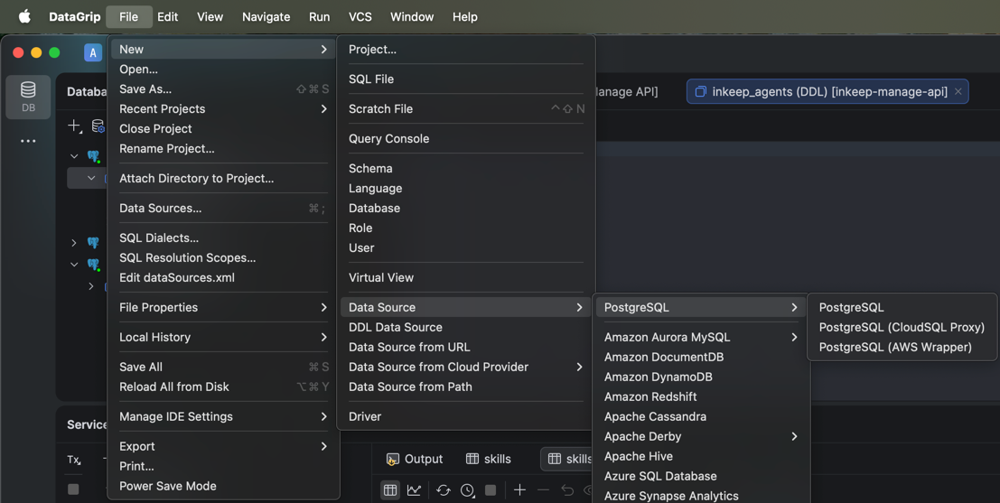
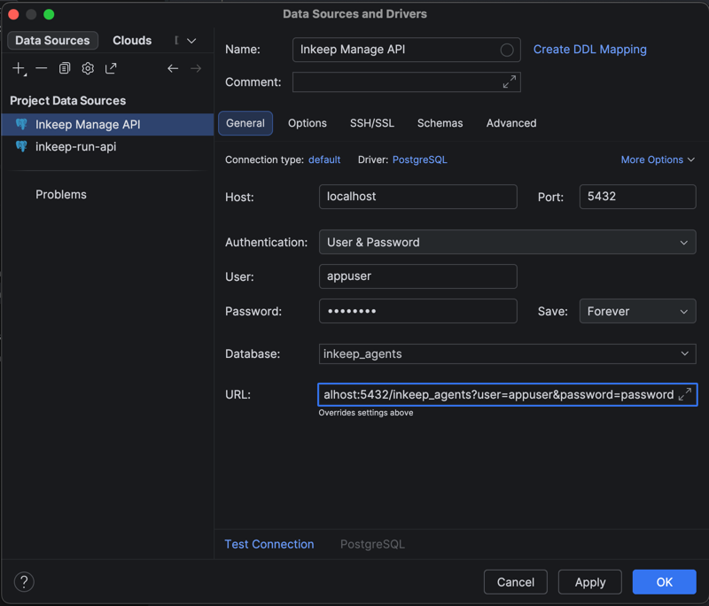
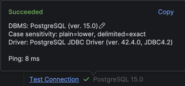
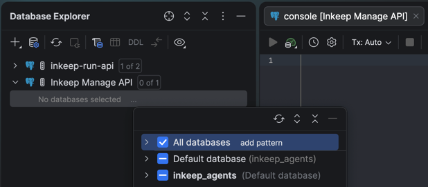
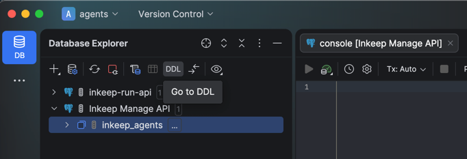
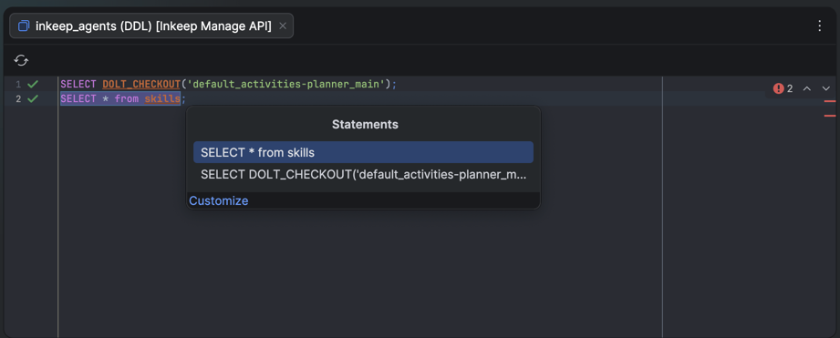
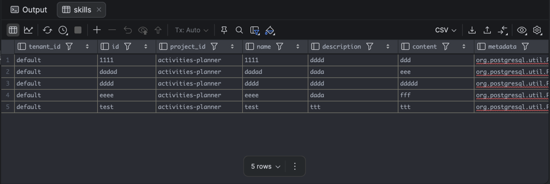

<Steps>
<Step>
## Download DataGrip

Install the latest version of DataGrip from JetBrains:
[DataGrip download](https://jetbrains.com/datagrip/download).
</Step>
<Step>
## Create a PostgreSQL data source

In DataGrip, go to:
`File -> New -> Data Source -> PostgreSQL -> PostgreSQL`.

<></>
</Step>
<Step>
## Fill data source details

Use this URL:

```text
jdbc:postgresql://localhost:5432/inkeep_agents?user=appuser&password=password
```

Or fill the fields with these values:

- Name: `Inkeep Manage API`
- User: `appuser`
- Password: `password`
- Database: `inkeep_agents`

<></>
</Step>
<Step>
## Test the connection

Click **Test Connection** and confirm it succeeds.

<></>
</Step>
<Step>
## Select databases

In **Database Explorer**, click the 3 dots next to **No databases selected** and select all databases.

<></>
</Step>
<Step>
## Go to DDL

Select the `inkeep_agents` database and click **Go to DDL**.

<></>
</Step>
<Step>
## Check out a Dolt branch and run a query

In the query console, check out the project branch first, then run your SQL.

Example for the default sample project:

```sql
SELECT DOLT_CHECKOUT('default_activities-planner_main');
SELECT * FROM skills;
```

General branch pattern:

```sql
SELECT DOLT_CHECKOUT('{tenant_id}_{project_id}_{branch}');
```

Run queries with `Cmd/Ctrl + Enter`, then choose the statement to execute.

<></>
</Step>
<Step>
## View results

Query results appear in the bottom panel of the IDE.

<></>
</Step>
</Steps>
