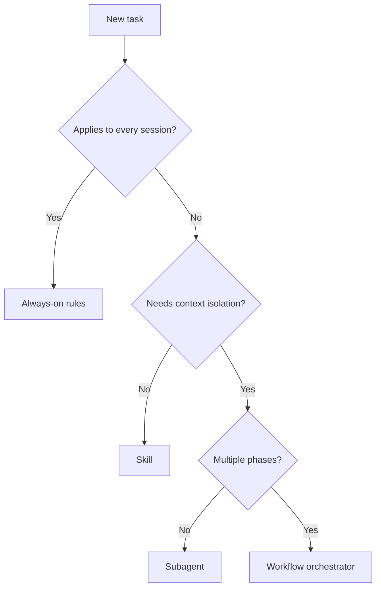

Not every task needs an agent. And not every agent needs to be an orchestrator. Start by choosing the lightest mechanism that reliably achieves the goal, then pick the right agent pattern if an agent is the answer.

## Agent vs skill vs always-on rules

Choose the lightest mechanism that reliably achieves the goal:

| If you need... | Prefer | Why |
|---|---|---|
| Always-on repo constraints (commands, conventions, non-negotiables) | **Always-on rules** | Applied everywhere; no routing needed |
| Reusable instructions that run in the **main** conversation context | **Skill** | Reuse without context isolation; easy to invoke interactively |
| A single specialized worker/reviewer with tool restrictions | **Subagent** | Isolated context + least-privilege tools |
| A multi-phase pipeline that coordinates other agents | **Workflow orchestrator** | Encodes phase order, dispatch, aggregation, iteration |

<Note>
Subagents cannot spawn other subagents. If you need multi-step specialization, orchestration must live in the top-level agent/session.
</Note>

### When to use always-on rules

Always-on rules are the simplest mechanism. Use them for constraints that apply to every interaction:

- Commit message formats
- Code style conventions
- Security non-negotiables
- Required commands before merging

These go in `AGENTS.md` (or equivalent) and are loaded into every session automatically.

### When to use skills

Skills are reusable instruction sets that run in the main conversation context. Use them when:

- The instructions need to be available on-demand across different agents
- You want reuse without the overhead of context isolation
- The workflow benefits from interactive back-and-forth with the user

### When to use a subagent

Subagents are isolated, single-purpose executors. Use them when:

- The task needs tool restrictions (e.g., read-only reviewer)
- You want to isolate high-volume output from the main conversation
- The task is self-contained with clear inputs and outputs
- You need parallel execution of independent tasks

### When to use a workflow orchestrator

Orchestrators coordinate multi-phase pipelines. Use them when:

- The task has distinct phases (research, plan, implement, review)
- Multiple subagents need to work together
- Results from one phase feed into the next
- Quality gates determine whether to iterate or proceed

## Subagent vs workflow orchestrator

Once you've decided an agent is the right mechanism, pick the lightest agent pattern that fits:

| Need | Choose | Practical effect |
|---|---|---|
| One job, one output (review, implement, diagnose, summarize) | **Subagent** | Simple scope, easier to validate; no Task tool needed |
| Multi-phase workflow (research → plan → implement → judge → iterate) | **Workflow orchestrator** | Needs Task tool; coordinates phases, dispatches subagents, aggregates results |
| Isolation for a single task, but no multi-phase orchestration | **Subagent** | Avoid writing orchestration logic unless needed |

### Subagent characteristics

- Does one job (review OR implement OR diagnose)
- Returns one report
- Does NOT use the Task tool
- Cannot spawn other subagents
- Preloads domain skills via `skills:` field
- Should have a strong output contract

### Orchestrator characteristics

- Runs a pipeline with explicit inputs/outputs per phase
- Spawns multiple subagents via the Task tool
- Aggregates outputs from parallel subagents
- Implements iteration loops with termination conditions
- Must run as the top-level session agent (not as a Task-spawned subagent)

## Mapping task characteristics to strictness

Different tasks need different levels of control:

| Strictness level | Task characteristics | Approach |
|---|---|---|
| **High freedom** | Reviews, audits, brainstorming | Heuristics + output contract |
| **Medium** | Refactors, migrations | Step sequence + required checks |
| **Low (strict)** | Fragile operations, deployments | Scripts/commands + strict validation loops |

## Decision flowchart

## Quick checklist

Before creating a new agent, verify:

- [ ] An always-on rule or skill isn't sufficient
- [ ] The task genuinely benefits from context isolation
- [ ] You've chosen the lightest pattern that fits (subagent if possible, orchestrator only when needed)
- [ ] You understand the [constraints](/guides/agent-engineering/workflow-orchestrators) (no nested spawning, fresh context per subagent)
