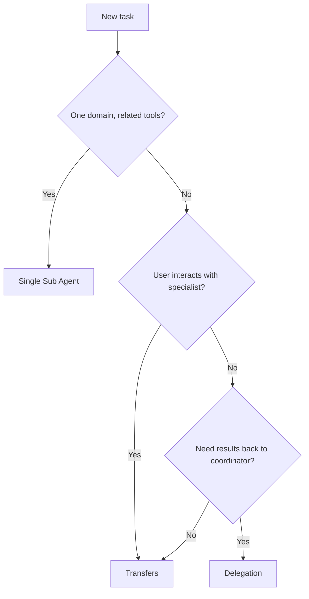

Not every task needs multiple agents. Start by choosing the simplest design that reliably achieves the goal, then add complexity only when you have a clear reason.

## Single Sub Agent vs multi-agent

The most fundamental design decision is whether your Agent needs one Sub Agent or several.

A **single Sub Agent** is the right starting point when:

- The task is well-scoped (answering questions, performing a set of related actions)
- All the tools the agent needs are thematically related
- The conversation doesn't need to shift between fundamentally different domains

A **multi-agent system** (multiple Sub Agents within one Agent) becomes valuable when:

- Different parts of the workflow require different expertise, tools, or prompts
- You want specialized agents that each do one thing well rather than a generalist that does many things adequately
- The conversation naturally routes between distinct domains (e.g., billing questions vs technical support)
- Some tasks are better handled as temporary subtasks that return results to a coordinator

### Rule of thumb

Keep each Sub Agent focused on 5-7 related tools. If you find yourself cramming unrelated capabilities into a single Sub Agent's prompt, that's a signal to split into multiple Sub Agents.

## Transfers vs delegation

Once you've decided on a multi-agent design, the next question is how your Sub Agents should interact. Inkeep supports two relationship types, each suited to different scenarios.

### Transfers

A **transfer** permanently hands conversation control from one Sub Agent to another. The source Sub Agent stops processing, and the target takes over the thread.

**Use transfers when:**

- The user will likely have follow-up questions for the specialist (customer support, troubleshooting)
- The conversation is moving into a different domain entirely
- The target Sub Agent needs to interact directly with the user

**Common pattern:** A router Sub Agent that analyzes the user's intent and transfers to the appropriate specialist.

```typescript
const routerSubAgent = subAgent({
  id: 'router',
  name: 'Router',
  description: 'Routes customer inquiries to specialized agents',
  prompt: `Analyze the customer's inquiry and route them:
    - Product questions → Transfer to QA agent
    - Order issues → Transfer to Order agent
    - Complex issues → Handle directly or escalate`,
  canTransferTo: () => [qaSubAgent, orderSubAgent],
});
```

### Delegation

A **delegation** passes a subtask to another Sub Agent while the source retains control. The delegate executes the task and returns its results to the source, which continues processing.

**Use delegation when:**

- You need a quick result from a specialist (data retrieval, calculation, lookup)
- The task is self-contained and doesn't require user interaction
- A coordinator needs to combine results from multiple specialists

**Common pattern:** A coordinator Sub Agent that breaks a complex task into subtasks and delegates each to a specialist.

```typescript
const coordinatorSubAgent = subAgent({
  id: 'coordinator',
  name: 'Research Coordinator',
  description: 'Coordinates multi-step research tasks',
  prompt: `When given a research task:
    1. Delegate to the data agent for raw information
    2. Delegate to the analysis agent for interpretation
    3. Synthesize the results into a final answer`,
  canDelegateTo: () => [dataSubAgent, analysisSubAgent],
});
```

### Quick comparison

| | Transfer | Delegation |
|---|---|---|
| **Control** | Permanently moves to the target | Stays with the source |
| **User interaction** | Target responds directly to the user | Only the source responds to the user |
| **Best for** | Domain routing, conversation handoffs | Subtasks, data retrieval, parallel work |
| **Think of it as** | "You take it from here" | "Do this for me and report back" |

### Combining both

Sub Agents can use both transfers and delegation simultaneously. A common pattern is a coordinator that delegates subtasks to specialists but can also transfer to a different agent when the conversation moves to a different domain.

```typescript
const supportSubAgent = subAgent({
  id: 'support',
  name: 'Technical Support',
  description: 'Handles technical support with research capabilities',
  prompt: `Help users with technical issues.
    - Delegate to the diagnostics agent for system checks
    - Transfer to billing if the issue is billing-related`,
  canDelegateTo: () => [diagnosticsSubAgent],
  canTransferTo: () => [billingSubAgent],
});
```

## Mapping task characteristics to strictness

Different tasks need different levels of control in the Sub Agent's prompt:

| Strictness level | Task characteristics | Prompt approach |
|---|---|---|
| **High freedom** | Open-ended questions, brainstorming, research | Heuristics + output guidelines |
| **Medium** | Structured workflows, data processing | Step sequence + required checks |
| **Low (strict)** | Sensitive operations, financial transactions | Explicit commands + validation loops |

A Sub Agent that answers product questions can be given broad latitude. A Sub Agent that modifies customer orders needs precise guardrails.

## Decision flowchart



## Quick checklist

Before finalizing your agent design:

- [ ] Start with the simplest pattern that works (single Sub Agent if possible)
- [ ] Each Sub Agent has a clear, focused responsibility
- [ ] Transfers are used for domain routing where the user interacts with the target
- [ ] Delegation is used for subtasks where results flow back to a coordinator
- [ ] Each Sub Agent has 5-7 related tools (not an overloaded grab-bag)
