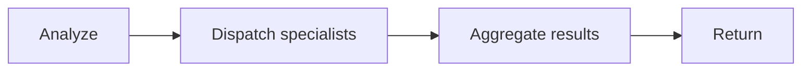
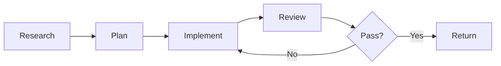

A multi-agent workflow uses a **coordinator Sub Agent** that delegates subtasks to specialized Sub Agents, aggregates their results, and drives the overall process forward. This is the most complex agent pattern — use it only when simpler patterns won't work.

## Single vs multi-agent

The first design decision is whether your Agent needs one Sub Agent or several.

A **single Sub Agent** is usually enough when:

- The task is well-scoped and stays in one domain
- Required tools are closely related
- The conversation does not need to switch between specialist domains

A **multi-agent workflow** is worth it when:

- Different phases require different expertise, prompts, or tools
- A coordinator must combine outputs from several specialists
- You need parallel specialist work and explicit quality gates

**Rule of thumb:** Keep each Sub Agent focused on 5-7 related tools. If one prompt starts looking like a grab-bag of unrelated capabilities, split it into specialists coordinated by a workflow.

## When to use a multi-agent workflow

A coordinator pattern fits when your task has:

- **Distinct phases** with different expertise requirements (research, then implement, then review)
- **Multiple specialists** whose results need to be combined
- **Quality gates** that determine whether to iterate or proceed
- **Parallel work** where independent subtasks can run simultaneously

If the task is a single job with one output, a single Sub Agent with the right tools is simpler and easier to debug.

## Transfers vs delegation

Multi-agent systems can coordinate in two ways, and many workflows use both.

### Transfers

A **transfer** permanently moves conversation control from one Sub Agent to another.

Use transfers when:

- The user is entering a different domain and should talk directly to a specialist
- Follow-up questions are expected for the specialist
- You are routing intent rather than collecting a one-off subtask result

### Delegation

A **delegation** sends a subtask to a specialist while the source agent keeps control.

Use delegation when:

- The task is self-contained and the specialist only needs to return a result
- A coordinator will synthesize multiple specialist outputs
- Parallel specialist work can reduce overall latency

### Quick comparison

| | Transfer | Delegation |
|---|---|---|
| **Control** | Permanently moves to target | Stays with source |
| **Who replies to user** | Target specialist | Source/coordinator |
| **Best for** | Domain routing and handoffs | Subtasks and aggregation |

## Designing the coordinator

The coordinator Sub Agent is the entry point. Its prompt should encode the workflow logic: what phases to run, when to delegate, and how to aggregate results.

## Delegation context and handoff structure

For reliable delegation, make the context packet explicit. The coordinator should pass:

```markdown
- **Objective:** What to accomplish
- **Why this is needed:** One sentence of context
- **Scope:** What to focus on
- **Non-goals:** What to avoid
- **Target files / areas:** Specific files or directories
- **Constraints:** Hard rules (must / must-not)
- **Required checks:** Tests, linters, commands
- **Output format:** Structure expected in the return
- **Done criteria:** What completion means
- **If blocked:** Fallback behavior
```

Not every subtask needs every field, but complex work should include most of them.

### Phase sequencing

For each phase of your workflow, define:

| Field | Description |
|-------|-------------|
| **Purpose** | What this phase accomplishes (1 sentence) |
| **Inputs** | What the phase needs to start |
| **Outputs** | What the phase must produce |
| **Quality gate** | What "pass" means |
| **Next phase** | What condition advances to the next phase |

Common phase patterns:





### Delegation rules

Make delegation deterministic in the coordinator's prompt:

- **Which specialists** to delegate to based on the task characteristics
- **What runs in parallel** — usually independent analyses or lookups
- **What must be sequential** — a plan must exist before implementation
- **Skip conditions** — when a phase can be omitted

**Practical rule:** If two subtasks don't depend on each other's outputs, delegate them in parallel.

```typescript
const reviewCoordinator = subAgent({
  id: 'review-coordinator',
  name: 'Review Coordinator',
  description: 'Coordinates multi-reviewer code reviews',
  prompt: `When given code to review:
    1. Delegate to security-reviewer for security analysis
    2. Delegate to docs-reviewer for documentation check
    3. Aggregate findings by severity
    4. Return a unified report

    Run security and docs reviews in parallel.
    Deduplicate findings that appear in both reviews.
    Sort by severity: CRITICAL > HIGH > MEDIUM > LOW.`,
  canDelegateTo: () => [securityReviewer, docsReviewer],
});
```

### Aggregation

When combining results from multiple delegates, your coordinator's prompt should specify:

**Dedup strategy:**
- Key by `(file, line/range, message)` or `(file, rule_id, location)` for structured findings

**Sort strategy:**
- Severity first: CRITICAL > HIGH > MEDIUM > LOW
- Then file path, then line number

**Counts:**
- Always compute counts per severity level

<Tip>
Give each specialist Sub Agent the same output format instructions in their prompts. Consistent return formats make aggregation reliable.
</Tip>

### Specialist return format

Use a consistent structure for specialist outputs so aggregation is deterministic:

```markdown
### TL;DR (2-5 bullets)

### Findings (prioritized)
- **Critical:** blocking issues
- **Warnings:** should-fix issues
- **Suggestions:** nice-to-have improvements

### Evidence
- Files + line ranges (or short excerpts)
- Commands run + key outputs (truncated)

### Recommended next actions
1. Highest priority
2. Second priority

### Open questions
- Only questions that materially affect next steps
```

### Iteration and retry

Define bounded iteration in the coordinator's prompt:

| Field | Description |
|-------|-------------|
| **Max iterations** | Commonly 2-3 |
| **Loop-back triggers** | What triggers another pass (e.g., CRITICAL findings, failing tests) |
| **Fix list** | What gets passed back into the implementation phase |
| **Termination** | What to return when max iterations are exceeded |

**Iteration flow:**

<Steps>
  <Step>
    Run the implementation phase (delegate to implementer)
  </Step>
  <Step>
    Run the review phase (delegate to reviewers in parallel)
  </Step>
  <Step>
    If quality gate passes, return the result
  </Step>
  <Step>
    If gate fails and iterations remain, extract actionable fix list and loop back
  </Step>
  <Step>
    If gate fails and max iterations reached, return with remaining blockers
  </Step>
</Steps>

### Quality gates

Each phase should have an explicit gate:

| Phase | Gate criteria |
|-------|-------------|
| **Research** | Returns key files and risks |
| **Plan** | Includes file list, step sequence, and validations |
| **Implement** | Changes compile and tests run |
| **Review** | 0 critical, 0 high findings |
| **Verify** | Tests pass |

## Procedural patterns for bounded workflows

Use these patterns in coordinator or specialist prompts when workflows need stronger reliability.

### Validation loops

```markdown
1. Complete the task
2. Run checks and capture output
3. If checks fail, fix and re-run (max 2 attempts)
4. If still failing, return status: BLOCKED with errors and attempted fixes
5. If checks pass, return status: COMPLETE
```

### Iteration policy

```markdown
- **Max iterations:** 2-3
- **Loop-back when:** quality gate fails with actionable fixes
- **Terminate when:** gate passes, max iterations reached, or blocked on external dependency
```

### Error handling

```markdown
- If file read fails: continue where possible and report skipped scope
- If checks cannot run: return status: BLOCKED with diagnostic output
- If API calls fail: retry once, then report failure
- Never silently swallow errors
```

## Structuring specialist prompts

Each specialist Sub Agent should have a focused prompt with:

1. **A clear role** — what it's responsible for and what it's not
2. **Scoped tools** — only the tools relevant to its specialty
3. **An output format** — consistent structure that the coordinator can parse

Specialists don't need to know about the coordinator or the overall workflow. Write each specialist's prompt as if it's the only agent that exists — the coordinator handles orchestration.

| Specialist prompt (avoid) | Specialist prompt (prefer) |
|---|---|
| "The coordinator will pass your findings to the implementer" | "Return findings in the format below" |
| "Unlike the security-reviewer, you focus on docs" | "Focus on documentation quality and completeness" |
| "You are part of a review pipeline" | "Review code for security vulnerabilities" |

## Output format

Even when specialist Sub Agents return structured results, the coordinator should produce:

- Human-readable summary
- Aggregated findings (sorted by severity)
- Evidence for high-severity items

If the coordinator's output will be consumed programmatically, include a structured block:

```json
{
  "status": "PASS | FAIL | BLOCKED",
  "phases_completed": ["research", "plan", "implement", "review"],
  "iterations": 2,
  "counts": {
    "critical": 0,
    "high": 1,
    "medium": 3,
    "low": 5
  }
}
```

## Common failure modes

| Failure mode | How to prevent it |
|---|---|
| **Inconsistent specialist outputs** | Use the same output format instructions in every specialist's prompt |
| **Infinite loops** | Set max iterations in the coordinator prompt with a clear FAIL output |
| **Coordinator doesn't aggregate** | Include explicit aggregation instructions (dedup, sort, count) |
| **Over-delegating simple tasks** | If a single Sub Agent with the right tools can do it, skip the coordinator pattern |

## Planning checklist

When designing a multi-agent workflow, define these upfront:

| Field | Description |
|-------|-------------|
| **Phases** | Ordered list (and which can run in parallel) |
| **Specialist roster** | Which Sub Agents to delegate to, and when |
| **Quality gates** | What must be true to advance or stop |
| **Iteration policy** | Max iterations; termination conditions |
| **Output format** | What the coordinator returns and in what structure |
