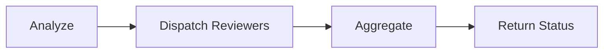
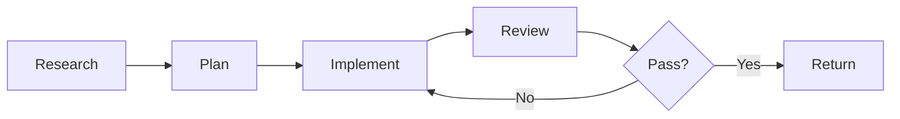

Workflow orchestrators are multi-phase coordinators that spawn subagents, aggregate results, and iterate with quality gates. They're the most complex agent pattern — use them only when simpler patterns won't work.

## When to use an orchestrator

Use a workflow orchestrator when your task has:

- **Distinct phases** with explicit inputs and outputs (research → plan → implement → review)
- **Multiple subagents** that need coordination
- **Quality gates** that determine whether to iterate or proceed
- **Aggregation** of results from parallel subagents

If the task is a single job with one output, use a [subagent](/guides/agent-engineering/choosing-patterns) instead.

## Non-negotiable constraints

Design around these constraints — they're fundamental to the architecture:

### 1. No nesting

Subagents cannot spawn other subagents. Therefore, orchestrators must run as the **top-level session agent**, not as a Task-spawned subagent.

### 2. Fresh context for each spawned agent

Each subagent starts with a blank slate. Provide a structured [handoff packet](/guides/agent-engineering/handoff-protocol) — don't assume they know "what just happened."

### 3. Skills are not inherited

If a reviewer needs a specific skill, it must declare it in its own frontmatter (or you must inline the relevant standards into the handoff).

### 4. Read-only exploration phases

If you want durable artifacts from exploration or planning phases, the orchestrator must write them (if it has Write access) based on the return packets.

## Orchestrator design checklist

### Phase sequencing

For each phase, define:

| Field | Description |
|-------|-------------|
| **Purpose** | What this phase accomplishes (1 sentence) |
| **Inputs** | What the phase needs to start |
| **Outputs** | What the phase must produce |
| **Quality gate** | What "pass" means |
| **Next phase trigger** | What condition advances to the next phase |

Common phase patterns:





### Subagent dispatch rules

Make dispatch deterministic:

- **Which subagents** to run based on changed file patterns or feature type
- **What runs in parallel** — usually independent reviews
- **What must be sequential** — plan must exist before implement
- **Skip conditions** — when a phase can be omitted

**Practical rule:** If two tasks don't depend on each other's outputs, run them in parallel.

### Aggregation rules

Aggregation is fragile without an output contract. Require each subagent to return findings in a structured format:

**Dedup strategy:**
- Key by `(file, line/range, message)` or `(file, rule_id, location)` for structured IDs

**Sort strategy:**
- Severity first: CRITICAL > HIGH > MEDIUM > LOW
- Then file path
- Then line number

**Counts:**
- Always compute counts per severity level

<Tip>
Use a shared "output contract" skill that every reviewer subagent preloads to prevent drift in return formats.
</Tip>

### Iteration and retry policy

Define bounded iteration:

| Field | Description |
|-------|-------------|
| **Max iterations** | Commonly 2-3 |
| **Loop-back triggers** | What triggers another pass (e.g., CRITICAL/HIGH findings, failing tests) |
| **Fix list** | What gets passed back into the implement phase |
| **Termination** | What to return when max iterations exceeded |

**Iteration flow:**

<Steps>
  <Step>
    Run implement phase
  </Step>
  <Step>
    Run review phase (parallel reviewers)
  </Step>
  <Step>
    If quality gate passes → return PASS
  </Step>
  <Step>
    If gate fails and iterations remain → extract actionable fix list, loop back to implement
  </Step>
  <Step>
    If gate fails and max iterations reached → return FAIL with remaining blockers and evidence
  </Step>
</Steps>

### Artifact passing strategy

Use a mixed approach based on size:

| Artifact size | Strategy |
|---|---|
| **Small** (< ~2-3 KB) | Pass in handoff packet text |
| **Large** (plans, research notes, many findings) | Write to disk and pass the file path forward |

Recommended artifact layout:

```
.workflow/feature-development/
├── research.md
├── plan.md
└── review.json
```

Keep artifacts scannable, with stable paths, and referenced explicitly in later phase handoffs.

### Quality gates

Each phase should have an explicit gate:

| Phase | Gate criteria |
|-------|-------------|
| **Research** | Returns key files + risks |
| **Plan** | Includes file list + step sequence + validations |
| **Implement** | Changes compiled / tests run (or explicit reason why not) |
| **Review** | 0 critical, 0 high findings |
| **Verify** | Tests pass |

## Built-in vs custom subagents

Orchestrators can spawn two kinds of subagents:

### Built-in agents

Provided by the runtime, no file needed. Examples: Explore, Plan, general-purpose. Typically optimized for common patterns.

**Use when:** Generic phases (research, planning) where you don't need domain skills or custom tool restrictions.

### Custom role agents

Defined in your agent directory with custom prompts, tool restrictions, and domain skills.

**Use when:**
- Domain skills need to be preloaded
- Specific tool restrictions are required (e.g., reviewers with no Write/Edit)
- Consistent output format is essential (e.g., all reviewers return the same finding schema)

## Orchestrator output contract

Even if subagents return structured JSON, the orchestrator should return:

- Human-readable summary
- Aggregated findings (sorted by severity)
- Evidence for high-severity items
- A final machine-readable JSON block

Minimum JSON fields:

```json
{
  "status": "PASS | FAIL | BLOCKED",
  "phases_completed": ["research", "plan", "implement", "review"],
  "iterations": 2,
  "subagents_run": ["security-reviewer", "docs-reviewer", "implementer"],
  "counts": {
    "critical": 0,
    "high": 1,
    "medium": 3,
    "low": 5
  },
  "artifact_paths": [".workflow/feature-development/review.json"]
}
```

## Common failure modes

| Failure mode | Guardrail |
|---|---|
| **Orchestrator used as subagent** | Include explicit constraint: "must run as top-level session agent." Add fallback: if Task tool unavailable, return instructions to invoke correctly |
| **Inconsistent reviewer outputs** | Shared output contract skill preloaded in every reviewer subagent |
| **Token bloat from big artifacts** | Write artifacts to disk and pass paths forward |
| **Infinite loops** | Max iterations + clear FAIL output with remaining blockers |
| **Over-triggering orchestration** | Near-miss `<example>` blocks in description that direct single-step requests to subagents |

## Orchestrator-specific agent brief

When planning an orchestrator, add these fields to the [agent brief](/guides/agent-engineering/prompt-structure#agent-brief-template):

| Field | Description |
|-------|-------------|
| **Phases** | Ordered list (and which can run in parallel) |
| **Subagent roster** | Which subagents to spawn, and when |
| **Artifact strategy** | What gets written to disk vs passed via handoff packets |
| **Quality gates** | What must be true to advance or stop |
| **Iteration policy** | Max iterations; termination conditions; what to do on repeated failure |
