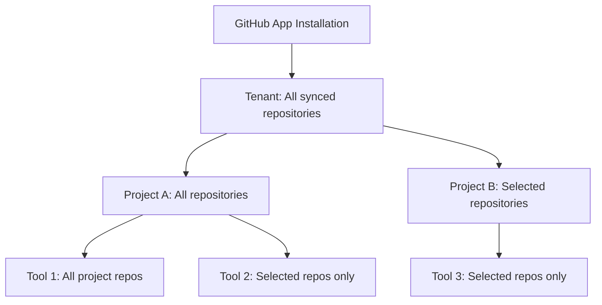

# Configure GitHub Repository Access

<Note>
This page is for **organization administrators**. It covers how to configure repository access at the project and tool levels after installing the GitHub App.
</Note>

After installing the GitHub App, configure which repositories your agents can access. Access control works at two levels: **project-wide settings** and **per-tool settings**.

## Access control hierarchy

Repository access flows through three levels:

| Level | Scope | Description |
|-------|-------|-------------|
| **Tenant** | Organization-wide | GitHub App installed, repositories synced |
| **Project** | Per-project | Controls which repositories agents in the project can access |
| **Tool** | Per-MCP tool | Further restricts access for specific GitHub MCP tools |

## Project repository access

Control which repositories are available to agents in a specific project.

### Access modes

| Mode | Description | Use case |
|------|-------------|----------|
| **All repositories** | Project can access all repositories from all GitHub installations | General-purpose projects needing broad access |
| **Selected repositories** | Project can only access explicitly chosen repositories | Restricted projects that should work with specific repos |

<Steps>
  <Step>
    ### Open GitHub settings

    Navigate to **Work Apps** → **GitHub** in the Inkeep dashboard. Select the GitHub installation you want to configure.
  </Step>
  <Step>
    ### Configure project access

    In the **Project Access** section, select a project and choose an access mode:
    - **All repositories** — The project can use all synced repositories from this installation
    - **Selected repositories** — Choose specific repositories from the list

    When using **Selected repositories**, check the boxes next to each repository you want to grant access to.
  </Step>
  <Step>
    ### Save changes

    Click **Save** to apply the configuration. Changes take effect immediately for agents in that project.
  </Step>
</Steps>

<Tip>
When you install a new GitHub App, all existing projects automatically get **All repositories** access. New projects created after the installation have no access by default — you must configure them explicitly.
</Tip>

## Tool-level access

For finer control, configure which repositories are available to specific GitHub MCP tools. This is useful when you want an agent to have broad read access but restricted write access.

### Tool access modes

| Mode | Description |
|------|-------------|
| **All repositories** | Tool can access all repositories the project has access to |
| **Selected repositories** | Tool is scoped to specific repositories (subset of project access) |

<Steps>
  <Step>
    ### Open tool settings

    Navigate to your project, then go to **Tools** in the sidebar. Select the GitHub MCP tool you want to configure.
  </Step>
  <Step>
    ### Configure repository access

    In the tool's **GitHub Access** section:
    - **All repositories** — The tool inherits all repository access from the project
    - **Selected repositories** — Choose specific repositories from those the project has access to
  </Step>
  <Step>
    ### Save changes

    Click **Save**. The tool can now only access the configured repositories.
  </Step>
</Steps>

<Note>
Tool-level access can only restrict access, not expand it. A tool can never access repositories that its parent project doesn't have access to.
</Note>

## Default behavior

| Event | Default access |
|-------|----------------|
| New GitHub App installed | All existing projects get **All repositories** mode |
| New project created | **No access** — must be configured explicitly |
| New GitHub MCP tool created | **All repositories** (inherits from project) |

## Syncing repositories

If you modify the GitHub App's repository access in GitHub's settings (adding or removing repositories), sync the changes in Inkeep:

<Steps>
  <Step>
    ### Open the installation

    Go to **Work Apps** → **GitHub** and select the installation.
  </Step>
  <Step>
    ### Sync repositories

    Click **Sync Repositories**. This fetches the current repository list from GitHub and updates Inkeep's records.
  </Step>
</Steps>

<Tip>
Repository syncing also happens automatically via GitHub webhooks when you add or remove repositories from the GitHub App's access.
</Tip>

## Permission model

| Action | Required role |
|--------|---------------|
| View GitHub installations | Organization member |
| View project repository access | Project viewer |
| Modify project repository access | Project editor or admin |
| Modify tool repository access | Project editor or admin |
| Sync repositories | Organization admin or owner |
| Disconnect/reconnect installations | Organization admin or owner |

## Next steps

<Cards>
  <Card title="Installation Guide" icon="LuDownload" href="/talk-to-your-agents/github/installation">
    Install the GitHub App and connect your repositories
  </Card>
  <Card title="API Reference" icon="LuFileCode" href="/api-reference/github">
    Manage GitHub installations programmatically
  </Card>
</Cards>
