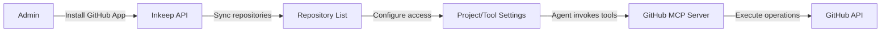

# GitHub Integration for Agents

<Note>
The GitHub integration is available on **Inkeep Cloud**. On cloud, the required environment variables are already configured — no setup needed on your end beyond installing the GitHub App.
</Note>

The GitHub integration connects your repositories to Inkeep agents, enabling them to search code, read files, create branches, commit changes, and open pull requests. This powers use cases like automated documentation updates, code-aware Q&A, and workflow automation.

## Key features

- **Repository access** — Connect GitHub organizations or user accounts and give agents access to search, read, and modify code
- **GitHub MCP Server** — Agents use GitHub tools to search files, read content, create branches, commit changes, and open pull requests
- **Flexible access control** — Configure which repositories each project and tool can access at a granular level
- **Automatic sync** — Repositories are automatically synced when the GitHub App is installed or updated

## How it works

1. An admin installs the Inkeep GitHub App on their organization or user account
2. Inkeep syncs the list of repositories the app can access
3. Admins configure which repositories each project or tool can use
4. Agents invoke GitHub MCP tools to perform operations like searching files or creating pull requests
5. The GitHub MCP Server executes operations against GitHub's API using installation tokens

## Available MCP tools

When you add the GitHub MCP Server to an agent, it gains access to these tools:

| Tool | Description |
|------|-------------|
| `search-files-in-repo` | Find files using GitHub's code search API |
| `get-file-content` | Read the content of a specific file |
| `get-pull-request-details` | Get PR details including commits and changed files |
| `get-file-patches` | Get patch/diff for specific files in a PR |
| `create-branch` | Create a new branch from an existing branch |
| `commit-file-changes` | Commit changes to existing files |
| `commit-new-file` | Create and commit a new file |
| `create-pull-request` | Open a pull request with specified reviewers |
| `leave-comment-on-pull-request` | Post a comment on a pull request |
| `add-comment-reaction` | Add a reaction to a PR comment |
| `remove-comment-reaction` | Remove a reaction from a PR comment |
| `list-comment-reactions` | List all reactions on a comment |

## Use cases

- **Code-aware Q&A** — Agents search and read code to answer technical questions with accurate, up-to-date information
- **Automated documentation** — Agents update documentation based on code changes or pull requests
- **Code review assistants** — Agents analyze PRs and leave review comments
- **Workflow automation** — Agents create branches, commit changes, and open pull requests as part of larger workflows

## Get started

<Cards>
  <Card title="Install GitHub App" icon="LuGithub" href="/talk-to-your-agents/github/installation">
    Connect your GitHub organization to Inkeep
  </Card>
  <Card title="Configure Repository Access" icon="LuSettings" href="/talk-to-your-agents/github/configuration">
    Set up which repositories agents can access
  </Card>
  <Card title="API Reference" icon="LuFileCode" href="/api-reference/github">
    Explore the GitHub management API endpoints
  </Card>
</Cards>
