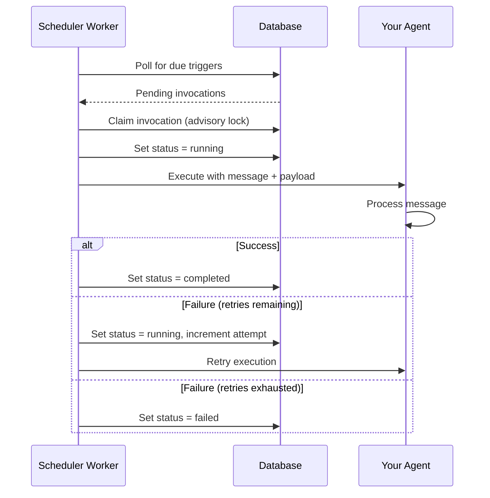
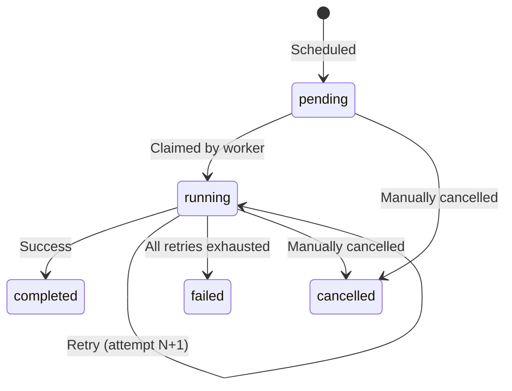

Scheduled triggers let you run agents automatically on a recurring schedule (cron) or at a specific future time (one-time). Unlike [webhook triggers](/talk-to-your-agents/triggers) that respond to external events, scheduled triggers are driven by time — daily reports, hourly health checks, periodic data syncs, or deferred tasks.

## How Scheduled Triggers Work



1. **You define a schedule** — a cron expression for recurring runs, or a timestamp for one-time execution
2. **The scheduler creates invocations** when the scheduled time arrives
3. **Each invocation is claimed and executed** with exactly-once semantics via advisory locks
4. **The agent processes the message** built from your template and payload
5. **Retries are automatic** — failed executions retry up to your configured limit

## When to Use Scheduled Triggers

| Use Case | Schedule | Example |
| --- | --- | --- |
| **Daily reports** | Cron | `0 9 * * MON-FRI` — Weekdays at 9 AM |
| **Health checks** | Cron | `0 * * * *` — Every hour |
| **Data syncs** | Cron | `*/15 * * * *` — Every 15 minutes |
| **Cleanup tasks** | Cron | `0 2 * * SUN` — Sundays at 2 AM |
| **Deferred execution** | One-time | Run at a specific future timestamp |
| **Migration tasks** | One-time | Execute once at a scheduled time |

## Schedule Types

### Cron Expressions (Recurring)

Cron triggers use standard 5-field cron syntax to define recurring schedules:

```
┌───────────── minute (0–59)
│ ┌───────────── hour (0–23)
│ │ ┌───────────── day of month (1–31)
│ │ │ ┌───────────── month (1–12)
│ │ │ │ ┌───────────── day of week (0–7 or MON–SUN)
│ │ │ │ │
* * * * *
```

**Common examples:**

| Expression | Description |
| --- | --- |
| `0 9 * * *` | Every day at 9:00 AM |
| `0 9 * * MON-FRI` | Weekdays at 9:00 AM |
| `*/15 * * * *` | Every 15 minutes |
| `0 */2 * * *` | Every 2 hours |
| `0 0 1 * *` | First day of every month at midnight |
| `30 14 * * WED` | Wednesdays at 2:30 PM |

#### Timezone Support

Cron expressions are evaluated in the timezone you specify via `cronTimezone`. This defaults to `UTC` and accepts any valid [IANA timezone identifier](https://en.wikipedia.org/wiki/List_of_tz_database_time_zones):

```typescript
const dailyReport = scheduledTrigger({
  name: 'Daily Report',
  cronExpression: '0 9 * * MON-FRI',
  cronTimezone: 'America/New_York', // 9 AM Eastern
  messageTemplate: 'Generate the daily report',
});
```

### One-Time Execution

One-time triggers run at a specific ISO 8601 timestamp and are automatically disabled after execution:

```typescript
const migrationTask = scheduledTrigger({
  name: 'Year-End Migration',
  runAt: '2025-12-31T23:59:59Z',
  messageTemplate: 'Run the end-of-year data migration',
});
```

<Note>
You must specify either `cronExpression` or `runAt`, but not both. The system validates this at creation time.
</Note>

## Trigger Configuration

| Option | Type | Required | Default | Description |
| --- | --- | --- | --- | --- |
| `name` | `string` | Yes | — | Human-readable name |
| `description` | `string` | No | — | Description of the trigger's purpose |
| `enabled` | `boolean` | No | `true` | Whether the trigger is active |
| `cronExpression` | `string` | One of `cronExpression` or `runAt` | — | 5-field cron expression for recurring execution |
| `cronTimezone` | `string` | No | `UTC` | IANA timezone for cron evaluation |
| `runAt` | `string` | One of `cronExpression` or `runAt` | — | ISO 8601 timestamp for one-time execution |
| `messageTemplate` | `string` | No | — | Template with `{{placeholder}}` syntax |
| `payload` | `object` | No | — | Static JSON payload passed to the agent |
| `maxRetries` | `number` | No | `1` | Max retry attempts on failure (0–10) |
| `retryDelaySeconds` | `number` | No | `60` | Seconds between retries (10–3600) |
| `timeoutSeconds` | `number` | No | `780` | Execution timeout in seconds (30–780) |

### Message Templates

Message templates use `{{placeholder}}` syntax to interpolate values from the `payload`:

```typescript
const weeklyDigest = scheduledTrigger({
  name: 'Weekly Digest',
  cronExpression: '0 8 * * MON',
  payload: {
    reportType: 'weekly',
    includeMetrics: true,
  },
  messageTemplate: 'Generate a {{reportType}} digest. Include metrics: {{includeMetrics}}',
});
```

When the trigger fires, the agent receives:
- A **text part** with the interpolated message: `"Generate a weekly digest. Include metrics: true"`
- A **data part** with the full payload object

If `messageTemplate` is omitted, the agent receives only the JSON-serialized payload.

### Retry Configuration

Failed executions are automatically retried based on your configuration:

```typescript
const resilientTask = scheduledTrigger({
  name: 'Critical Data Sync',
  cronExpression: '0 */4 * * *',
  messageTemplate: 'Sync data from external source',
  maxRetries: 5,           // Retry up to 5 times
  retryDelaySeconds: 120,  // Wait 2 minutes between retries
  timeoutSeconds: 600,     // Each attempt times out after 10 minutes
});
```

Each retry creates a new conversation with the agent. All conversation IDs are tracked on the invocation record so you can review each attempt.

## Invocation Tracking

Every scheduled execution creates an **invocation** record with full observability:

| Field | Description |
| --- | --- |
| **Status** | `pending` → `running` → `completed`, `failed`, or `cancelled` |
| **Scheduled For** | The time the invocation was scheduled to run |
| **Started At** | When execution actually began |
| **Completed At** | When execution finished |
| **Attempt Number** | Current attempt (1-based, increments on retry) |
| **Conversation IDs** | All conversations created across attempts |
| **Idempotency Key** | Ensures exactly-once execution |

### Invocation Statuses



## Manual Operations

### Run Now

Trigger an immediate execution of any scheduled trigger, regardless of its schedule:

```bash
POST /manage/tenants/{tenantId}/projects/{projectId}/agents/{agentId}/scheduled-triggers/{id}/run
```

This creates a new invocation scheduled for the current time and executes it immediately with the trigger's configured payload, message template, and retry settings.

### Rerun a Past Invocation

Rerun any completed, failed, or cancelled invocation:

```bash
POST /manage/tenants/{tenantId}/projects/{projectId}/agents/{agentId}/scheduled-triggers/{id}/invocations/{invocationId}/rerun
```

This creates a new invocation using the same trigger configuration and executes it immediately.

### Cancel an Invocation

Cancel a pending or running invocation:

```bash
POST /manage/tenants/{tenantId}/projects/{projectId}/agents/{agentId}/scheduled-triggers/{id}/invocations/{invocationId}/cancel
```

<Note>
Completed and failed invocations cannot be cancelled. Already-cancelled invocations return success without changes.
</Note>

### View Upcoming Runs

See all pending and running invocations across all scheduled triggers for an agent:

```bash
GET /manage/tenants/{tenantId}/projects/{projectId}/agents/{agentId}/scheduled-triggers/upcoming-runs
```

## Execution Guarantees

Scheduled triggers are designed for reliability:

- **Exactly-once execution** — Postgres advisory locks prevent duplicate execution across multiple workers
- **Automatic failover** — If a worker crashes, another worker picks up the pending invocations
- **Idempotency keys** — Each invocation has a unique key to prevent duplicate processing
- **Durable scheduling** — Schedules are stored in the database, not in memory

## Next Steps

<Cards>
  <Card title="Define in Code" icon="LuCode" href="/typescript-sdk/triggers/scheduled">
    Create scheduled triggers using the TypeScript SDK.
  </Card>
  <Card title="Webhook Triggers" icon="LuWebhook" href="/talk-to-your-agents/triggers">
    For event-driven execution from external services, use webhook triggers.
  </Card>
  <Card title="Chat API" icon="LuNetwork" href="/talk-to-your-agents/chat-api">
    For synchronous conversations, use the Chat API.
  </Card>
</Cards>
