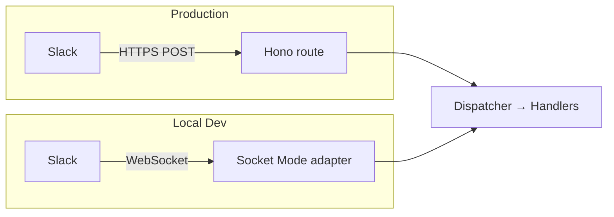

# Local Development Setup for Slack

Test Slack integrations locally without tunnels. The `setup-slack-dev` script creates a personal, isolated Slack app for each developer using [Socket Mode](https://api.slack.com/apis/socket-mode), which receives events over WebSocket instead of HTTP webhooks — no public URL required.

<Note>
This guide is for **developers** contributing to the Slack integration. If you're an admin looking to install the Slack app for your team, see [Install and Set Up the Slack App](/talk-to-your-agents/slack/installation).
</Note>

## How it works

In production, Slack sends events as HTTPS POST requests to a public endpoint. Locally, Socket Mode replaces that transport layer — everything downstream (the event dispatcher and handlers) stays the same.



Because Socket Mode distributes events randomly across all connected clients, each developer must have their own isolated Slack app — otherwise events get split unpredictably between multiple local servers.

## Prerequisites

- Slack workspace where you can install apps
- Monorepo dependencies installed (`pnpm install`)
- Permission to create Slack apps in your workspace

## Setup

<Steps>
  <Step>
    ### Run the setup script

    ```bash
    pnpm setup-slack-dev
    ```

    The script generates a unique identifier for your dev app (e.g. `frost-ember`) and walks you through two manual steps on first run.
  </Step>
  <Step>
    ### Provide your config refresh token

    The script will prompt you to paste a **Slack App Configuration Token** (a refresh token starting with `xoxe.xoxp-1-...`). This is used to create your personal Slack app via the API.

    Retrieve this from [api.slack.com/apps](https://api.slack.com/apps) under your profile → **Generate Token**.

    <Tip>
    The script handles token rotation automatically on subsequent runs — you only need to paste this once.
    </Tip>
  </Step>
  <Step>
    ### Provide your app-level token

    After the Slack app is created, the script opens a browser for the OAuth installation flow, then prompts you to paste an **app-level token** (`xapp-...`). This token enables Socket Mode.

    Retrieve it from your newly created app's settings under **Basic Information** → **App-Level Tokens**.
  </Step>
  <Step>
    ### Confirm credentials are written

    The script writes the following variables to your `.env` file:

    ```dotenv
    SLACK_CLIENT_ID=
    SLACK_CLIENT_SECRET=
    SLACK_SIGNING_SECRET=
    SLACK_APP_URL=http://localhost:3002
    SLACK_APP_TOKEN=xapp-...   # App-level token (Socket Mode)
    SLACK_BOT_TOKEN=xoxb-...   # Bot user token
    ```

    Configuration is also stored in `.slack-dev.json` (git-ignored) so re-runs require **zero manual steps**.
  </Step>
</Steps>

## Verify the setup

<Steps>
  <Step>
    ### Start the dev server

    ```bash
    pnpm dev
    ```
  </Step>
  <Step>
    ### Confirm Socket Mode is active

    Look for this line in the output:

    ```
    Slack Socket Mode client started
    ```
  </Step>
  <Step>
    ### Test in Slack

    @mention your dev bot in any Slack channel where it's been invited. The event should be received and processed by your local server.
  </Step>
</Steps>

## Troubleshooting

| Symptom | Fix |
|---------|-----|
| `User not linked` | Run `/inkeep link` in Slack to connect your account |
| `No agent configured` | An admin needs to set a workspace or channel default agent in the dashboard |
| Events not arriving | Verify the app is installed, the bot is invited to the channel, and `socket_mode_enabled: true` is set in your app's manifest |
| `@slack/socket-mode not installed` | Run `pnpm --filter @inkeep/agents-work-apps add -D @slack/socket-mode` |

## Re-runs

Once `.slack-dev.json` exists, re-running `pnpm setup-slack-dev` requires no manual input. The script reads persisted credentials, rotates the config token automatically, and refreshes your `.env`.

## Related

- [Install and Set Up the Slack App](/talk-to-your-agents/slack/installation) — admin guide for production installs
- [Configuration](/talk-to-your-agents/slack/configuration) — workspace and channel agent defaults
