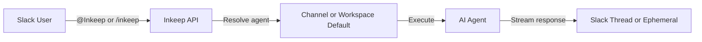

# Slack Work App

The Slack Work App brings your Inkeep agents directly into Slack. Team members can interact with agents through `@mentions` for public responses or `/inkeep` commands for private ones — no context switching required.

## Key features

- **Public responses** — `@Inkeep <message>` in any channel to get an agent response visible to everyone in a thread
- **Private responses** — `/inkeep <message>` for ephemeral responses only you can see, with multi-turn follow-up support
- **Thread context** — Mention `@Inkeep` in a thread to give the agent full conversation context
- **Agent configuration** — Set a workspace-wide default agent, or assign specific agents to individual channels
- **Account linking** — Each Slack user links their account to Inkeep via `/inkeep link` for personalized, secure access

## How it works

1. A user sends a message via `@Inkeep` or `/inkeep` in Slack
2. The Inkeep API verifies the user's identity and resolves the configured agent for that channel
3. The agent processes the message (with optional thread context) and returns a response
4. The response appears as a public thread reply (`@Inkeep`) or a private ephemeral message (`/inkeep`)

## Getting started

<Cards>
  <Card title="Install the Slack App" icon="LuDownload" href="/talk-to-your-agents/slack/installation">
    Set up the Slack app in your workspace
  </Card>
  <Card title="Commands Reference" icon="LuTerminal" href="/talk-to-your-agents/slack/commands">
    Learn all available slash commands and @mention patterns
  </Card>
  <Card title="Configure Agents" icon="LuSettings" href="/talk-to-your-agents/slack/configuration">
    Set up workspace and channel default agents
  </Card>
</Cards>
