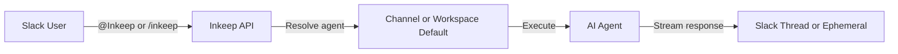

# AI Assistant for Slack

<Note>
The Slack integration is available on **Inkeep Cloud**. On cloud, the required environment variables are already configured — no setup needed on your end beyond installing the app.
</Note>

The AI Assistant for Slack brings your Inkeep agents directly into Slack. Team members can interact with agents through `@mentions` for public responses or `/inkeep` commands for private ones — no context switching required.

## Key features

- **Public responses** — `@Inkeep <message>` in any channel to get an agent response visible to everyone in a thread
- **Private responses** — `/inkeep <message>` for ephemeral responses only you can see, with multi-turn follow-up support
- **Thread context** — Mention `@Inkeep` in a thread to give the agent full conversation context
- **Agent configuration** — Set a workspace-wide default agent, or assign specific agents to individual channels
- **Account linking** — Unlinked users are automatically prompted to connect their Inkeep account when they first interact with the bot, and their original question resumes after linking

## How it works

1. A user sends a message via `@Inkeep` or `/inkeep` in Slack
2. The Inkeep API verifies the user's identity and resolves the configured agent for that channel
3. The agent processes the message (with optional thread context) and returns a response
4. The response appears as a public thread reply (`@Inkeep`) or a private ephemeral message (`/inkeep`)

## Which agent handles my request?

The app uses an **agent resolution priority** to decide which agent responds:

| Priority | Source | Set by | Scope |
|----------|--------|--------|-------|
| 1 | **Channel default** | Admin, via the dashboard | Only that channel |
| 2 | **Workspace default** | Admin, via the dashboard | All channels without a channel default |

If no agent is configured at either level, the bot prompts you to ask an admin to set one up in the dashboard.

<Tip>
Use `/inkeep status` in any channel to see which agent is active for that channel and how it was resolved.
</Tip>

## Get started

<Cards>
  <Card title="Admin: Install & Configure" icon="LuShield" href="/talk-to-your-agents/slack/installation">
    For workspace admins — install the app, set up agents, manage users
  </Card>
  <Card title="Using the Slack App" icon="LuMessageSquare" href="/talk-to-your-agents/slack/commands">
    For all team members — how to ask questions, link your account, and use commands
  </Card>
  <Card title="Dashboard Configuration" icon="LuSettings" href="/talk-to-your-agents/slack/configuration">
    For admins — workspace defaults, channel defaults, and user management
  </Card>
</Cards>
