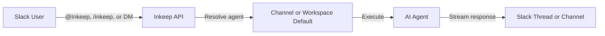

The Slack Work App brings your Inkeep agents directly into Slack. Team members can talk to agents by mentioning `@Inkeep` or by using `/inkeep` commands.

<Note>
The Slack integration is only available for [Inkeep Enterprise](https://inkeep.com/enterprise?cta_id=docs_nav).
</Note>

## Key features

- **`@Inkeep` and `/inkeep`** — Mention `@Inkeep` or use `/inkeep` commands in a channel or your DMs to talk to an Inkeep agent.
- **Channel configuration** — Set a workspace-wide default agent, or assign specific agents to individual channels

## How it works

1. A user sends a message via `@Inkeep`, `/inkeep`, a message shortcut, or a direct message
2. The Inkeep API verifies the user's identity and resolves the configured agent
3. The agent processes the message (with optional thread context) and streams a response
4. The agent replies in a thread (`@Inkeep`, message shortcuts, DMs) or at the channel root (`/inkeep`)

## Which agent handles my request?

The app uses an **agent resolution priority** to decide which agent responds:

| Priority | Source | Set by | Scope |
|----------|--------|--------|-------|
| 1 | **Channel default** | Admin, via the dashboard | Only that channel |
| 2 | **Workspace default** | Admin, via the dashboard | All channels without a channel default |

If no agent is configured at either level, the bot prompts you to ask an admin to set one up in the dashboard.

<Tip>
Use `/inkeep status` in any channel to see which agent is active for that channel and how it was resolved.
</Tip>

## Get started

<Cards>
  <Card title="Admin: Install & Configure" icon="LuShield" href="/talk-to-your-agents/slack/installation">
    Guide for Slack workspace admins — install the app, set up agents, manage users
  </Card>
  <Card title="Using the Slack App" icon="LuMessageSquare" href="/talk-to-your-agents/slack/commands">
    Guide for all team members — how to ask questions, link your account, and use commands
  </Card>
  <Card title="Dashboard Configuration" icon="LuSettings" href="/talk-to-your-agents/slack/configuration">
    Guide for admins — workspace defaults, channel defaults, and user management
  </Card>
</Cards>
