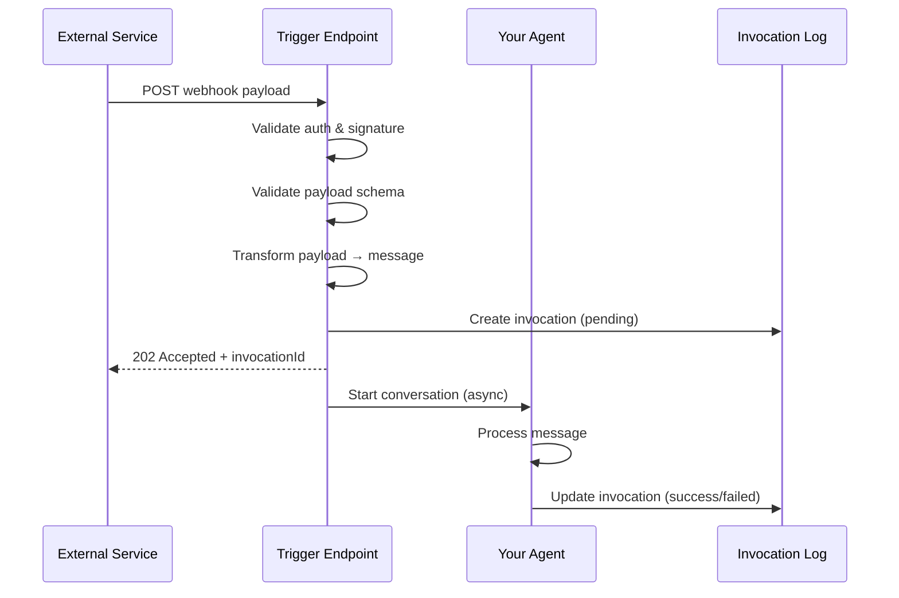

Triggers create webhook endpoints that allow external services to invoke your Agents via HTTP. When a service like GitHub, Slack, or Stripe sends a webhook, the payload is validated, transformed, and used to start a new conversation with your Agent.

## How Triggers Work



1. **External service sends a webhook** to your trigger's URL
2. **Authentication is verified** (custom headers or signature)
3. **Payload is validated** against the input schema (if configured)
4. **Payload is transformed** using the message template
5. **Invocation is logged** and the webhook returns immediately with `202 Accepted`
6. **Agent processes the message** asynchronously in a new conversation

## When to Use Triggers

Triggers are ideal for:

| Use Case | Example |
| --- | --- |
| **CI/CD pipelines** | Trigger code review agents on PR creation |
| **Customer events** | Respond to Stripe payment webhooks |
| **DevOps alerts** | Process PagerDuty or Datadog alerts |
| **Chat integrations** | Handle Slack or Discord messages |
| **Form submissions** | Process Typeform or webhook-enabled forms |
| **Scheduled tasks** | Invoke agents from cron jobs or schedulers |

<Warning>
**User-scoped MCP servers are not supported with triggers.** Webhook triggers do not have user context, so the framework cannot determine which user's credentials to use. Use only project-scoped MCP servers with trigger-invoked agents. See [User vs Project MCPs](/deployment/inkeep-cloud/user-vs-project-mcp) for more details.
</Warning>

## Trigger Configuration

Each trigger is configured with:

### Required

- **Name**: Human-readable identifier for the trigger
- **Message Template**: Template that converts the webhook payload into a message for the Agent

### Optional

- **Input Schema**: JSON Schema to validate incoming payloads
- **Authentication**: Custom headers with expected values
- **Signing Secret**: HMAC-SHA256 signature verification (for GitHub, Slack, etc.)
- **Output Transform**: Reshape payloads before interpolating the message template. Choose one approach:
  - **Object Transformation**: Simple field remapping (recommended for basic use cases)
  - **JMESPath**: Complex transformations like filtering arrays or restructuring nested data

## Authentication Options

Triggers support flexible header-based authentication:

| Configuration | Use Case |
| --- | --- |
| Custom header (e.g., `X-API-Key`) | Simple API key authentication |
| `Authorization` header with Bearer token | OAuth-style authentication |
| Multiple headers | Multi-factor authentication |
| Signing secret only | Webhooks from services that sign requests |
| No authentication | Public webhooks (use with caution) |

```typescript
// Example: Require a custom API key header
authentication: {
  headers: [
    { name: "X-API-Key", value: process.env.MY_API_KEY },
  ],
}
```

<Note>
Header values are securely hashed before storage. For services that sign webhooks (GitHub, Stripe, Slack), you can rely on `signingSecret` alone for security.
</Note>

## Webhook URL Format

After creating a trigger, the webhook URL follows this pattern:

```
POST https://<your-run-api>/tenants/{tenantId}/projects/{projectId}/agents/{agentId}/triggers/{triggerId}
```

You can find the complete webhook URL in the API response when creating or listing triggers.

## Invocation Tracking

Every webhook invocation is tracked with:

- **Status**: `pending` → `success` or `failed`
- **Request Payload**: The original webhook body
- **Transformed Payload**: The payload after transformation
- **Conversation ID**: The conversation created for this invocation
- **Error Message**: Details if the invocation failed

This allows you to monitor webhook activity, debug failures, and audit trigger usage.

## Example: GitHub Issue Handler

Here's a conceptual example of a trigger that responds to GitHub issues:

```typescript
// When GitHub sends: { action: "opened", issue: { title: "Bug report", body: "..." }, ... }
// The trigger creates a message like:
// "New GitHub issue opened: Bug report\n\nDescription: ..."
// And starts a conversation with your support agent
```

The Agent then processes this message like any other conversation, using its configured tools and sub-agents to respond.

## Next Steps

<Cards>
  <Card title="Define Triggers in Code" icon="LuCode" href="/typescript-sdk/triggers/webhooks">
    Learn how to create and configure webhook triggers using the TypeScript SDK.
  </Card>
  <Card title="Chat API" icon="LuNetwork" href="/talk-to-your-agents/chat-api">
    For synchronous conversations, use the Chat API instead.
  </Card>
</Cards>
