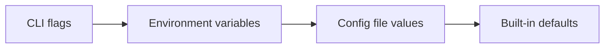

<SkillRule
  id="workspace-config-overview"
  skills="typescript-sdk"
  title="Workspace Configuration File"
  description="Structure and options for inkeep.config.ts"
>

## Overview

The `inkeep.config.ts` file at the workspace root defines settings for all projects in this workspace. See [Project Management](/typescript-sdk/project-management) for where this file should be placed.

```typescript
import { defineConfig } from "@inkeep/agents-cli/config";
import "dotenv/config";

export default defineConfig({
  tenantId: 'my-company',
  agentsApi: {
    url: 'http://localhost:3002',
    apiKey: process.env.API_KEY, // Optional
  },
  outputDirectory: "./output",
});
```

<AutoTypeTable
  name="default"
  type="export { NestedInkeepConfig as default } from '@inkeep/agents-cli/config'"
/>

<AutoTypeTable
  name="default"
  type="export { ApiConfig as default } from '@inkeep/agents-cli/config'"
/>

</SkillRule>

<SkillRule
  id="config-hierarchy"
  skills="typescript-sdk"
  title="Configuration Priority Hierarchy"
  description="How CLI flags, env vars, and config file values are resolved"
>

## Configuration hierarchy

One can override the settings in `inkeep.config.ts` by setting the following settings in this order (highest to lowest priority):



### 1. CLI Flags

Command-line flags override all other settings:

```bash
# Override API URL
inkeep push --agents-api-url https://api.production.com

# Override config file location
inkeep pull --config /path/to/custom.config.ts
```

### 2. Environment Variables

Environment variables override config file values:

```bash
# Set via environment
export INKEEP_TENANT_ID=staging-tenant
export INKEEP_AGENTS_API_URL=https://api.staging.com

# Now CLI commands use these values
inkeep push
```

**Supported Environment Variables:**

| Variable | Config Equivalent | Description |
|----------|-------------------|-------------|
| `INKEEP_TENANT_ID` | `tenantId` | Tenant identifier |
| `INKEEP_AGENTS_API_URL` | `agentsApi.url` | Agents API URL |

</SkillRule>

### 3. Config File Values

Values explicitly set in your `inkeep.config.ts`:

```typescript
export default defineConfig({
  tenantId: 'my-tenant',
  agentsApi: {
    url: 'http://localhost:3002',
  },
});
```

### 4. Built-in Defaults

Default values used when not specified elsewhere:

```typescript
const defaults = {
  agentsApiUrl: 'http://localhost:3002',
  manageUiUrl: 'http://localhost:3000',
};
```

## Working with multiple configurations

### Dynamic configuration

You can use environment-based logic in your workspace config:

```typescript
// inkeep.config.ts
import { defineConfig } from "@inkeep/agents-cli/config";

const isDevelopment = process.env.NODE_ENV === "development";

export default defineConfig({
  tenantId: process.env.TENANT_ID || 'default-tenant',
  agentsApi: {
    url: isDevelopment
      ? 'http://localhost:3002'
      : 'https://api.production.com',
  },
});
```

### Multiple configuration files

For workspaces requiring different configurations:

```typescript
// inkeep.config.ts
export default defineConfig({
  tenantId: 'production-tenant',
  agentsApi: {
    url: 'https://api.production.com',
  },
});
```

```typescript
// inkeep.dev.config.ts
export default defineConfig({
  tenantId: 'dev-tenant',
  agentsApi: {
    url: 'http://localhost:3002',
  },
});
```

```bash
# Use development config (specify from any project directory)
inkeep push --config ../inkeep.dev.config.ts
# or with absolute path
inkeep push --config /path/to/workspace/inkeep.dev.config.ts
```
