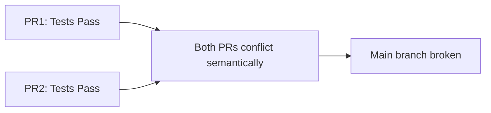

# Merge Queues vs Concurrency Groups for GitHub Actions

## 📊 Comparison Overview

### Current Approach: Concurrency Groups
```yaml
concurrency:
  group: ${{ github.workflow }}-${{ github.ref }}
  cancel-in-progress: true
```

**How it works:** Automatically cancels in-progress workflow runs when a new commit is pushed to the same branch.

### Alternative: GitHub Merge Queue
```yaml
on:
  merge_group:
    types: [checks_requested]
```

**How it works:** Queues PRs and tests them sequentially with the latest main branch before merging.

## 🎯 When to Use Each Approach

### Use Concurrency Groups When:
- **Rapid iteration** on feature branches is common
- **Solo developers** or small teams working on separate features
- **Resource conservation** is a priority
- **Quick feedback** is more important than comprehensive testing
- Working on **non-critical** codebases

### Use Merge Queues When:
- **Multiple developers** frequently merge to main
- **Critical production** code requiring high reliability
- **Merge conflicts** are common
- **"Merge skew"** issues occur (tests pass on PR but fail after merge)
- **Sequential validation** of changes is important

## 🔄 Merge Queue Benefits

### 1. **Prevents Semantic Conflicts**

Merge queue prevents this by testing PR2 with PR1's changes already included.

### 2. **Automatic Retry and Batching**
- Groups compatible PRs together for efficiency
- Automatically retries failed PRs after others merge
- Maintains a always-green main branch

### 3. **Better Resource Utilization**
- No wasted runs from cancellations
- Predictable CI load
- Efficient batching of compatible changes

## 🚀 Implementation Guide

### Step 1: Enable Merge Queue (Repository Settings)

1. Go to Settings → General → Pull Requests
2. Enable "Require merge queue"
3. Configure merge queue settings:
   ```yaml
   Merge method: Squash and merge
   Maximum PRs to build: 5
   Maximum PRs to merge: 2
   Timeout: 60 minutes
   ```

### Step 2: Update Workflow Files

```yaml
name: CI with Merge Queue

on:
  pull_request:
  merge_group:  # Add this trigger
    types: [checks_requested]

jobs:
  test:
    # Remove concurrency group for merge_group events
    if: github.event_name != 'merge_group'
    concurrency:
      group: ${{ github.workflow }}-${{ github.ref }}
      cancel-in-progress: true
    
    # Your existing job configuration
    steps:
      - uses: actions/checkout@v4
      # ... rest of your steps
```

### Step 3: Update Branch Protection Rules

```yaml
Required status checks:
  - ci/test
  - ci/typecheck
  - ci/lint

Require branches to be up to date: true
Require merge queue: true
```

## 📈 Performance Impact Analysis

| Scenario | Concurrency Groups | Merge Queue |
|----------|-------------------|-------------|
| **5 PRs/hour, no conflicts** | ✅ Faster (parallel) | ❌ Slower (sequential) |
| **20 PRs/hour, some conflicts** | ⚠️ Many cancelled runs | ✅ Efficient batching |
| **Semantic conflicts common** | ❌ Broken main branch | ✅ Always green main |
| **Resource usage** | ⚠️ Wasted on cancellations | ✅ Predictable |
| **Feedback speed** | ✅ Immediate | ⚠️ Queued |

## 🎯 Recommended Approach for Your Repository

Based on your repository's profile:
- **Current PR volume**: Moderate
- **Team size**: Growing
- **Criticality**: Production system

### Hybrid Approach (Recommended)

```yaml
name: Optimized CI

on:
  pull_request:
    types: [opened, synchronize, reopened]
  merge_group:
    types: [checks_requested]
  push:
    branches: [main]

jobs:
  test:
    runs-on: ubuntu-latest
    # Only use concurrency for PR updates, not merge queue
    concurrency:
      group: ${{ github.event_name == 'pull_request' && format('pr-{0}', github.event.pull_request.number) || format('{0}-{1}', github.workflow, github.sha) }}
      cancel-in-progress: ${{ github.event_name == 'pull_request' }}
    
    steps:
      - uses: actions/checkout@v4
      
      # Fetch depth for merge queue to get base branch
      - if: github.event_name == 'merge_group'
        run: git fetch --depth=2 origin +refs/heads/main:refs/remotes/origin/main
      
      # Your existing steps...
```

This approach:
- ✅ Cancels outdated PR runs (saves resources during development)
- ✅ Doesn't cancel merge queue runs (ensures reliability)
- ✅ Tests with latest main before merging (prevents conflicts)

## 🔧 Additional Optimizations for Merge Queue

### 1. **Parallel Job Execution**
```yaml
merge_group:
  jobs:
    - test
    - typecheck
    - lint
  parallel: true  # Run all jobs in parallel
```

### 2. **Smart Batching Rules**
```yaml
merge_queue_config:
  grouping_strategy:
    - by: labels
      pattern: "safe-to-batch"
    - by: paths
      pattern: "docs/**"  # Batch documentation changes
```

### 3. **Priority Queue**
```yaml
# In PR description or labels
priority: high  # Jumps to front of queue
priority: low   # Processed after normal PRs
```

## 📊 Monitoring and Metrics

Track these metrics to evaluate effectiveness:

```bash
# GitHub CLI commands to monitor merge queue
gh api /repos/{owner}/{repo}/merge-queue/entries
gh api /repos/{owner}/{repo}/actions/runs?event=merge_group

# Or use our profiling script
pnpm workflow:profile --workflow "merge"
```

Key metrics:
- **Queue depth**: Average number of PRs waiting
- **Time in queue**: How long PRs wait before merging
- **Failure rate**: Percentage of PRs failing in queue
- **Batch efficiency**: Average PRs merged per batch

## 🎯 Decision Matrix

| If your repository has... | Use this approach |
|--------------------------|-------------------|
| < 10 PRs/day, small team | Concurrency groups only |
| 10-50 PRs/day, medium team | Hybrid approach |
| > 50 PRs/day, large team | Full merge queue |
| Critical production code | Merge queue required |
| Frequent semantic conflicts | Merge queue required |
| Mostly independent features | Concurrency groups sufficient |

## 🚦 Migration Path

1. **Week 1-2**: Keep concurrency groups, monitor cancellation rate
2. **Week 3-4**: Enable merge queue for `main` branch only
3. **Week 5-6**: Add batching rules and optimize
4. **Week 7+**: Remove concurrency groups if queue is working well

## 📝 Example Configuration for Your Repo

Based on your current setup, here's the recommended configuration:

```yaml
# .github/workflows/test-optimized-with-queue.yml
name: CI with Smart Concurrency

on:
  pull_request:
    types: [opened, synchronize, reopened]
  merge_group:
    types: [checks_requested]
  push:
    branches: [main]

env:
  TURBO_TOKEN: ${{ secrets.TURBO_TOKEN }}
  TURBO_TEAM: ${{ secrets.TURBO_TEAM }}

jobs:
  test-and-typecheck:
    runs-on: ubuntu-latest
    
    # Smart concurrency: cancel PR runs but not merge queue
    concurrency:
      group: ${{ 
        github.event_name == 'pull_request' && 
        format('pr-test-{0}', github.event.pull_request.number) || 
        format('merge-{0}', github.sha) 
      }}
      cancel-in-progress: ${{ github.event_name == 'pull_request' }}
    
    steps:
      - uses: actions/checkout@v4
        with:
          # Ensure we have enough history for merge queue
          fetch-depth: ${{ github.event_name == 'merge_group' && 2 || 1 }}
      
      # Cache configuration (same as before)
      - name: Setup build cache
        uses: actions/cache@v4
        with:
          path: |
            **/dist
            **/.turbo
            **/.next
          key: ${{ runner.os }}-build-${{ github.sha }}
          restore-keys: |
            ${{ runner.os }}-build-
      
      # Your optimized build and test steps...
      - run: pnpm install --frozen-lockfile
      - run: pnpm build --cache-dir=.turbo
      - run: pnpm test & pnpm typecheck & wait
```

This gives you the best of both worlds: resource efficiency during development and reliability for production merges.
