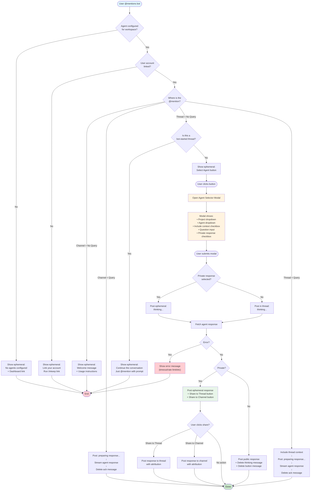

# Slack @Mention User Flow

## Flow Diagram



## User Scenarios

| Scenario | User Action | Bot Response |
|----------|-------------|--------------|
| **No config** | `@bot` | Ephemeral: "No agents configured" + dashboard link |
| **Not linked** | `@bot` | Ephemeral: "Link your account" + `/inkeep link` |
| **Channel, no query** | `@bot` | Ephemeral: Welcome message with usage |
| **Channel, with query** | `@bot how do I...` | Public thread: Streamed response |
| **Thread, no query (user thread)** | `@bot` | Ephemeral: "Select Agent" button → Modal |
| **Thread, no query (bot thread)** | `@bot` | Ephemeral: "Just @mention with your prompt" |
| **Thread, with query** | `@bot summarize this` | Public thread: Context + streamed response |
| **Modal submit (public)** | Submit modal | Thinking → Public response → Cleanup |
| **Modal submit (private)** | Submit with private checked | Ephemeral thinking → Ephemeral response + Share buttons |

## Share Button Logic

Share buttons are **only shown on ephemeral (private) responses**:

| Context | Buttons Shown | Behavior |
|---------|---------------|----------|
| **Private response in thread** | "Share to Thread" (primary) + "Share to Channel" | User chooses where to share |
| **Private response in channel** | "Share to Channel" only | No thread to share to |
| **Public response** | None | Content already visible to everyone |

**Button Actions:**
- **Share to Thread** - Posts the response in the current thread (contextual, less intrusive)
- **Share to Channel** - Posts the response in the main channel (broadcasts to all)

## Markdown to mrkdwn Conversion

Agent responses in standard Markdown are automatically converted to Slack's mrkdwn format:

| Markdown | Slack mrkdwn |
|----------|-------------|
| `# Header` | `*Header*` (bold) |
| `**bold**` | `*bold*` |
| `[text](url)` | `<url\|text>` |
| `~~strike~~` | `~strike~` |

## Error Handling

Users see friendly, actionable error messages based on error type:

| Error Type | User Message | Cause |
|------------|--------------|-------|
| **Timeout** | "Request timed out" + suggestions to simplify | Agent took too long (>30s) |
| **Rate Limit** | "Too many requests" + wait message | 429 status from API |
| **Auth Error** | "Authentication issue" + link instructions | 401/403 from API |
| **API Error** | "Something went wrong" + retry suggestions | Other 4xx/5xx errors |
| **Unknown** | "Unexpected error" + retry suggestions | Network issues, etc. |

Error messages are posted as ephemeral when possible (only visible to user), falling back to thread messages if needed. Error responses do NOT include share buttons.

## Agent Resolution for @Mentions

For @mentions, the resolution priority is:

```
Channel config > Workspace default
```

This is the same resolution order used for slash commands.

## Code Organization

```
packages/agents-work-apps/src/slack/services/events/
├── index.ts              # Module exports with flow documentation
├── app-mention.ts        # Main @mention event handler
├── block-actions.ts      # Button click handlers (share, modal trigger)
├── modal-submission.ts   # Agent selector modal form submission
├── streaming.ts          # Agent response streaming to Slack
└── utils.ts              # Shared utilities
    ├── markdownToMrkdwn()    - Convert MD to Slack format
    ├── classifyError()        - Categorize errors for UX
    ├── getUserFriendlyErrorMessage() - Human-readable errors
    ├── fetchProjectsForTenant() - Get projects via API
    ├── fetchAgentsForProject()  - Get agents via API
    ├── getChannelAgentConfig()  - Resolve agent for channel
    ├── getThreadContext()       - Get thread messages
    ├── sendResponseUrlMessage() - Send via response_url
    └── generateSlackConversationId() - Create conversation ID
```

## Key Files

| File | Purpose |
|------|---------|
| `services/events/app-mention.ts` | Main @mention handler - routes based on context |
| `services/events/block-actions.ts` | Button handlers for share and modal trigger |
| `services/events/modal-submission.ts` | Processes agent selector modal submission |
| `services/events/streaming.ts` | Streams agent responses with real-time updates |
| `services/events/utils.ts` | Shared utilities for error handling, API calls, formatting |
| `services/modals.ts` | Builds the agent selector modal UI |
| `services/agent-resolution.ts` | Agent priority resolution logic |
| `routes/events.ts` | Routes Slack events to handlers |

---

*See also: [SLASH_COMMANDS.md](./SLASH_COMMANDS.md) for `/inkeep` command flows*
