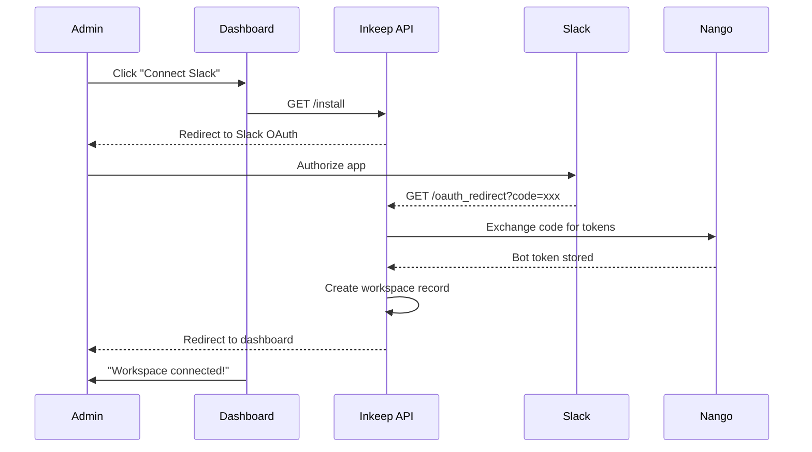
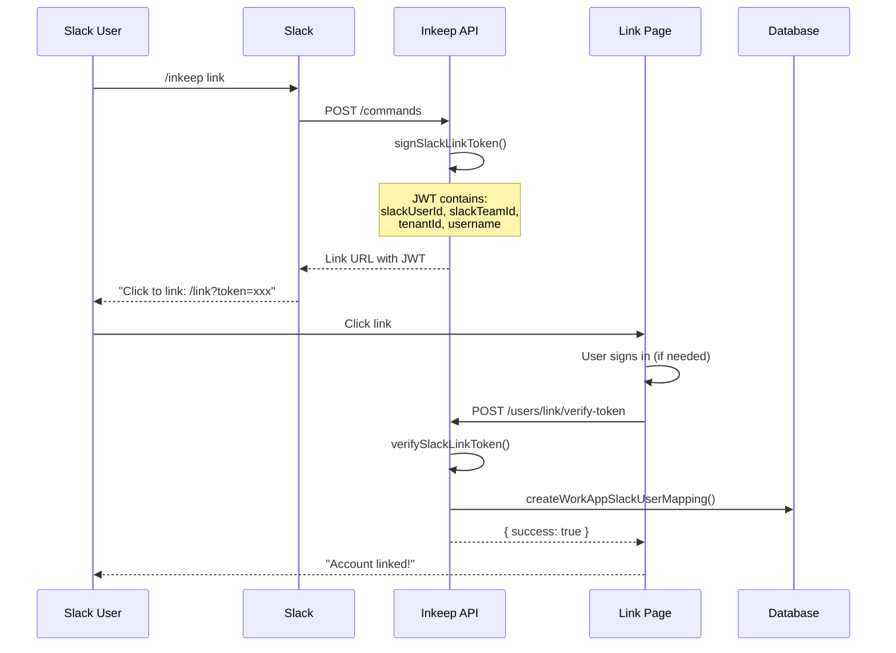
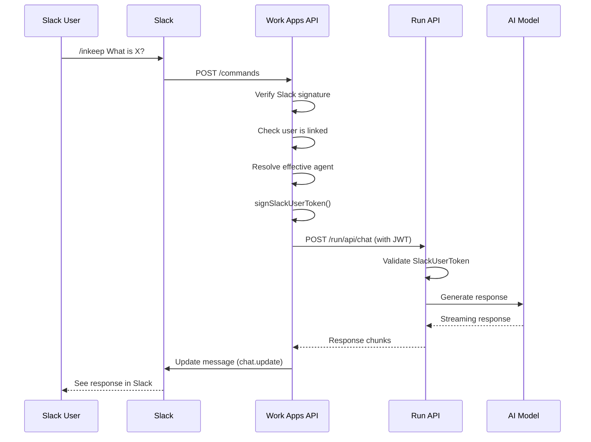

# User Flows

> Part of the [Slack Work App Technical Documentation](../INDEX.md)

## 1. Workspace Installation Flow



---

## 2. User Linking Flow (JWT-Based)



---

## 3. Agent Query Flow



---

## 4. Agent Resolution Flow

### For `/inkeep` slash commands (user-controlled)

```mermaid
flowchart TD
    A[/inkeep command] --> B{User has personal default?}
    B -->|Yes| C[Use user default]
    B -->|No| D{Channel has agent config?}
    D -->|Yes| E[Use channel default]
    D -->|No| F{Workspace has default?}
    F -->|Yes| G[Use workspace default]
    F -->|No| H[Error: No agent configured]
    
    C --> I[Generate SlackUserToken]
    E --> I
    G --> I
    I --> J[Call /run/api/chat]
    J --> K[Stream response to Slack]
```

### For `@Inkeep` mentions (admin-controlled)

- Channel config > Workspace default
- User personal defaults are **ignored** for public @mention responses

### Priority Summary

| Context | Priority |
|---------|----------|
| `/inkeep` commands | User personal > Channel > Workspace |
| `@Inkeep` mentions | Channel > Workspace (admin-controlled) |

---

## Detailed Flow Documentation

For more detailed flow diagrams with all edge cases:

- [SLASH_COMMANDS.md](./SLASH_COMMANDS.md) - `/inkeep` command flows
- [MENTIONS.md](./MENTIONS.md) - `@Inkeep` mention flows
