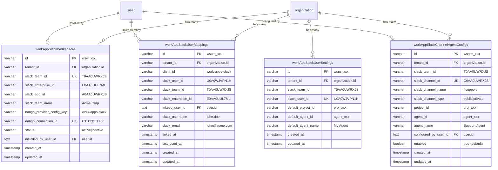

# Database Design

> Part of the [Slack Work App Technical Documentation](../INDEX.md)

## Entity Relationship Diagram



---

## Table Purposes

| Table | Purpose | Unique Constraint |
|-------|---------|-------------------|
| `work_app_slack_workspaces` | Track installed Slack workspaces | `(tenant_id, slack_team_id)` |
| `work_app_slack_user_mappings` | Link Slack users to Inkeep users | `(tenant_id, client_id, slack_team_id, slack_user_id)` |
| `work_app_slack_channel_agent_configs` | Channel-specific agent overrides | `(tenant_id, slack_team_id, slack_channel_id)` |
| `work_app_slack_user_settings` | Personal default agent preferences | `(tenant_id, slack_team_id, slack_user_id)` |

---

## SQL: Understanding the Relationships

```sql
-- View all users with their organization memberships and Slack link status
SELECT 
  u.id as user_id,
  u.email,
  u.name,
  o.name as org_name,
  m.role as org_role,
  CASE 
    WHEN m.role IN ('owner', 'admin') THEN 'Can manage Slack workspace'
    ELSE 'Can only use agents'
  END as slack_permissions,
  CASE 
    WHEN wm.id IS NOT NULL THEN 'Linked'
    ELSE 'Not Linked'
  END as slack_link_status,
  wm.slack_username,
  ws.slack_team_name
FROM "user" u
LEFT JOIN member m ON u.id = m.user_id
LEFT JOIN organization o ON m.organization_id = o.id
LEFT JOIN work_app_slack_user_mappings wm ON u.id = wm.inkeep_user_id
LEFT JOIN work_app_slack_workspaces ws ON wm.slack_team_id = ws.slack_team_id
ORDER BY u.created_at;
```

---

## Nango Connection ID Format

Bot tokens are stored in Nango. The connection ID format:

```
Non-enterprise: T:{teamId}         → T:T0AA0UWRXJS
Enterprise:     E:{enterpriseId}:T:{teamId} → E:E0AA0UUL7ML:T:T0AA0UWRXJS
```

This format enables:
- Quick lookup by team ID
- Enterprise Grid support
- Deterministic connection IDs (no random suffixes)
