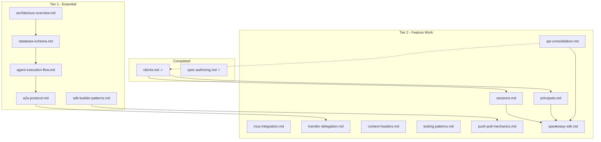

# Spec Plan

Tracking specification documents for the Inkeep Agent Framework. These specs provide AI agent developers with context on specific features of the framework.

## Completed Specs

| Spec File | Description |
|-----------|-------------|
| `spec-authoring.md` | Guidelines for writing spec documents |
| `clients.md` | Client entity for agent access (authentication, credentials, first-party handling) |

---

## Specs to Create

### Tier 1 - Essential for Understanding the System

| Spec File | Status | Description |
|-----------|--------|-------------|
| `architecture-overview.md` | Planned | High-level system architecture: services (agents-api, CLI, UI, SDK), their responsibilities, and how they interact. Include deployment topology and data flow diagrams. |
| `database-schema.md` | Planned | Entity model (projects, agents, subAgents, tools, tasks, conversations, messages), scoping hierarchy (tenant → project → agent → subAgent), and key relationships. Reference `packages/agents-core/src/db/schema.ts`. |
| `agent-execution-flow.md` | Planned | How agent turns work: receiving messages → sub-agent selection → tool calls → responses. Include the execution loop, stopWhen conditions, and context preservation. |
| `a2a-protocol.md` | Planned | Agent-to-agent communication: JSON-RPC methods (`message/send`, `message/stream`, `tasks/get`), message parts, context IDs, task lifecycle, blocking vs streaming modes. |
| `sdk-builder-patterns.md` | Planned | How to use SDK builders (`agent()`, `subAgent()`, `tool()`, `mcpServer()`, `dataComponent()`). Include composition patterns and common configurations. |

### Tier 2 - Important for Feature Work

| Spec File | Status | Description |
|-----------|--------|-------------|
| `api-consolidation.md` | Planned | Unified agents-api service with path-based routing (`/manage/*`, `/run/*`, `/evals/*`). |
| `mcp-integration.md` | Planned | MCP server lifecycle: registration, health checks, transport types (stdio, SSE, HTTP), tool discovery, and credential injection. |
| `transfer-delegation.md` | Planned | How transfers and delegations work: when to use each, how context is preserved, parent-child task relationships, and implementation patterns. |
| `context-headers.md` | Planned | How headers flow from API requests to sub-agents, variable interpolation (`{{variable}}`), and context fetcher patterns. |
| `testing-patterns.md` | Planned | Vitest setup, in-memory SQLite for tests, A2A integration testing (60s timeouts), mocking patterns, and test organization. |
| `push-pull-mechanics.md` | Planned | How `inkeep push` and `inkeep pull` work: serialization format, diff detection, LLM-assisted code updates, and conflict resolution. |
| `speakeasy-sdk.md` | Planned | Speakeasy-generated TypeScript SDK for API access. |
| `sessions.md` | Planned | Session management for browser widgets (server-side vs JWT TBD). |
| `principals.md` | Planned | Principal (end user) identity model. |

### Tier 3 - Reference for Specific Scenarios

| Spec File | Status | Description |
|-----------|--------|-------------|
| `structured-outputs.md` | Planned | Data components, artifact components, status updates: schemas, when to use each, and rendering patterns. |
| `credentials.md` | Planned | Credential management patterns: InkeepCredentialProvider, env vars, keychain, Nango OAuth, and how credentials flow to MCP servers. |
| `observability.md` | Planned | OpenTelemetry integration, span patterns, correlation IDs, SigNoz/Jaeger setup, and logging conventions. |
| `multi-tenancy.md` | Planned | Tenant isolation patterns, organization/project scoping, foreign key cascades, and how tenantId flows through the system. |
| `authentication.md` | Planned | API key auth, development mode, bypass secrets, Better Auth integration, and SSO patterns. (Implementation in separate project.) |
| `tool-execution.md` | Planned | How tools are called: validation, execution context, result handling, error patterns, and tool approvals. |
| `conversation-history.md` | Planned | Conversation history config, message types, history limits, and how sub-agents access prior messages. |
| `agent-discovery.md` | Planned | Agent card discovery via `/.well-known/agent.json`, capabilities advertisement, and how external platforms discover and connect. |
| `api-conventions.md` | Planned | Request/response patterns for agents-api, Zod validation, error codes, and OpenAPI alignment. |
| `inkeep-config.md` | Planned | Structure of `inkeep.config.ts`, project exports, environment profiles, and CLI configuration. |

---

## Dependencies



---

## Authoring Guidelines

See `spec-authoring.md` for detailed guidelines. Key points:

- **Target audience**: AI coding agents (primary), humans who proofread (secondary)
- **Code is source of truth**: specs summarize and point to relevant code
- **Target length**: 500-1500 words per document
- **Use Mermaid** for diagrams (AI agents parse structured DSL better than ASCII)
- **Reference specific file paths**: always point to relevant source files

---

## Suggested Format

```markdown
# [Feature Name]

## Overview
Brief description of what this feature is and why it matters.

## Key Concepts
Core terminology and concepts an AI agent developer needs to understand.

## Architecture
How components interact, data flow, relevant files/packages.

## Implementation Details
Patterns, code references, and key functions/classes.

## Common Operations
Typical tasks and how to accomplish them.

## Gotchas & Edge Cases
Known issues, non-obvious behaviors, debugging tips.

## Related Specs
Links to related specification documents.
```

---

## Source References

Key files to reference when writing specs:

- **Database Schema**: `packages/agents-core/src/db/schema.ts`
- **SDK Builders**: `packages/agents-sdk/src/`
- **API Domains**: `agents-api/src/domains/` (manage, run, evals)
- **A2A Protocol**: `agents-api/src/domains/run/` and `agents-docs/content/talk-to-your-agents/a2a.mdx`
- **MCP Integration**: `packages/agents-manage-mcp/`
- **CLI**: `agents-cli/`
- **Existing Docs**: `agents-docs/content/`
- **Agents.md**: `Agents.md` (comprehensive guide for AI coding agents)
