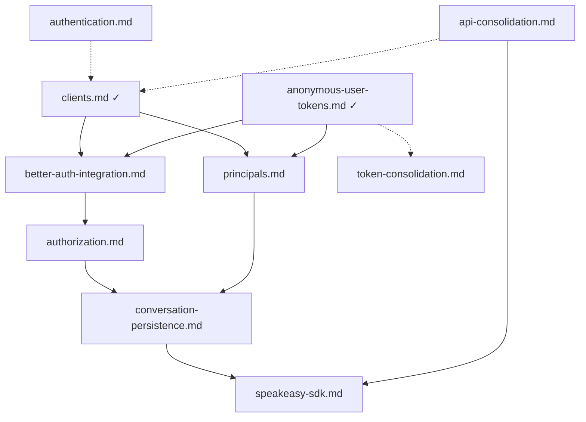

# Spec Plan

Tracking specification documents to be created for the Inkeep Agent Framework.

## Specs to Create

| Spec File | Status | Description | Priority |
|-----------|--------|-------------|----------|
| `api-consolidation.md` | Planned | Merge manage-api and run-api into single service on one port with path-based routing (`/manage/*`, `/run/*`) | High |
| `better-auth-integration.md` | Planned | Better Auth as unified auth layer: anonymous plugin for end users, SSO/OAuth for admin users, session management, account linking | High |
| `authorization.md` | Planned | SpiceDB integration for resource-level access control, authz service interface, migration path from Postgres | High |
| `speakeasy-sdk.md` | Planned | Speakeasy-generated TypeScript SDK for API access | Medium |
| `conversation-persistence.md` | Planned | Conversation storage, participantIds access model, list/fetch endpoints | Medium |
| `principals.md` | Planned | Principal (end user) identity model, distinctId pattern, analytics integration | Medium |
| `authentication.md` | Planned | Authentication service overview (separate project) | Low |
| `token-consolidation.md` | Planned | Evaluate consolidating lightweight token mechanisms (anonymous tokens, playground tokens, temp tokens) into unified approach | Low |

## Completed Specs

| Spec File | Description |
|-----------|-------------|
| `spec-authoring.md` | Guidelines for writing spec documents |
| `clients.md` | Client entity for agent access (authentication, credentials, first-party handling) |
| `anonymous-user-tokens.md` | Anonymous user identity via Better Auth anonymous plugin, distinctId for analytics, session management |

## Dependencies

## Notes

- Code is the source of truth; specs summarize and reference it
- Specs should be 500-1500 words
- Use Mermaid for diagrams when helpful
- Authentication implementation is handled by a separate project
