# Spec Plan

Tracking specification documents to be created for the Inkeep Agent Framework.

## Specs to Create

| Spec File | Status | Description | Priority |
|-----------|--------|-------------|----------|
| `api-consolidation.md` | Planned | Merge manage-api and run-api into single service on one port with path-based routing (`/manage/*`, `/run/*`) | High |
| `speakeasy-sdk.md` | Planned | Speakeasy-generated TypeScript SDK for API access | Medium |
| `sessions.md` | Planned | Session management for browser widgets (server-side vs JWT TBD) | Medium |
| `principals.md` | Planned | Principal (end user) identity model | Medium |
| `authentication.md` | Planned | Authentication service overview (separate project) | Low |

## Completed Specs

| Spec File | Description |
|-----------|-------------|
| `spec-authoring.md` | Guidelines for writing spec documents |
| `clients.md` | Client entity for agent access (authentication, credentials, first-party handling) |

## Dependencies

```mermaid
flowchart TD
    A[clients.md ✓] --> B[sessions.md]
    A --> C[principals.md]
    B --> D[speakeasy-sdk.md]
    C --> D
    E[authentication.md] -.-> A
    F[api-consolidation.md] --> D
    F -.-> A
```

## Notes

- Code is the source of truth; specs summarize and reference it
- Specs should be 500-1500 words
- Use Mermaid for diagrams when helpful
- Authentication implementation is handled by a separate project
