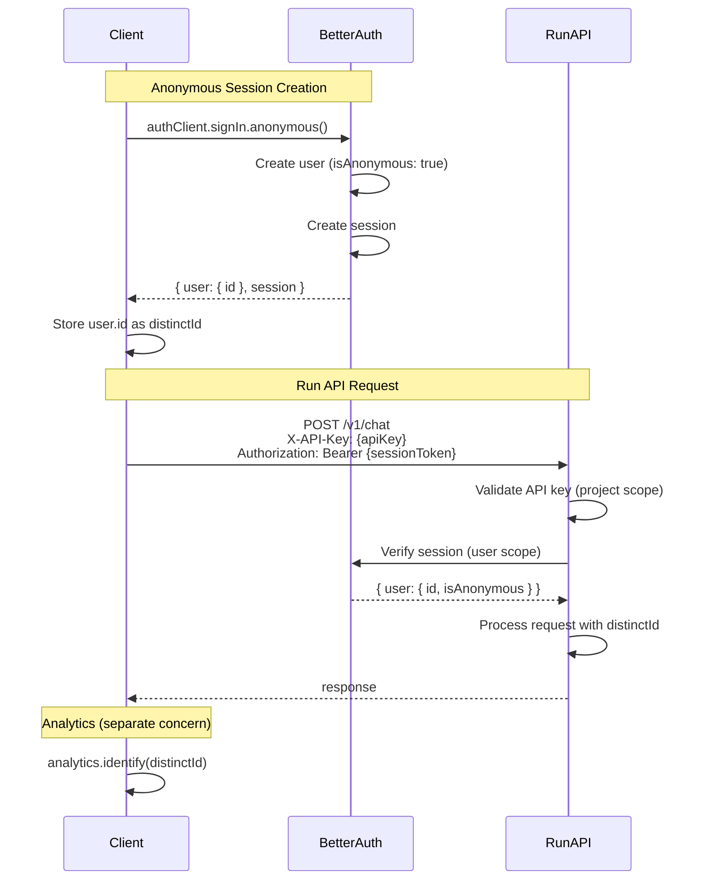

# Anonymous User Tokens

## Overview

Anonymous users need stable identity for conversation history and analytics without authentication. This spec uses Better Auth's Anonymous plugin to provide a **public distinctId** (the user ID) for analytics/tracking and **server-managed sessions** for secure API access.

The distinctId is the Better Auth user ID. Session tokens are managed by Better Auth and cannot be forged.

## Key Concepts

| Term | Description |
|------|-------------|
| distinctId | Public user identifier (`user.id` from Better Auth). Safe to log, send to analytics. |
| Session | Better Auth managed session (cookie or bearer token). Proves ownership of distinctId. |
| Principal | Unified identity abstraction used across auth methods (anonymous, OAuth, SSO). |

## Architecture



## Implementation Details

### Enable Anonymous Plugin

Location: `packages/agents-core/src/auth/auth.ts`

```typescript
import { anonymous } from 'better-auth/plugins';

export function createAuth(config: BetterAuthConfig) {
  const auth = betterAuth({
    // ... existing config
    plugins: [
      bearer(),  // Enables Authorization header auth
      anonymous(),
      // ... other existing plugins (sso, organization, etc.)
    ],
  });

  return auth;
}
```

Run migration after adding plugin:

```bash
pnpm dlx @better-auth/cli migrate
```

### Client Setup

Location: `packages/agents-ui/src/lib/auth-client.ts`

```typescript
import { createAuthClient } from 'better-auth/client';
import { anonymousClient } from 'better-auth/client/plugins';

export const authClient = createAuthClient({
  baseURL: process.env.NEXT_PUBLIC_AUTH_URL,
  plugins: [
    anonymousClient(),
  ],
});
```

### Client Usage

```typescript
// Initialize anonymous session
async function initSession() {
  let session = await authClient.getSession();

  if (!session.data) {
    // Create anonymous session
    const result = await authClient.signIn.anonymous();
    session = { data: result.data };
  }

  const distinctId = session.data.user.id;

  // Store for easy analytics access
  localStorage.setItem('inkeep_distinct_id', distinctId);

  return { distinctId, session: session.data };
}

// Analytics: read distinctId directly
analytics.identify(localStorage.getItem('inkeep_distinct_id'));

// API calls require both API key and session token
fetch('/v1/chat', {
  method: 'POST',
  headers: {
    'X-API-Key': PROJECT_API_KEY,
    'Authorization': `Bearer ${session.session.token}`,
    'Content-Type': 'application/json',
  },
  body: JSON.stringify({ message: 'Hello' }),
});
```

## Access Control

Anonymous users can only access Run API endpoints. They cannot access the Manage API or Manage UI.

| API | Anonymous | Authenticated |
|-----|-----------|---------------|
| `agents-run-api` (chat, feedback) | ✅ | ✅ |
| `agents-manage-api` (projects, agents, settings) | ❌ | ✅ |
| `agents-manage-ui` | ❌ | ✅ |

### Origin Verification

Origin verification is handled at the **Client** level, not the anonymous session level. See `spec/clients.md` for details.

- Clients define `allowedOrigins` - a list of permitted CORS origins
- Session creation validates the request origin against this allowlist
- Anonymous sessions inherit the origin restrictions of their parent Client

### Run API Authentication

The Run API requires **both** an API key and a session token:

| Header | Purpose |
|--------|---------|
| `X-API-Key` | Identifies the project/agent. Required for all Run API requests. |
| `Authorization: Bearer {token}` | Identifies the user (distinctId). Required for user-scoped operations. |

### Run API Middleware

Location: `apps/agents-run-api/src/middleware/auth.ts`

Validates API key first (project scope), then session token (user scope):

```typescript
async function runApiAuthMiddleware(c, next) {
  // 1. Validate API key (existing logic)
  const apiKey = c.req.header('X-API-Key');
  if (!apiKey) {
    throw new HTTPException(401, { message: 'API key required' });
  }
  const project = await validateApiKey(apiKey);
  if (!project) {
    throw new HTTPException(401, { message: 'Invalid API key' });
  }

  // 2. Validate session token (new logic)
  const session = await auth.api.getSession({ headers: c.req.raw.headers });
  if (!session) {
    throw new HTTPException(401, { message: 'Session token required' });
  }

  c.set('project', project);
  c.set('principal', {
    type: session.user.isAnonymous ? 'anonymous' : 'authenticated',
    id: session.user.id,
  });

  return next();
}
```

### Manage API Middleware

Location: `apps/agents-manage-api/src/middleware/auth.ts`

Rejects anonymous sessions:

```typescript
async function manageApiAuthMiddleware(c, next) {
  const session = await auth.api.getSession({ headers: c.req.raw.headers });

  if (!session) {
    throw new HTTPException(401, { message: 'Unauthorized' });
  }

  if (session.user.isAnonymous) {
    throw new HTTPException(403, { message: 'Authentication required' });
  }

  c.set('principal', {
    type: 'authenticated',
    id: session.user.id,
    email: session.user.email,
  });

  return next();
}
```

## Security Model

| Threat | Mitigation |
|--------|------------|
| Impersonation | Sessions are server-managed, cryptographically signed |
| Session theft | Configurable expiration, secure cookie attributes |
| Brute force | Better Auth rate limiting |
| CSRF | SameSite cookies, CSRF tokens |
| Anonymous privilege escalation | Manage API rejects `isAnonymous: true` sessions |

Better Auth handles session security. The `advanced` config in `auth.ts` already sets secure cookie attributes:

```typescript
advanced: {
  defaultCookieAttributes: {
    sameSite: 'none',
    secure: true,
    httpOnly: true,
    partitioned: true,
  },
}
```

## Integration Points

### Analytics

The distinctId is public and stable:

```typescript
// Client-side
const { user } = await authClient.getSession();
analytics.identify(user.id, {
  isAnonymous: user.isAnonymous,
});

// Server-side logging
logger.info('API request', {
  distinctId: session.user.id,
  isAnonymous: session.user.isAnonymous,
});
```

## Database Schema

Better Auth adds an `isAnonymous` field to the user table. Run migrations after enabling the plugin.

| Field | Type | Description |
|-------|------|-------------|
| isAnonymous | boolean | True for anonymous users, null/false for authenticated |

## Error Handling

If anonymous session creation fails, display an error message to the user. Do not attempt recovery or fallback strategies.

| Error | Response |
|-------|----------|
| Network failure | Display error: "Unable to connect. Please try again." |
| Rate limited | Display error: "Too many requests. Please wait and try again." |
| Server error (5xx) | Display error: "Service unavailable. Please try again later." |
| Origin not allowed | Display error: "This domain is not authorized." |

No retry logic, no silent fallbacks. Surface the error clearly.

## Gotchas & Edge Cases

- **Session expiration**: Better Auth handles refresh. Default 7-day expiration configured in `auth.ts`.
- **User record retention**: Anonymous user records are retained indefinitely for audit purposes. Sessions expire, but the user ID and associated data remain in the database. Configurable retention policies are a future enhancement.
- **Cross-device**: Each device gets separate anonymous session. No cross-device sync for anonymous users.
- **Cookies cleared**: User gets new anonymous identity with new distinctId.

## Definition of Done

This spec is complete when the following server-side capabilities are implemented:

- [ ] **Anonymous plugin enabled**: Better Auth configured with `anonymous()` plugin
- [ ] **Migration run**: Database schema updated with `isAnonymous` field
- [ ] **Anonymous user creation endpoint**: `POST /auth/sign-in/anonymous` creates user and session
- [ ] **Session token validation**: Run API middleware validates Bearer token via Better Auth
- [ ] **Session refresh**: Better Auth handles session refresh automatically (verify working)
- [ ] **Dual auth enforcement**: Run API requires both API key and valid session token
- [ ] **Principal on context**: Middleware sets `principal.id` (distinctId) on request context

**Out of scope for this spec:**
- Widget/client implementation (separate spec)
- Conversation persistence
- Account linking

## Related Specs

- `spec/clients.md` - Client entity, origin allowlists, session management

## Future Enhancements

- **Conversation persistence**: Store and retrieve conversation history scoped to distinctId
- **Account linking**: Convert anonymous user to authenticated user while preserving data
- **Relationship-based authorization**: Migrate to SpiceDB for fine-grained access control
- **Configurable retention policies**: Allow customization of anonymous user data retention periods
