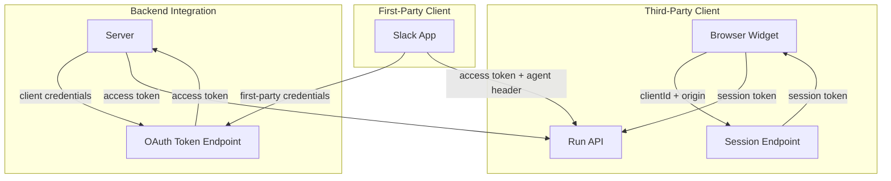

# Clients

## Overview

Clients provide a browser-safe, integration-friendly access point for agents. They run parallel to API keys: API keys serve server-side/backend access, while Clients serve browser widgets, third-party integrations, and first-party apps like Slack.

Clients use OAuth-style authentication (credentials → access token) rather than exposing secrets directly. They support granular permissions, origin allowlists for CORS, and session-based authentication for browser widgets.

## Key Concepts

- **Client**: An agent-scoped entity representing an external integration or widget
- **Client Credentials**: Public `clientId` + secret used to obtain access tokens
- **Session**: Browser-safe authentication using session tokens instead of secrets
- **Principal**: The end-user identity (required for all sessions)
- **First-party Client**: Special client type for internal integrations (e.g., Slack) with multi-agent access

## Architecture



## Implementation Details

### Database Schema

Clients are agent-scoped, following the same pattern as API keys (`packages/agents-core/src/db/schema.ts`).

**clients table**:
- `tenantId`, `projectId`, `agentId`, `id` - Composite primary key (agent-scoped)
- `clientId` - Public identifier (unique, indexed)
- `clientSecretHash`, `clientSecretPrefix` - Hashed secret with prefix for display
- `oldClientSecretHash`, `oldSecretExpiresAt` - Support for 24-hour rotation grace period
- `name`, `description` - Human-readable metadata
- `type` - `'third_party'` or `'first_party'`
- `permissionLevel` - `'read'`, `'write'`, or `'admin'` (semantics defined by auth service)
- `allowedOrigins` - JSONB array of allowed CORS origins
- `sessionEnabled` - Whether browser sessions are allowed
- `isActive`, `expiresAt`, `lastUsedAt` - Status tracking

**client_sessions table** (for browser widgets):
- `id`, `clientId` - Session identity
- `sessionToken` - Unique session token (indexed)
- `userIdentifier` - Required principal ID (Inkeep user, external ID, or SDK-generated UUID)
- `expiresAt` - Session expiration

### API Endpoints

**Manage API** - Client CRUD at `/tenants/{tid}/projects/{pid}/agents/{aid}/clients`:

| Method | Path | Description |
|--------|------|-------------|
| GET | `/clients` | List clients for agent |
| POST | `/clients` | Create client (returns secret once) |
| GET | `/clients/{id}` | Get client details |
| PATCH | `/clients/{id}` | Update client metadata |
| DELETE | `/clients/{id}` | Delete client |
| POST | `/clients/{id}/rotate-secret` | Rotate secret (24h grace) |
| POST | `/clients/{id}/revoke-old-secret` | Force revoke old secret |

**Run API** - Authentication:

| Method | Path | Description |
|--------|------|-------------|
| POST | `/oauth/token` | Exchange credentials for access token |
| POST | `/clients/{clientId}/sessions` | Create browser session (origin validated) |
| DELETE | `/clients/{clientId}/sessions/{id}` | Revoke session |

### Authentication Flows

**Client Credentials Flow** (backend integrations):
```
POST /oauth/token
grant_type=client_credentials&client_id=cli_xxx&client_secret=secret_xxx

→ { "access_token": "eyJ...", "expires_in": 3600 }
```

**Session Flow** (browser widgets):
1. Widget loads with embedded `clientId`
2. `POST /clients/{clientId}/sessions` with origin header
3. Server validates origin against `allowedOrigins`
4. Returns session token; widget stores in localStorage
5. Subsequent requests use session token as Bearer

### Error Codes

| Code | HTTP | Description |
|------|------|-------------|
| `client_not_found` | 401 | Unknown client ID |
| `invalid_secret` | 401 | Wrong client secret |
| `client_deactivated` | 401 | Client is deactivated |
| `client_expired` | 401 | Client past expiration |
| `secret_expired` | 401 | Old secret after grace period |
| `origin_not_allowed` | 403 | Origin not in allowlist |
| `session_expired` | 401 | Session token expired |
| `session_revoked` | 401 | Session was revoked |

### First-Party Clients

First-party clients (Slack, future integrations) have special privileges:
- Created via database migrations, not public API
- Can be tenant-scoped (no `agentId` requirement)
- Access tokens permit any agent in tenant
- Target agent specified via request headers

## Common Operations

**Creating a client for a browser widget**:
1. `POST /clients` with `sessionEnabled: true` and `allowedOrigins: ["https://example.com"]`
2. Store returned `clientId` in widget config (secret not needed for sessions)
3. Widget calls `POST /clients/{clientId}/sessions` on load
4. Use session token for subsequent API calls

**Rotating a client secret**:
1. `POST /clients/{id}/rotate-secret` - generates new secret, old valid for 24h
2. Update integration with new secret
3. Optionally `POST /clients/{id}/revoke-old-secret` to force immediate revocation

## Gotchas & Edge Cases

- **Token revocation is immediate**: When a client is deactivated or deleted, existing access tokens are rejected immediately (no grace period for tokens, only for secrets during rotation)
- **Principal ID required**: All sessions must have a principal ID. For anonymous users, the SDK generates and persists a UUID
- **Permission levels TBD**: The `permissionLevel` field is stored but semantics are defined by the separate authentication service
- **First-party clients aren't agent-scoped**: Unlike third-party clients, first-party clients may omit `agentId` and access multiple agents

## Related Specs

- `spec/sessions.md` (planned) - Session management details
- `spec/principals.md` (planned) - Principal identity model
- `spec/speakeasy-sdk.md` (planned) - TypeScript SDK integration
