# PRD: Scheduled Agent Triggers (Cron Jobs for Agents)

## Introduction

Add time-based scheduling capabilities to agent triggers, enabling both recurring schedules (cron-style) and one-time delayed execution. Currently, agents can only be triggered via webhooks or direct API calls. Users need the ability to schedule agents to run automatically—daily reports, periodic data syncs, scheduled reminders, or deferred task execution.

This feature extends the existing trigger system to support scheduled execution while maintaining the same execution flow, observability, and reliability guarantees. The scheduler must handle thousands of triggers across dozens of customers with exactly-once execution semantics, comprehensive debugging capabilities, and full integration across all product surfaces.

### Key Design Decisions

1. **Internal Scheduler vs Vercel Cron**: Vercel cron functions require static configuration in `vercel.json` and cannot be dynamically created via API—unsuitable for multi-tenant SaaS with thousands of user-configured schedules. We'll build an internal scheduler using the existing `@workflow/*` infrastructure with Postgres-backed durable queues.

2. **Exactly-Once Execution**: Using Postgres advisory locks and transactional job claiming to prevent duplicate executions, with idempotency keys for downstream operations.

3. **UTC-Only Scheduling**: All schedules stored and executed in UTC. Users convert their local times; no DST complexity in v1.

## Goals

- Enable recurring agent execution via cron expressions (e.g., `0 9 * * MON-FRI` for weekdays at 9am UTC)
- Enable one-time delayed execution (e.g., "run this agent in 2 hours" or "run at specific timestamp")
- Achieve exactly-once execution guarantees with transactional job claiming
- Support thousands of scheduled triggers with efficient polling and batched processing
- Provide comprehensive debugging: execution history, retry tracking, error details, trace linkage
- Enable manual re-run of any past invocation
- Expose real-time status visibility for running/pending executions
- Integrate with all product surfaces: API, Manage UI, SDK, CLI

## User Stories

### US-001: Add scheduled trigger schema to database
**Description:** As a developer, I need database tables to store scheduled trigger configurations and their execution state.

**Acceptance Criteria:**
- [ ] Add `scheduledTriggers` table to manage schema (`packages/agents-core/src/db/manage/manage-schema.ts`):
  ```typescript
  export const scheduledTriggers = pgTable('scheduled_triggers', {
    ...agentScoped,
    id: varchar('id', { length: 256 }).notNull(),
    name: varchar('name', { length: 256 }).notNull(),
    description: text('description'),
    enabled: boolean('enabled').default(true).notNull(),

    // Schedule configuration (one of these must be set)
    cronExpression: varchar('cron_expression', { length: 256 }), // e.g., "0 9 * * MON-FRI"
    runAt: timestamp('run_at', { withTimezone: true }), // One-time execution

    // Payload configuration
    payload: jsonb('payload').$type<Record<string, unknown> | null>(),
    messageTemplate: text('message_template'), // Mustache-style template

    // Execution settings
    maxRetries: integer('max_retries').default(3).notNull(),
    retryDelaySeconds: integer('retry_delay_seconds').default(60).notNull(),
    timeoutSeconds: integer('timeout_seconds').default(300).notNull(),

    ...timestamps,
  }, (table) => ({
    pk: primaryKey({ columns: [table.tenantId, table.projectId, table.agentId, table.id] }),
    // Index for scheduler polling
    enabledCronIdx: index('scheduled_triggers_enabled_cron_idx')
      .on(table.enabled, table.cronExpression),
    enabledRunAtIdx: index('scheduled_triggers_enabled_run_at_idx')
      .on(table.enabled, table.runAt),
  }));
  ```
- [ ] Add `scheduledTriggerInvocations` table to runtime schema (`packages/agents-core/src/db/runtime/runtime-schema.ts`):
  ```typescript
  export const scheduledTriggerInvocations = pgTable('scheduled_trigger_invocations', {
    ...tenantScoped,
    projectId: varchar('project_id', { length: 256 }).notNull(),
    agentId: varchar('agent_id', { length: 256 }).notNull(),
    scheduledTriggerId: varchar('scheduled_trigger_id', { length: 256 }).notNull(),
    id: varchar('id', { length: 256 }).notNull(),

    // Execution tracking
    status: varchar('status', { length: 50 }).notNull(), // pending, running, success, failed, retrying
    scheduledFor: timestamp('scheduled_for', { withTimezone: true }).notNull(),
    startedAt: timestamp('started_at', { withTimezone: true }),
    completedAt: timestamp('completed_at', { withTimezone: true }),

    // Payload and results
    resolvedPayload: jsonb('resolved_payload').$type<Record<string, unknown> | null>(),
    conversationId: varchar('conversation_id', { length: 256 }),
    traceId: varchar('trace_id', { length: 256 }),

    // Error handling
    errorMessage: text('error_message'),
    errorCode: varchar('error_code', { length: 100 }),
    attemptNumber: integer('attempt_number').default(1).notNull(),
    nextRetryAt: timestamp('next_retry_at', { withTimezone: true }),

    // Idempotency
    idempotencyKey: varchar('idempotency_key', { length: 256 }).notNull(),

    createdAt: timestamp('created_at', { withTimezone: true }).defaultNow().notNull(),
  }, (table) => ({
    pk: primaryKey({ columns: [table.tenantId, table.id] }),
    // Index for scheduler job claiming
    pendingJobsIdx: index('sched_invocations_pending_idx')
      .on(table.status, table.scheduledFor),
    // Index for retry processing
    retryIdx: index('sched_invocations_retry_idx')
      .on(table.status, table.nextRetryAt),
    // Index for listing by trigger
    triggerIdx: index('sched_invocations_trigger_idx')
      .on(table.scheduledTriggerId, table.createdAt),
    // Idempotency constraint
    idempotencyIdx: uniqueIndex('sched_invocations_idempotency_idx')
      .on(table.idempotencyKey),
  }));
  ```
- [ ] Generate migration via `pnpm db:generate`
- [ ] Migration applies successfully via `pnpm db:migrate`
- [ ] Tests: Add schema validation tests
- [ ] `pnpm typecheck` passes
- [ ] `pnpm test --run` passes
- [ ] `pnpm lint` passes

---

### US-002: Create Zod validation schemas for scheduled triggers
**Description:** As a developer, I need Zod schemas to validate scheduled trigger configurations with proper cron expression validation.

**Acceptance Criteria:**
- [ ] Create `ScheduledTriggerSchema` in `packages/agents-core/src/validation/schemas.ts`:
  ```typescript
  export const CronExpressionSchema = z.string()
    .regex(/^(\*|[0-9,\-\/]+)\s+(\*|[0-9,\-\/]+)\s+(\*|[0-9,\-\/]+)\s+(\*|[0-9,\-\/]+)\s+(\*|[0-9,\-\/A-Z]+)$/i,
      'Invalid cron expression. Expected 5 fields: minute hour day month weekday')
    .describe('Cron expression in standard 5-field format (minute hour day month weekday)')
    .openapi('CronExpression');

  export const ScheduledTriggerSelectSchema = createSelectSchema(scheduledTriggers)
    .extend({
      payload: z.record(z.unknown()).nullable().optional(),
    })
    .openapi('ScheduledTrigger');

  export const ScheduledTriggerInsertSchema = createInsertSchema(scheduledTriggers)
    .extend({
      id: resourceIdSchema,
      cronExpression: CronExpressionSchema.nullable().optional(),
      runAt: z.string().datetime().nullable().optional(),
      payload: z.record(z.unknown()).nullable().optional(),
      maxRetries: z.number().int().min(0).max(10).default(3),
      retryDelaySeconds: z.number().int().min(10).max(3600).default(60),
      timeoutSeconds: z.number().int().min(30).max(1800).default(300),
    })
    .refine(
      (data) => data.cronExpression || data.runAt,
      { message: 'Either cronExpression or runAt must be provided' }
    )
    .refine(
      (data) => !(data.cronExpression && data.runAt),
      { message: 'Cannot specify both cronExpression and runAt' }
    )
    .openapi('ScheduledTriggerCreate');

  export const ScheduledTriggerUpdateSchema = ScheduledTriggerInsertSchema.partial()
    .openapi('ScheduledTriggerUpdate');

  // API versions with scope stripping
  export const ScheduledTriggerApiSelectSchema = createAgentScopedApiSchema(ScheduledTriggerSelectSchema)
    .openapi('ScheduledTrigger');
  export const ScheduledTriggerApiInsertSchema = createAgentScopedApiInsertSchema(ScheduledTriggerInsertSchema)
    .extend({ id: resourceIdSchema.optional() })
    .openapi('ScheduledTriggerCreate');
  ```
- [ ] Create `ScheduledTriggerInvocationSchema` for runtime records
- [ ] Add cron expression validation using `cron-parser` library for semantic validation (not just regex)
- [ ] Export types: `ScheduledTrigger`, `ScheduledTriggerInsert`, `ScheduledTriggerInvocation`
- [ ] Tests: Add validation tests for cron expressions and schema refinements
- [ ] `pnpm typecheck` passes
- [ ] `pnpm test --run` passes
- [ ] `pnpm lint` passes

---

### US-003: Implement data access layer for scheduled triggers
**Description:** As a developer, I need data access functions for CRUD operations on scheduled triggers and their invocations.

**Acceptance Criteria:**
- [ ] Create `packages/agents-core/src/data-access/manage/scheduledTriggers.ts`:
  - `getScheduledTriggerById(scope, id)`
  - `listScheduledTriggers(scope)` with pagination
  - `listScheduledTriggersPaginated(scope, options)`
  - `createScheduledTrigger(trigger)`
  - `updateScheduledTrigger(scope, id, updates)`
  - `deleteScheduledTrigger(scope, id)`
  - `upsertScheduledTrigger(trigger)`
  - `getEnabledCronTriggers()` - for scheduler polling
  - `getEnabledOneTimeTriggers(before: Date)` - for scheduler polling
- [ ] Create `packages/agents-core/src/data-access/runtime/scheduledTriggerInvocations.ts`:
  - `createScheduledTriggerInvocation(invocation)`
  - `getScheduledTriggerInvocationById(tenantId, id)`
  - `listScheduledTriggerInvocationsPaginated(scope, options)` with status/date filtering
  - `updateScheduledTriggerInvocationStatus(tenantId, id, status, details)`
  - `claimPendingInvocations(limit, lockDuration)` - transactional with advisory locks
  - `markForRetry(tenantId, id, nextRetryAt, errorMessage)`
  - `getInvocationByIdempotencyKey(key)` - for deduplication
- [ ] Follow existing data-access patterns (functional, database-agnostic)
- [ ] Tests: Add unit tests for all data access functions
- [ ] `pnpm typecheck` passes
- [ ] `pnpm test --run` passes
- [ ] `pnpm lint` passes

---

### US-004: Implement SchedulerService for job orchestration
**Description:** As a developer, I need a SchedulerService that manages the lifecycle of scheduled trigger executions with exactly-once semantics.

**Acceptance Criteria:**
- [ ] Create `agents-api/src/domains/run/services/SchedulerService.ts`:
  ```typescript
  export class SchedulerService {
    // Job creation
    async scheduleNextInvocations(trigger: ScheduledTrigger): Promise<void>;
    async scheduleOneTimeInvocation(trigger: ScheduledTrigger): Promise<ScheduledTriggerInvocation>;

    // Job execution
    async claimAndExecuteJobs(batchSize: number): Promise<ExecutionResult[]>;
    async executeInvocation(invocation: ScheduledTriggerInvocation): Promise<void>;

    // Retry handling
    async processRetries(): Promise<void>;

    // Manual operations
    async rerunInvocation(tenantId: string, invocationId: string): Promise<ScheduledTriggerInvocation>;
    async cancelPendingInvocation(tenantId: string, invocationId: string): Promise<void>;
  }
  ```
- [ ] Implement exactly-once semantics using:
  - Postgres advisory locks for job claiming (`pg_try_advisory_xact_lock`)
  - Idempotency keys generated from `triggerId + scheduledFor` timestamp
  - Transactional status updates
- [ ] Implement exponential backoff for retries: `retryDelaySeconds * (2 ^ attemptNumber)`
- [ ] Integrate with existing `ExecutionHandler` for agent execution
- [ ] Add OpenTelemetry tracing with attributes:
  - `scheduled_trigger.id`, `scheduled_trigger.name`
  - `scheduled_trigger.invocation.id`, `scheduled_trigger.invocation.attempt`
  - `scheduled_trigger.type` ('cron' | 'one_time')
- [ ] Tests: Add unit tests with mocked dependencies
- [ ] `pnpm typecheck` passes
- [ ] `pnpm test --run` passes
- [ ] `pnpm lint` passes

---

### US-005: Implement scheduler polling worker
**Description:** As a developer, I need a background worker that polls for due scheduled triggers and dispatches them for execution.

**Acceptance Criteria:**
- [ ] Create `agents-api/src/domains/run/workers/schedulerWorker.ts`:
  ```typescript
  export class SchedulerWorker {
    private pollIntervalMs: number = 10_000; // 10 seconds
    private batchSize: number = 100;

    async start(): Promise<void>;
    async stop(): Promise<void>;
    async tick(): Promise<void>; // Single poll iteration
  }
  ```
- [ ] Worker performs these operations each tick:
  1. Calculate next run times for all enabled cron triggers
  2. Create pending invocations for triggers due within next poll interval
  3. Claim and execute pending invocations (batch processing)
  4. Process retries for failed invocations
- [ ] Implement leader election using Postgres advisory locks to prevent multiple workers
- [ ] Add health check endpoint for monitoring
- [ ] Handle graceful shutdown (complete in-flight jobs, don't claim new ones)
- [ ] Use `@workflow/world-postgres` for durable execution guarantees
- [ ] Tests: Add integration tests with test database
- [ ] `pnpm typecheck` passes
- [ ] `pnpm test --run` passes
- [ ] `pnpm lint` passes

---

### US-006: Add manage API routes for scheduled triggers
**Description:** As a developer, I need REST API endpoints to manage scheduled triggers.

**Acceptance Criteria:**
- [ ] Create `agents-api/src/domains/manage/routes/scheduledTriggers.ts`:
  - `GET /tenants/{tenantId}/projects/{projectId}/agents/{agentId}/scheduled-triggers` - List
  - `POST /tenants/{tenantId}/projects/{projectId}/agents/{agentId}/scheduled-triggers` - Create
  - `GET /tenants/{tenantId}/projects/{projectId}/agents/{agentId}/scheduled-triggers/{id}` - Get
  - `PATCH /tenants/{tenantId}/projects/{projectId}/agents/{agentId}/scheduled-triggers/{id}` - Update
  - `DELETE /tenants/{tenantId}/projects/{projectId}/agents/{agentId}/scheduled-triggers/{id}` - Delete
  - `POST /tenants/{tenantId}/projects/{projectId}/agents/{agentId}/scheduled-triggers/{id}/enable` - Enable
  - `POST /tenants/{tenantId}/projects/{projectId}/agents/{agentId}/scheduled-triggers/{id}/disable` - Disable
- [ ] Register routes in manage domain router
- [ ] Add OpenAPI documentation for all endpoints
- [ ] Tests: Add route integration tests
- [ ] `pnpm typecheck` passes
- [ ] `pnpm test --run` passes
- [ ] `pnpm lint` passes

---

### US-007: Add run API routes for invocation management
**Description:** As a developer, I need REST API endpoints to view and manage scheduled trigger invocations.

**Acceptance Criteria:**
- [ ] Create `agents-api/src/domains/run/routes/scheduledTriggerInvocations.ts`:
  - `GET /tenants/{tenantId}/projects/{projectId}/agents/{agentId}/scheduled-triggers/{triggerId}/invocations` - List with pagination and filters
  - `GET /tenants/{tenantId}/scheduled-trigger-invocations/{id}` - Get single invocation
  - `POST /tenants/{tenantId}/scheduled-trigger-invocations/{id}/rerun` - Manual re-run
  - `POST /tenants/{tenantId}/scheduled-trigger-invocations/{id}/cancel` - Cancel pending
- [ ] Support query filters: `status`, `from`, `to`, `limit`, `cursor`
- [ ] Include `traceId` in response for linking to observability
- [ ] Register routes in run domain router
- [ ] Add OpenAPI documentation
- [ ] Tests: Add route integration tests
- [ ] `pnpm typecheck` passes
- [ ] `pnpm test --run` passes
- [ ] `pnpm lint` passes

---

### US-008: Implement SDK builder for scheduled triggers
**Description:** As a developer using the SDK, I need a builder function to define scheduled triggers in code.

**Acceptance Criteria:**
- [ ] Create `scheduledTrigger()` builder in `packages/agents-sdk/src/builderFunctions.ts`:
  ```typescript
  export function scheduledTrigger(config: ScheduledTriggerConfig): ScheduledTrigger {
    // Validate cron expression at build time
    if (config.cronExpression) {
      try {
        cronParser.parseExpression(config.cronExpression);
      } catch (error) {
        throw new Error(`Invalid cron expression for scheduled trigger '${config.id || config.name}': ${error.message}`);
      }
    }
    return new ScheduledTrigger(config);
  }
  ```
- [ ] Create `ScheduledTrigger` class in `packages/agents-sdk/src/builders.ts`
- [ ] Add to agent builder: `agent({ scheduledTriggers: [scheduledTrigger({...})] })`
- [ ] Export types from SDK index
- [ ] Add JSDoc with usage examples
- [ ] Tests: Add SDK builder tests
- [ ] `pnpm typecheck` passes
- [ ] `pnpm test --run` passes
- [ ] `pnpm lint` passes

---

### US-009: Update CLI pull command for scheduled triggers
**Description:** As a developer using the CLI, I need `agents pull` to generate TypeScript code for scheduled triggers.

**Acceptance Criteria:**
- [ ] Create `agents-cli/src/commands/pull-v3/components/scheduled-trigger-generator.ts`:
  - Generate `scheduledTrigger()` calls with all configuration
  - Handle cron expressions and one-time `runAt` timestamps
  - Generate payload objects with proper escaping
  - Handle message template strings
- [ ] Update `introspect-generator.ts` to include scheduled triggers
- [ ] Update `ComponentRegistry` to track scheduled trigger dependencies
- [ ] Generated code follows existing code style patterns
- [ ] Tests: Add generator unit tests with snapshots
- [ ] `pnpm typecheck` passes
- [ ] `pnpm test --run` passes
- [ ] `pnpm lint` passes

---

### US-010: Update CLI push command for scheduled triggers
**Description:** As a developer using the CLI, I need `agents push` to sync scheduled triggers to the API.

**Acceptance Criteria:**
- [ ] Update push command to read scheduled triggers from project definition
- [ ] Implement create/update/delete sync logic for scheduled triggers
- [ ] Show diff preview for scheduled trigger changes
- [ ] Handle validation errors with clear messages
- [ ] Tests: Add push command integration tests
- [ ] `pnpm typecheck` passes
- [ ] `pnpm test --run` passes
- [ ] `pnpm lint` passes

---

### US-011: Add scheduled trigger form to Manage UI
**Description:** As a user, I want to create and edit scheduled triggers in the Manage UI dashboard.

**Acceptance Criteria:**
- [ ] Create `agents-manage-ui/src/components/scheduled-triggers/scheduled-trigger-form.tsx`:
  - Name and description fields
  - Toggle between "Recurring" (cron) and "One-time" (runAt) modes
  - Cron expression input with visual helper/builder
  - Human-readable schedule preview (e.g., "Runs every weekday at 9:00 AM UTC")
  - Payload JSON editor
  - Message template editor with variable highlighting
  - Retry settings (max retries, delay)
  - Timeout setting
  - Enable/disable toggle
- [ ] Add cron expression builder component with presets:
  - Every hour, Every day at midnight, Weekdays at 9am, etc.
  - Custom cron with field-by-field inputs
- [ ] Validate cron expression client-side with preview of next 5 run times
- [ ] Tests: Add component tests
- [ ] `pnpm typecheck` passes
- [ ] `pnpm test --run` passes
- [ ] `pnpm lint` passes
- [ ] Verify in browser using dev-browser skill

---

### US-012: Add scheduled trigger list page to Manage UI
**Description:** As a user, I want to view all scheduled triggers for an agent and see their status at a glance.

**Acceptance Criteria:**
- [ ] Create `agents-manage-ui/src/app/[tenantId]/projects/[projectId]/agents/[agentId]/scheduled-triggers/page.tsx`:
  - Table with columns: Name, Schedule, Next Run, Last Run, Status, Actions
  - Status badges: Enabled (green), Disabled (gray), Error (red)
  - Quick actions: Enable/Disable toggle, Edit, Delete, View History
  - "Create Scheduled Trigger" button
- [ ] Show human-readable schedule description
- [ ] Show countdown to next execution
- [ ] Link to invocation history
- [ ] Tests: Add page tests
- [ ] `pnpm typecheck` passes
- [ ] `pnpm test --run` passes
- [ ] `pnpm lint` passes
- [ ] Verify in browser using dev-browser skill

---

### US-013: Add invocation history page to Manage UI
**Description:** As a user, I want to view the execution history of a scheduled trigger with detailed debugging information.

**Acceptance Criteria:**
- [ ] Create invocation history page/component:
  - Table with columns: Scheduled For, Started At, Duration, Status, Attempt, Actions
  - Status badges: Pending, Running, Success, Failed, Retrying
  - Expandable row details: resolved payload, error message, error code
  - Link to conversation (if created)
  - Link to trace in observability UI (using traceId)
  - "Re-run" button for any invocation
  - "Cancel" button for pending invocations
- [ ] Filters: status, date range
- [ ] Pagination
- [ ] Auto-refresh toggle for real-time updates
- [ ] Tests: Add component tests
- [ ] `pnpm typecheck` passes
- [ ] `pnpm test --run` passes
- [ ] `pnpm lint` passes
- [ ] Verify in browser using dev-browser skill

---

### US-014: Implement template variable interpolation for scheduled triggers
**Description:** As a developer, I need scheduled triggers to support dynamic payload generation using template variables.

**Acceptance Criteria:**
- [ ] Support template variables in `messageTemplate` and `payload` fields:
  - `{{current_timestamp}}` - ISO 8601 timestamp of execution
  - `{{current_date}}` - Date in YYYY-MM-DD format
  - `{{current_time}}` - Time in HH:MM:SS format
  - `{{run_count}}` - Number of times this trigger has run
  - `{{scheduled_for}}` - The intended execution time
  - `{{attempt_number}}` - Current retry attempt (1-based)
  - `{{trigger_id}}` - The scheduled trigger ID
  - `{{trigger_name}}` - The scheduled trigger name
- [ ] Use Mustache-style interpolation (consistent with webhook triggers)
- [ ] Document available variables in API docs and UI
- [ ] Tests: Add interpolation tests
- [ ] `pnpm typecheck` passes
- [ ] `pnpm test --run` passes
- [ ] `pnpm lint` passes

---

### US-015: Add alerting hooks for execution failures
**Description:** As a user, I want to be notified when scheduled trigger executions fail so I can investigate and fix issues.

**Acceptance Criteria:**
- [ ] Add `alertWebhookUrl` field to scheduled trigger configuration
- [ ] Send POST to alert webhook on:
  - Final failure (all retries exhausted)
  - Configurable: on any failure, on final failure only
- [ ] Alert payload includes:
  ```json
  {
    "event": "scheduled_trigger.failed",
    "trigger": { "id": "...", "name": "..." },
    "invocation": { "id": "...", "attemptNumber": 3, "errorMessage": "..." },
    "traceUrl": "https://...",
    "timestamp": "..."
  }
  ```
- [ ] Support for alert webhook authentication (header-based)
- [ ] Tests: Add alerting tests
- [ ] `pnpm typecheck` passes
- [ ] `pnpm test --run` passes
- [ ] `pnpm lint` passes

---

### US-016: Implement natural language schedule parsing for chat interface
**Description:** As a user, I want to describe schedules in natural language (e.g., "every Monday at 9am") and have them converted to cron expressions.

**Acceptance Criteria:**
- [ ] Create `packages/agents-core/src/utils/schedule-parser.ts`:
  ```typescript
  export function parseNaturalSchedule(input: string): {
    cronExpression?: string;
    runAt?: Date;
    confidence: number;
    humanReadable: string;
  }
  ```
- [ ] Support common patterns:
  - "every day at 9am" → `0 9 * * *`
  - "every Monday at 9am" → `0 9 * * MON`
  - "weekdays at 9am" → `0 9 * * MON-FRI`
  - "every hour" → `0 * * * *`
  - "in 2 hours" → one-time runAt
  - "tomorrow at 3pm" → one-time runAt
  - "next Tuesday at 10am" → one-time runAt
- [ ] Return confidence score for ambiguous inputs
- [ ] Use in Manage UI as input helper
- [ ] Expose for agent chat integration (deferred execution)
- [ ] Tests: Add parsing tests with many examples
- [ ] `pnpm typecheck` passes
- [ ] `pnpm test --run` passes
- [ ] `pnpm lint` passes

---

### US-017: Add documentation for scheduled triggers
**Description:** As a developer, I need comprehensive documentation for scheduled triggers.

**Acceptance Criteria:**
- [ ] Create `agents-docs/content/docs/features/scheduled-triggers.mdx`:
  - Overview and use cases
  - Cron expression reference with examples
  - Template variable reference
  - Retry behavior explanation
  - Debugging guide
  - Best practices
- [ ] Update SDK documentation with builder examples
- [ ] Add API reference for new endpoints
- [ ] Include architecture diagram showing execution flow
- [ ] Tests: Documentation builds successfully
- [ ] `pnpm typecheck` passes

---

### US-018: Create integration tests for scheduled trigger execution
**Description:** As a developer, I need comprehensive integration tests to verify the scheduled trigger system works end-to-end.

**Acceptance Criteria:**
- [ ] Create `agents-api/src/__tests__/run/scheduledTriggers.integration.test.ts`:
  - Test cron trigger scheduling and execution
  - Test one-time trigger execution
  - Test retry behavior on transient failures
  - Test exactly-once semantics (no duplicate executions)
  - Test manual re-run functionality
  - Test cancellation of pending invocations
  - Test template variable interpolation
  - Test alert webhook firing
- [ ] Use test database with fast-forward time capabilities
- [ ] Tests complete within 60 seconds
- [ ] `pnpm typecheck` passes
- [ ] `pnpm test --run` passes
- [ ] `pnpm lint` passes

---

### US-019: Create changesets for affected packages
**Description:** As a developer, I need changesets created for the version bumps.

**Acceptance Criteria:**
- [ ] `pnpm bump minor --pkg agents-core "Add scheduled trigger schema and data access layer"`
- [ ] `pnpm bump minor --pkg agents-sdk "Add scheduledTrigger() builder for time-based agent triggers"`
- [ ] `pnpm bump minor --pkg agents-api "Add scheduled trigger API endpoints and scheduler worker"`
- [ ] `pnpm bump minor --pkg agents-cli "Add CLI support for scheduled triggers in pull/push commands"`
- [ ] Changeset messages follow codebase conventions
- [ ] `pnpm typecheck` passes
- [ ] `pnpm test --run` passes
- [ ] `pnpm lint` passes

---

## Functional Requirements

- **FR-1:** The system must support cron expressions in standard 5-field format (minute hour day month weekday)
- **FR-2:** The system must support one-time execution at a specific UTC timestamp
- **FR-3:** The system must provide exactly-once execution guarantees using transactional job claiming
- **FR-4:** The system must retry failed executions with configurable max retries (0-10) and delay (10-3600 seconds)
- **FR-5:** The system must use exponential backoff for retries: `baseDelay * (2 ^ attemptNumber)`
- **FR-6:** The system must timeout executions that exceed the configured timeout (30-1800 seconds)
- **FR-7:** The system must support static payloads with optional template variable interpolation
- **FR-8:** The system must generate idempotency keys from `triggerId + scheduledFor` to prevent duplicates
- **FR-9:** The system must track all invocations with status, timing, errors, and trace linkage
- **FR-10:** The system must support manual re-run of any past invocation
- **FR-11:** The system must support cancellation of pending invocations
- **FR-12:** The system must send alerts to configured webhooks on execution failures
- **FR-13:** The system must poll for due triggers at a configurable interval (default 10 seconds)
- **FR-14:** The system must process triggers in batches to handle high volumes efficiently
- **FR-15:** The system must use leader election to prevent multiple scheduler workers from running
- **FR-16:** The system must store all timestamps in UTC

## Non-Goals (Out of Scope)

- **No timezone support:** All schedules are in UTC. Users must convert their local times. DST handling is not included.
- **No sub-minute scheduling:** Minimum granularity is 1 minute (standard cron)
- **No complex scheduling patterns:** No support for "every 3rd Tuesday" or holiday exclusions
- **No automatic scaling:** Single scheduler worker with leader election. Horizontal scaling is future work.
- **No real-time push notifications:** UI uses polling for status updates, not WebSockets
- **No execution priority:** All triggers have equal priority. Priority queues are future work.
- **No cross-agent dependencies:** Cannot schedule "run agent B after agent A completes"
- **No cost estimation:** No prediction of execution costs based on schedule frequency

## Design Considerations

### High-Level System Overview

This diagram shows how scheduled triggers fit into the broader Inkeep Agents architecture, highlighting the relationship between configuration surfaces, the scheduler, and agent execution.

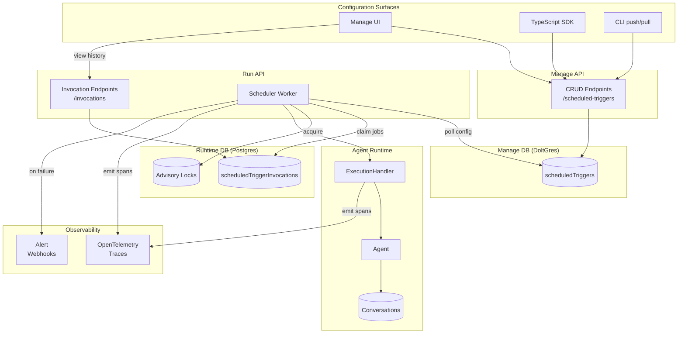

### Scheduler Architecture (Detailed)

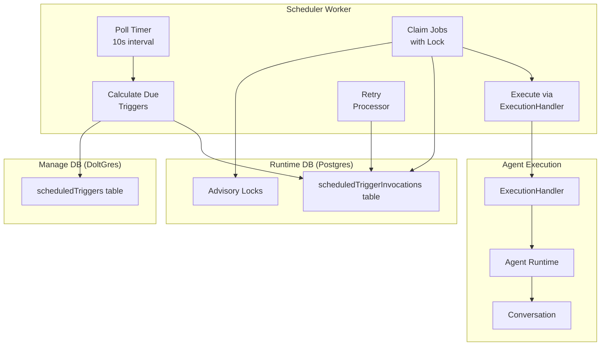

### Invocation State Machine

This state diagram shows all possible states for a scheduled trigger invocation and the transitions between them.

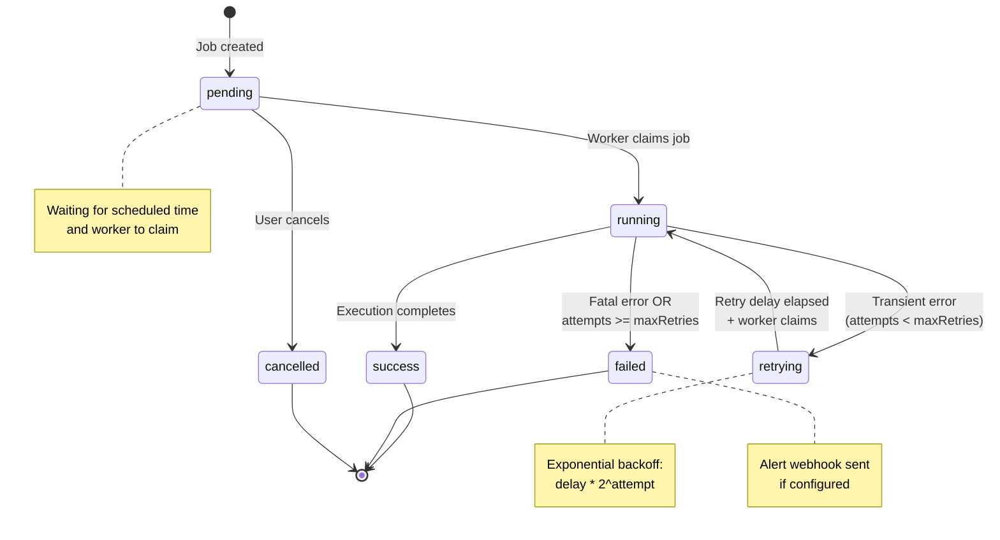

### Database Entity Relationships

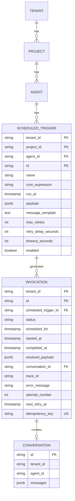

### Worker Poll Cycle

This diagram shows what happens during each 10-second poll interval of the scheduler worker.

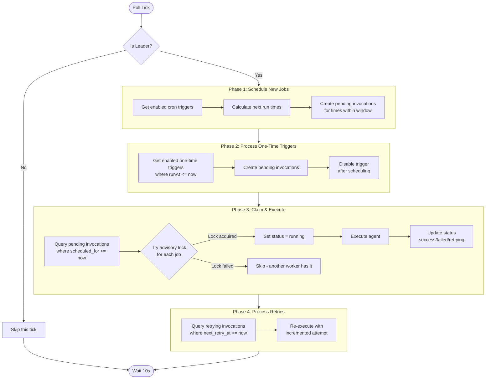

### Exactly-Once Execution Guarantees

This diagram illustrates how we prevent duplicate executions using Postgres primitives.

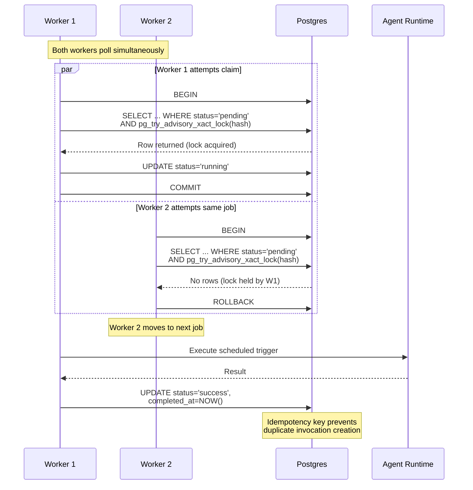

### Retry Flow with Exponential Backoff

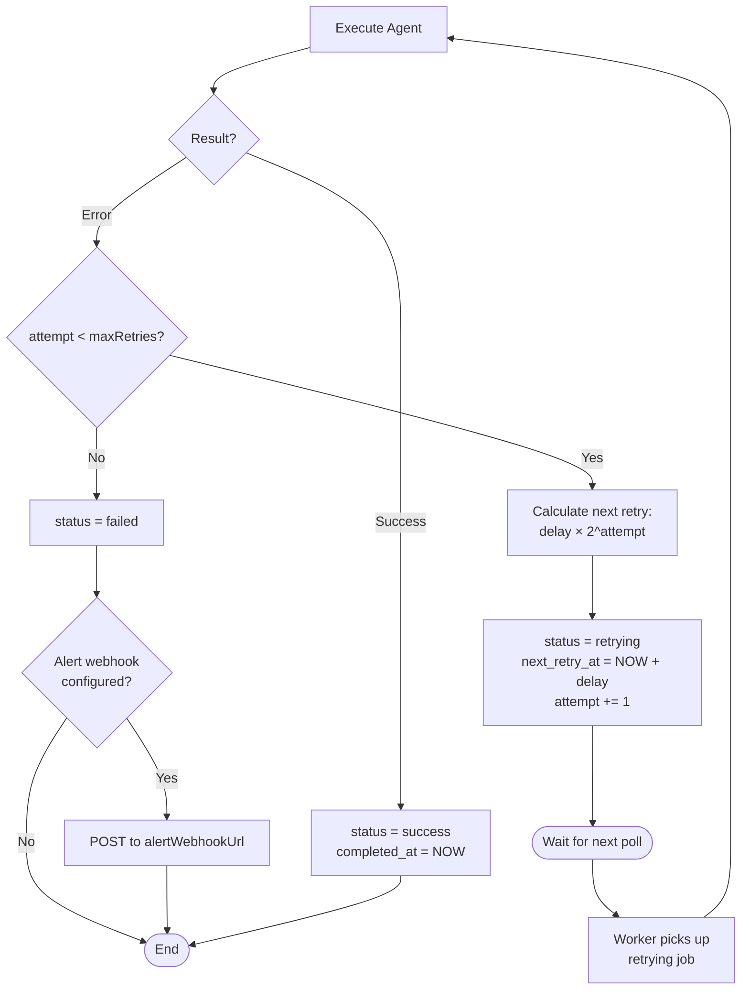

### Multi-Surface Configuration Flow

This shows how scheduled triggers can be configured through different product surfaces and how they converge on the same API.

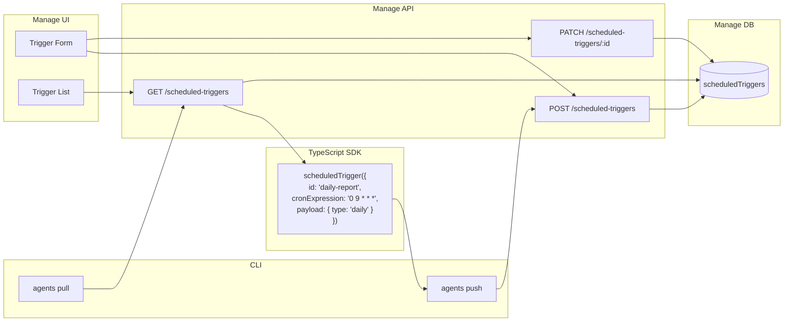

### Comparison: Webhook vs Scheduled Triggers

This shows how scheduled triggers reuse the existing webhook trigger execution infrastructure.

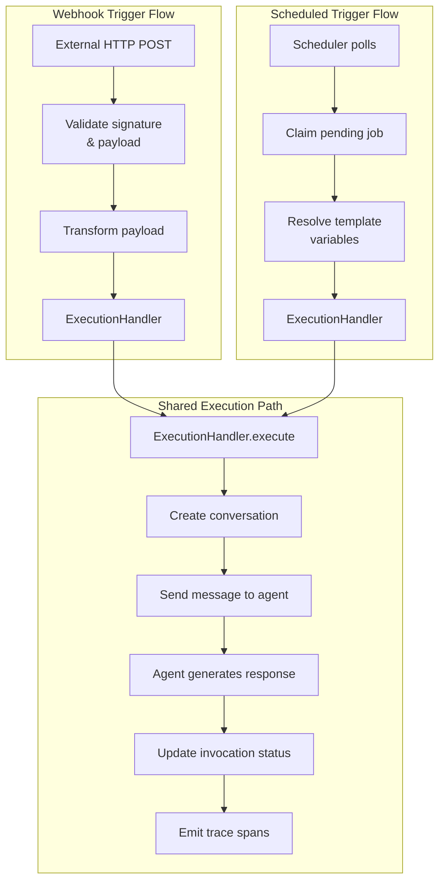

### User Journey: Creating a Scheduled Trigger in Manage UI

```mermaid
flowchart TD
    Start([User visits agent page]) --> Nav[Navigate to<br/>Scheduled Triggers tab]
    Nav --> List[View list of<br/>existing triggers]

    List --> Create[Click "Create<br/>Scheduled Trigger"]
    Create --> Form[Trigger creation form]

    subgraph FormFields["Form Configuration"]
        Name[Enter name<br/>& description]
        Type{Schedule type?}
        Type -->|Recurring| Cron[Enter cron expression<br/>OR use builder]
        Type -->|One-time| RunAt[Pick date/time]
        Cron --> Preview[See next 5<br/>run times]
        Payload[Configure payload<br/>& message template]
        Retry[Set retry policy<br/>& timeout]
    end

    Form --> Name
    Name --> Type
    RunAt --> Payload
    Preview --> Payload
    Payload --> Retry
    Retry --> Save[Save trigger]

    Save --> Enabled{Enable now?}
    Enabled -->|Yes| Active[Trigger active<br/>Next run shown]
    Enabled -->|No| Disabled[Trigger saved<br/>but disabled]

    Active --> Monitor[Monitor executions]
    Monitor --> History[View invocation<br/>history]
    History --> Debug{Execution failed?}
    Debug -->|Yes| ViewError[View error details<br/>& trace link]
    ViewError --> Rerun[Click Re-run]
    Rerun --> Monitor
    Debug -->|No| Success([Success])
```

### Debugging Flow: Investigating Failed Executions

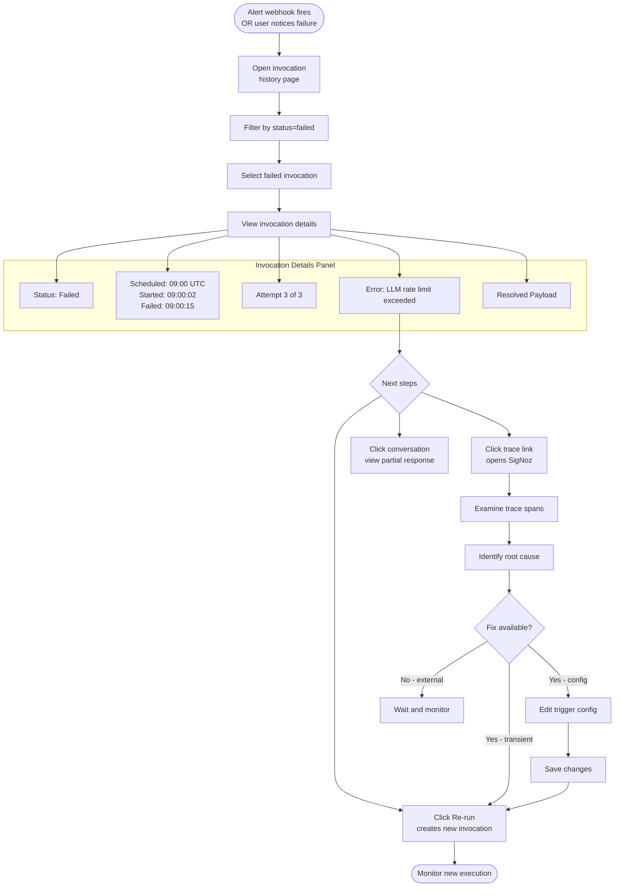

### Leader Election for Scheduler Workers

Only one scheduler worker should create new pending invocations to avoid duplicates. This diagram shows the leader election mechanism using Postgres advisory locks.

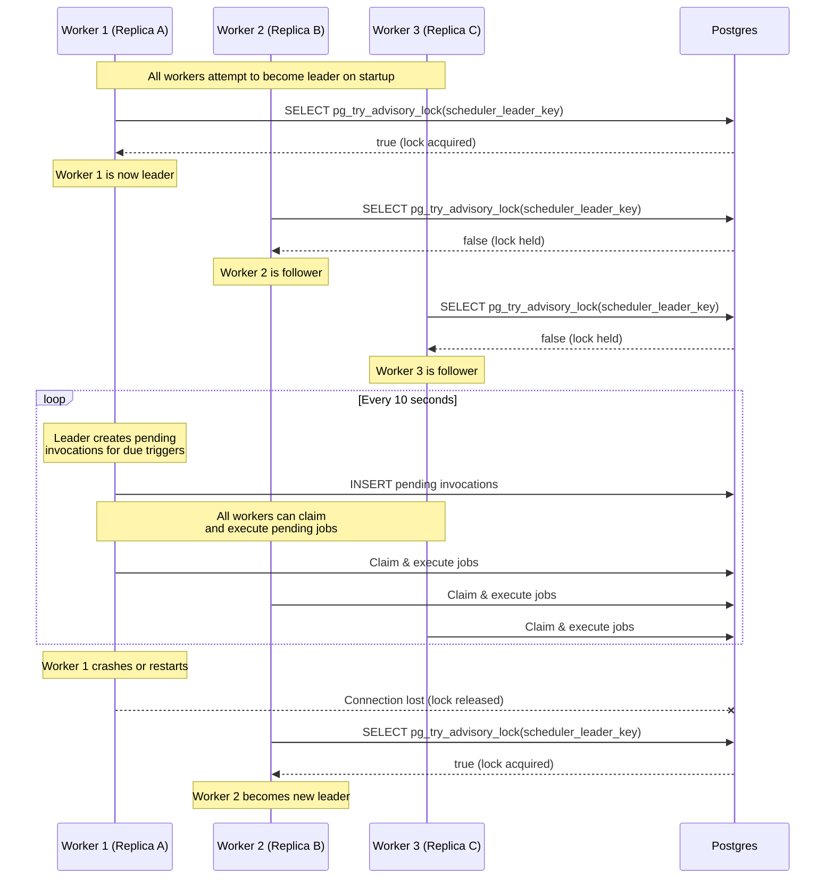

### Cron Execution Timeline

This timeline shows how a cron trigger (`0 9 * * *` - daily at 9am UTC) creates invocations over multiple days.

```mermaid
gantt
    title Cron Trigger: Daily Report (0 9 * * *)
    dateFormat HH:mm
    axisFormat %H:%M

    section Day 1
    Scheduled    :milestone, m1, 09:00, 0m
    Pending      :pending1, 09:00, 1m
    Running      :active, running1, after pending1, 3m
    Success      :done, success1, after running1, 0m

    section Day 2
    Scheduled    :milestone, m2, 09:00, 0m
    Pending      :pending2, 09:00, 1m
    Running      :active, running2, after pending2, 2m
    Success      :done, success2, after running2, 0m

    section Day 3 (with retry)
    Scheduled    :milestone, m3, 09:00, 0m
    Pending      :pending3, 09:00, 1m
    Running      :crit, running3, after pending3, 2m
    Failed (attempt 1) :crit, fail3, after running3, 0m
    Retrying     :retry3, 09:04, 2m
    Running      :active, running3b, after retry3, 3m
    Success      :done, success3, after running3b, 0m
```

### Job Claiming Algorithm

```sql
-- Claim pending jobs with advisory lock (pseudocode)
BEGIN;
  SELECT * FROM scheduled_trigger_invocations
  WHERE status = 'pending'
    AND scheduled_for <= NOW()
    AND pg_try_advisory_xact_lock(hashtext(id))
  ORDER BY scheduled_for
  LIMIT :batch_size
  FOR UPDATE SKIP LOCKED;

  UPDATE scheduled_trigger_invocations
  SET status = 'running', started_at = NOW()
  WHERE id IN (:claimed_ids);
COMMIT;
```

### Execution Flow

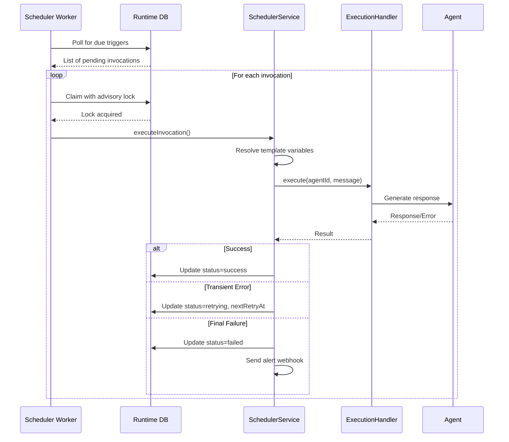

## Technical Considerations

### Dependencies

| Package | Purpose | Notes |
|---------|---------|-------|
| `cron-parser` | Parse and validate cron expressions | Already used elsewhere in ecosystem |
| `@workflow/world-postgres` | Durable execution | Existing infrastructure |
| `mustache` | Template interpolation | Consistent with webhook triggers |

### Database Considerations

- **Manage DB (DoltGres):** Trigger configurations are versioned with the rest of the project config
- **Runtime DB (Postgres):** Invocation records are transactional, not versioned
- **Advisory Locks:** Use `pg_try_advisory_xact_lock()` for non-blocking lock attempts
- **Indexes:** Optimized for scheduler polling patterns (status + scheduledFor)

### Observability Integration

All scheduled trigger executions emit OpenTelemetry spans with:

| Attribute | Description |
|-----------|-------------|
| `scheduled_trigger.id` | Trigger identifier |
| `scheduled_trigger.name` | Human-readable name |
| `scheduled_trigger.type` | 'cron' or 'one_time' |
| `scheduled_trigger.invocation.id` | Invocation identifier |
| `scheduled_trigger.invocation.attempt` | Attempt number (1-based) |
| `scheduled_trigger.invocation.scheduled_for` | Intended execution time |
| `invocation.type` | 'scheduled' (vs 'trigger' for webhooks) |

Traces can be correlated using `traceId` stored in invocation records.

### Surface Area & Side-Effects Scan

#### Impacted Surfaces

- **TypeScript SDK:** New `scheduledTrigger()` builder function and `ScheduledTrigger` class
- **APIs (manage):** New CRUD endpoints for scheduled trigger configuration
- **APIs (run):** New endpoints for invocation history and manual operations
- **Manage UI dashboard:** New pages for trigger management and invocation history
- **CLI workflows:** `pull` generates scheduled trigger code, `push` syncs configurations
- **Observability:** New span names and attributes for scheduled executions

#### Shared Contracts to Preserve

- **Webhook trigger compatibility:** Scheduled triggers use same `ExecutionHandler` flow
- **Message format:** Generated messages follow same structure as webhook trigger messages
- **Trace correlation:** Same `traceId` pattern used for observability linking

#### How It Shows Up

- **Traces:** New `scheduled_trigger.*` spans in trace UI, correlatable via invocation traceId
- **Streaming:** No change - uses existing agent execution streaming

#### Security / Permissions

- **Auth/authz:** Scheduled triggers inherit agent-level permissions
- **Multi-tenancy:** Strict tenant isolation via scoped queries and job claiming

### Files to Create

| File | Purpose |
|------|---------|
| `packages/agents-core/src/db/manage/scheduledTriggers.ts` | Drizzle table export |
| `packages/agents-core/src/db/runtime/scheduledTriggerInvocations.ts` | Drizzle table export |
| `packages/agents-core/src/data-access/manage/scheduledTriggers.ts` | Data access layer |
| `packages/agents-core/src/data-access/runtime/scheduledTriggerInvocations.ts` | Data access layer |
| `packages/agents-core/src/utils/schedule-parser.ts` | Natural language parsing |
| `agents-api/src/domains/run/services/SchedulerService.ts` | Job orchestration |
| `agents-api/src/domains/run/workers/schedulerWorker.ts` | Background polling |
| `agents-api/src/domains/manage/routes/scheduledTriggers.ts` | Config API routes |
| `agents-api/src/domains/run/routes/scheduledTriggerInvocations.ts` | Runtime API routes |
| `packages/agents-sdk/src/scheduledTrigger.ts` | SDK builder |
| `agents-cli/src/commands/pull-v3/components/scheduled-trigger-generator.ts` | Code generator |
| `agents-manage-ui/src/components/scheduled-triggers/*` | UI components |
| `agents-docs/content/docs/features/scheduled-triggers.mdx` | Documentation |

### Files to Modify

| File | Changes |
|------|---------|
| `packages/agents-core/src/db/manage/manage-schema.ts` | Add scheduledTriggers table |
| `packages/agents-core/src/db/runtime/runtime-schema.ts` | Add scheduledTriggerInvocations table |
| `packages/agents-core/src/validation/schemas.ts` | Add Zod schemas |
| `packages/agents-sdk/src/builderFunctions.ts` | Add scheduledTrigger() |
| `packages/agents-sdk/src/builders.ts` | Add ScheduledTrigger class |
| `packages/agents-sdk/src/index.ts` | Export new types |
| `agents-cli/src/commands/pull-v3/introspect-generator.ts` | Include scheduled triggers |
| `agents-api/src/domains/manage/index.ts` | Register new routes |
| `agents-api/src/domains/run/index.ts` | Register new routes, start worker |

## Success Metrics

- Scheduled triggers execute within 30 seconds of their scheduled time under normal load
- Zero duplicate executions (exactly-once guarantee verified in tests)
- Failed executions retry correctly with exponential backoff
- UI shows real-time status updates within 10 seconds
- All 13+ entity types remain fully functional (no regressions)
- Documentation covers all features with working examples

## Open Questions

1. **Scheduler scalability:** Should we design for horizontal scaling from the start, or is leader election sufficient for v1? (Current: leader election)

2. **Missed execution handling:** If the scheduler is down and misses a scheduled time, should it:
   - A. Run immediately when it comes back up (catch-up mode)
   - B. Skip and wait for next scheduled time
   - C. Configurable per trigger

3. **Execution overlap:** If a trigger is still running when the next scheduled time arrives, should it:
   - A. Queue the new execution
   - B. Skip the new execution
   - C. Configurable per trigger

4. **Alert webhook retry:** Should alert webhook delivery have its own retry logic, or fire-and-forget?

5. **Natural language parsing:** Should we use an LLM for natural language schedule parsing, or stick to regex-based parsing for predictability?

## References

- [Existing webhook trigger implementation](../agents-api/src/domains/run/services/TriggerService.ts)
- [Workflow infrastructure](../packages/workflow/)
- [Cron expression format](https://crontab.guru/)
- [Postgres advisory locks](https://www.postgresql.org/docs/current/explicit-locking.html#ADVISORY-LOCKS)
