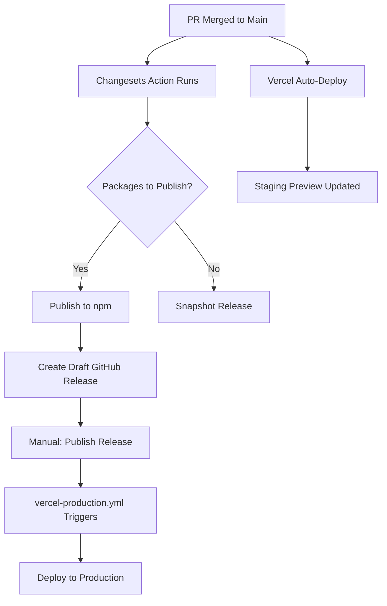

# PRD: Vercel Deployment Strategy - Staging & Production Separation

## Introduction

Implement a deployment strategy that separates staging (main branch) from production (release-based) deployments on Vercel. This ensures that the main branch always has a persistent staging environment for testing, while production deployments only occur when a GitHub release is published through the existing changesets workflow.

## Goals

- Maintain automatic preview deployments for all PRs and branches
- Provide a persistent staging environment tied to the `main` branch
- Restrict production deployments to only occur when a GitHub release is published
- Integrate with the existing changesets release workflow in `release.yml`
- Zero manual intervention required for staging deployments

## User Stories

### US-001: Configure Vercel Production Branch
**Description:** As a developer, I need Vercel configured so that pushes to `main` don't trigger production deployments, allowing us to control production releases separately.

**Acceptance Criteria:**
- [ ] Vercel project settings updated: Production Branch set to `_disabled_` (or similar non-matching value)
- [ ] Pushes to `main` create preview deployments (not production)
- [ ] Preview deployments for `main` have persistent URL pattern (`main-<project>.vercel.app`)
- [ ] Existing PR preview deployments continue working unchanged
- [ ] Typecheck passes
- [ ] CI: Run test suite and local CI checks pass

### US-002: GitHub Actions Production Deployment Workflow
**Description:** As a release manager, I want production deployments to trigger automatically when I publish a GitHub release, so that releases are tied to our existing version management process.

**Acceptance Criteria:**
- [ ] New workflow file `.github/workflows/vercel-production.yml` created
- [ ] Workflow triggers on `release: types: [published]` event
- [ ] Workflow checks out the correct release tag
- [ ] Workflow deploys to Vercel production using Vercel CLI
- [ ] Deployment uses the tagged commit, not latest main
- [ ] Typecheck passes
- [ ] CI: Run test suite and local CI checks pass

### US-003: Configure Required Secrets
**Description:** As a DevOps engineer, I need the required secrets documented and configured so the production deployment workflow can authenticate with Vercel.

**Acceptance Criteria:**
- [ ] `VERCEL_TOKEN` secret added to GitHub repository
- [ ] `VERCEL_ORG_ID` secret added to GitHub repository
- [ ] `VERCEL_PROJECT_ID` secret added to GitHub repository
- [ ] Secrets documented in workflow file comments or README
- [ ] CI: Workflow runs successfully with secrets configured

### US-004: Optional Staging Domain Configuration
**Description:** As a QA engineer, I want a custom staging domain so I can easily access and share the staging environment.

**Acceptance Criteria:**
- [ ] (Optional) Custom domain configured for main branch in Vercel (e.g., `staging.inkeep.com`)
- [ ] Domain correctly routes to main branch deployments
- [ ] SSL certificate provisioned automatically by Vercel

## Functional Requirements

- FR-1: Vercel must NOT deploy to production when commits are pushed to `main`
- FR-2: Vercel must continue creating preview deployments for all branches and PRs
- FR-3: Main branch must have a persistent, predictable preview URL
- FR-4: Production deployments must only occur via the GitHub Actions workflow
- FR-5: Production deployments must be triggered by the `release: published` event
- FR-6: Production deployments must checkout and deploy the exact tagged commit
- FR-7: The workflow must use Vercel CLI for deployment (`vercel deploy --prod`)

## Non-Goals

- No changes to the existing changesets release workflow (`release.yml`)
- No automatic rollback mechanism (handle manually if needed)
- No blue-green or canary deployment strategies
- No staging environment variable differences (use Vercel environment settings separately)
- No Slack/Discord notifications for deployments (can be added later)

## Technical Considerations

### Workflow File

The workflow is already created at `.github/workflows/vercel-production.yml`:

```yaml
name: Deploy to Vercel Production

on:
  release:
    types: [published]

env:
  VERCEL_ORG_ID: ${{ secrets.VERCEL_ORG_ID }}
  VERCEL_PROJECT_ID: ${{ secrets.VERCEL_PROJECT_ID }}

jobs:
  deploy:
    name: Deploy to Production
    runs-on: ubuntu-latest
    steps:
      - name: Checkout
        uses: actions/checkout@v4
        with:
          ref: ${{ github.event.release.tag_name }}

      - name: Install Vercel CLI
        run: npm install -g vercel

      - name: Pull Vercel Environment
        run: vercel pull --yes --environment=production --token=${{ secrets.VERCEL_TOKEN }}

      - name: Build
        run: vercel build --prod --token=${{ secrets.VERCEL_TOKEN }}

      - name: Deploy to Production
        run: vercel deploy --prebuilt --prod --token=${{ secrets.VERCEL_TOKEN }}
```

### Required Secrets

| Secret | Description | How to Obtain |
|--------|-------------|---------------|
| `VERCEL_TOKEN` | API token for Vercel CLI | Vercel Dashboard → Settings → Tokens → Create |
| `VERCEL_ORG_ID` | Organization/team ID | Run `vercel link` locally, check `.vercel/project.json` |
| `VERCEL_PROJECT_ID` | Project ID | Same as above, from `.vercel/project.json` |

### Vercel Dashboard Configuration

1. **Project Settings → Git → Production Branch**: Set to `_disabled_`
2. **Project Settings → Domains** (optional): Add `staging.yourdomain.com` with branch set to `main`

### Integration with Existing Release Flow



### Surface area & side-effects scan

#### Impacted surfaces (only list what applies)
- **CI/CD workflows**: New workflow file added; no changes to existing `release.yml`
- **Vercel Dashboard**: Manual configuration required (Production Branch setting)

#### Shared contracts to preserve (if any)
- **Release workflow**: The existing changesets flow remains unchanged; this workflow consumes its output (published releases)
- **Preview URLs**: Existing preview URL patterns for PRs must remain functional

#### Security / permissions (if applicable)
- **Secrets**: Three new secrets required with write access to Vercel deployments
- **GitHub permissions**: Workflow needs read access to releases (default available)

## Success Metrics

- Staging environment (`main` branch) updates within 5 minutes of merge
- Production deployments only occur after explicit release publication
- Zero accidental production deployments from direct pushes to main
- No disruption to existing PR preview deployment workflow

## Open Questions

- Should we add deployment status notifications (Slack, Discord)?
- Should staging have different environment variables than production?
- Do we need a manual "promote to production" option separate from releases?
- Should we add a deployment health check step after production deploy?
