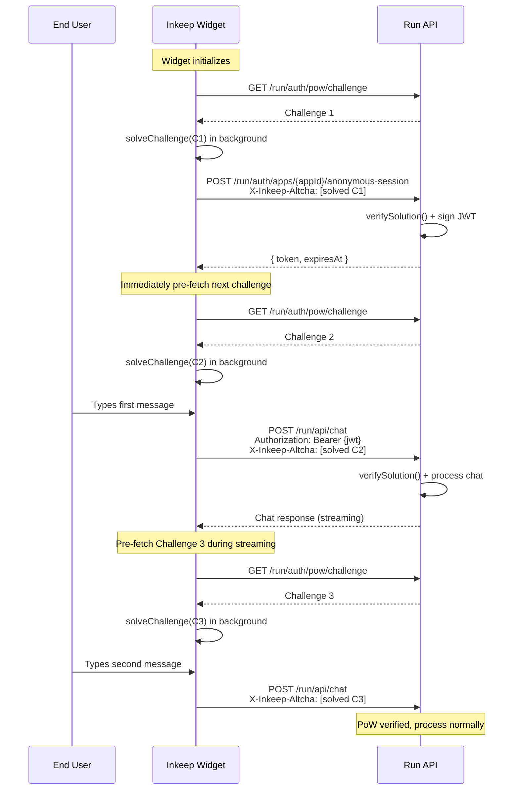

# ALTCHA Proof-of-Work for Run API — Spec

**Status:** Final
**Owner(s):** Andrew
**Last updated:** 2026-03-06
**Links:**
- Parent spec: `specs/2026-03-02-app-credentials-and-end-user-auth/SPEC.md` (Phase 2 extraction)
- Research: `reports/altcha-proof-of-work-integration/REPORT.md`
- Research: `reports/altcha-replay-protection/REPORT.md`
- Evidence: `./evidence/` (spec-local findings)

---

## 1) Problem Statement

- **Who is affected:**
  1. **End-users** of customer-deployed chat widgets (web_client apps)
  2. **Customer developers** integrating Inkeep agents via the Inkeep Widget
  3. **Inkeep platform** — runtime infrastructure and abuse protection

- **What pain / job-to-be-done:**
  The run API endpoints for `web_client` apps are protected only by an anonymous JWT and Origin/domain validation. Both are trivially obtained or spoofed outside a browser context. An attacker can:
  1. **Spin up unlimited anonymous identities** — each anonymous session request generates a fresh `anon_<uuid>` with a valid JWT
  2. **Send unlimited chat messages** — each identity can start conversations, consuming LLM tokens at the platform's cost
  3. **Evade per-user rate limits** — cheap identity rotation defeats per-`sub` throttling
  4. **Pollute conversation data** — mass-created sessions and messages create noise in analytics

  PoW on every run API request makes both identity creation AND message sending computationally expensive on the client side, making automated abuse economically unviable. A pre-fetch pipeline in the Inkeep Widget hides the solve latency from legitimate users entirely.

- **Why now:**
  Phase 1 (app credentials + anonymous sessions) is landing. Before customers deploy web_client apps to production, the abuse vector should be gated. PoW is the lightest-weight protection that doesn't require user interaction or third-party services.

---

## 2) Goals

1. Every run API request from `web_client` apps requires a valid PoW solution when PoW is enabled
2. Legitimate users experience zero perceived latency (pre-fetch pipeline hides solve time)
3. Automated abuse requires proportional compute cost per request
4. Zero third-party service dependencies (self-hosted `altcha-lib`)
5. Backward compatible — PoW is off by default, enabled by env var

## 3) Non-Goals

- Per-user rate limiting (separate future work)
- Visible CAPTCHA UI or user-facing challenge
- Per-app difficulty tuning (system-wide only for now)
- Adaptive difficulty based on server load
- PoW for `api` type apps (server-to-server has secrets)
- PoW for authenticated (HS256 customer-signed JWT) sessions
- Inkeep Widget implementation (separate repo — this spec covers the API contract)

---

## 4) Consumers / Personas

| Consumer | Interaction | Impact |
|---|---|---|
| **End-user (browser)** | Inkeep Widget pre-solves challenges in background — invisible | Zero perceived latency |
| **Customer developer** | Uses Inkeep Widget which handles PoW automatically | Zero config change if using official widget |
| **Custom API client** | Must implement challenge fetch → solve → attach flow | New integration requirement (documented) |
| **Platform operator** | Sets `INKEEP_POW_HMAC_SECRET` env var to enable PoW globally | Single env var to enable/disable |
| **Attacker (bot)** | Must solve PoW per request — compute cost scales linearly | Economic deterrent |

---

## 5) User Journey

### Happy Path: Pre-fetch Pipeline (Inkeep Widget)

```
1. User visits customer's website with embedded Inkeep Widget
2. Widget initializes → immediately fetches Challenge 1 and begins solving
3. Challenge 1 solved (~0.15-2.5s in background, invisible to user)
4. Widget submits anonymous session request with Challenge 1 solution
5. Server verifies PoW → issues anonymous JWT
6. Widget immediately fetches Challenge 2 and begins solving in background
7. User types first message
8. Widget sends first chat request with Challenge 2 solution attached
9. Server verifies PoW → processes chat request
10. Widget immediately fetches Challenge 3 in background (pipeline continues)
11. Subsequent messages always have a pre-solved challenge ready
```

The pipeline ensures a solved challenge is always available before the user needs it. Solve time is hidden behind user think-time and typing.

### Happy Path: Custom API Client

```
1. Client fetches challenge from GET /run/auth/pow/challenge
2. Client solves challenge (using altcha-lib solveChallenge())
3. Client attaches solution as X-Inkeep-Altcha header on run API request
4. Server verifies PoW → processes request
5. Client pre-fetches next challenge for subsequent requests
```

### Failure Paths

- **PoW disabled (env var absent):** All run API endpoints work exactly as today — no PoW required
- **Challenge expired:** Server returns 400 `pow_invalid` — client fetches new challenge
- **Invalid solution:** Server returns 400 `pow_invalid` — client fetches new challenge
- **Missing PoW when required:** Server returns 400 `pow_required`
- **Pipeline stall (slow device):** Widget queues the message until solve completes — slight delay

---

## 6) Requirements

### MUST

| ID | Requirement | Type |
|---|---|---|
| R1 | Challenge endpoint: `GET /run/auth/pow/challenge` returns ALTCHA challenge | T |
| R2 | All run API requests accept PoW solution via `X-Inkeep-Altcha` header (base64-encoded) | T |
| R3 | When PoW is enabled, run API requests from `web_client` apps WITHOUT valid PoW are rejected (400) | T |
| R4 | When PoW is disabled (env var absent), all endpoints work unchanged (backward compatible) | T |
| ~~R5~~ | ~~Replay protection: each challenge solution can only be used once~~ | ~~T~~ | *Deferred — future PR* |
| R6 | Challenge expiry: challenges expire after a configurable TTL (default 5 min) | T |
| R7 | PoW verification checks: hash match, HMAC signature, expiry, replay | T |
| R8 | `altcha-lib` version >= 1.4.1 (CVE-2025-68113 fix) | T |
| R9 | PoW verification runs in `tryAppCredentialAuth` middleware (not per-route) | T |
| R10 | PoW only enforced for `web_client` app type (not `api` type or other auth methods) | T |

### SHOULD

| ID | Requirement | Type |
|---|---|---|
| ~~R11~~ | ~~Replay store entries auto-expire (no unbounded growth)~~ | ~~T~~ | *Deferred — future PR* |
| R12 | Observability: log/metric on PoW verification success/failure with reason | T |
| R13 | Error responses include machine-readable error codes for client retry logic | T |
| R14 | Ship guide snippets updated to document PoW integration pattern | P |
| R15 | Challenge endpoint does NOT require auth (pre-auth by definition) | T |

### COULD

| ID | Requirement | Type |
|---|---|---|
| R16 | Per-app opt-out of PoW (for internal/trusted apps) | P |
| R17 | Multi-worker solving on client for faster solve times | T |

---

## 7) Technical Design

### 7.1 Environment Variables

| Variable | Type | Required | Default | Description |
|---|---|---|---|---|
| `INKEEP_POW_HMAC_SECRET` | string | No | — | HMAC secret for signing PoW challenges. **Presence enables PoW globally for `web_client` apps.** Min 32 chars. |
| `INKEEP_POW_DIFFICULTY` | number | No | 50000 | `maxnumber` parameter for challenge generation. Controls client-side compute cost. |
| `INKEEP_POW_CHALLENGE_TTL_SECONDS` | number | No | 300 | Challenge expiry in seconds (5 min default). |

**Enabling PoW:** Set `INKEEP_POW_HMAC_SECRET`. That's it. Difficulty and TTL have sensible defaults.

**Disabling PoW:** Remove or unset `INKEEP_POW_HMAC_SECRET`. All endpoints revert to current behavior.

### 7.2 Challenge Endpoint

**Route:** `GET /run/auth/pow/challenge`
**Auth:** `noAuth()` (public — must be callable before authentication)

Note: Challenge endpoint is NOT scoped to `{appId}`. Challenges are generic — the server binds no app-specific data into the challenge. This simplifies the client (one challenge endpoint regardless of app) and avoids leaking app configuration.

```typescript
// Handler pseudocode
if (!env.INKEEP_POW_HMAC_SECRET) {
  return c.json({ error: 'pow_disabled', message: 'PoW is not enabled' }, 404);
}

const challenge = await createChallenge({
  hmacKey: env.INKEEP_POW_HMAC_SECRET,
  algorithm: 'SHA-256',
  maxnumber: env.INKEEP_POW_DIFFICULTY,
  expires: new Date(Date.now() + env.INKEEP_POW_CHALLENGE_TTL_SECONDS * 1000),
});

return c.json({
  algorithm: challenge.algorithm,
  challenge: challenge.challenge,
  maxnumber: challenge.maxnumber,
  salt: challenge.salt,
  signature: challenge.signature,
});
```

**Design choice — no app binding in challenge:** The previous draft bound `appId` into the challenge via `params`. With per-request PoW, this adds complexity without meaningful security benefit. The HMAC signature already proves the challenge originated from this server. The auth middleware independently validates the app credential. A challenge proves "this client did compute work" — it doesn't need to prove which app it's for.

### 7.3 Shared PoW Verification Utility

A single reusable function handles PoW verification for all call sites — both `tryAppCredentialAuth` middleware and the anonymous session handler.

```typescript
// e.g. packages/agents-core/src/utils/pow.ts

import { verifySolution } from 'altcha-lib';

type PoWResult =
  | { ok: true }
  | { ok: false; error: 'pow_required' | 'pow_invalid' };

function isPoWEnabled(): boolean {
  return !!env.INKEEP_POW_HMAC_SECRET;
}

async function verifyPoW(request: Request): Promise<PoWResult> {
  if (!isPoWEnabled()) {
    return { ok: true }; // PoW disabled — pass through
  }

  const altchaHeader = request.headers.get('x-inkeep-altcha');
  if (!altchaHeader) {
    return { ok: false, error: 'pow_required' };
  }

  // Verify solution (hash + HMAC + expiry) — cheap: 1 SHA-256 + 1 HMAC
  const valid = await verifySolution(altchaHeader, env.INKEEP_POW_HMAC_SECRET);
  if (!valid) {
    return { ok: false, error: 'pow_invalid' };
  }

  // Note: replay protection (used challenge tracking) deferred to future PR.
  // Challenge expiry (checked by verifySolution) is the sole temporal bound for now.

  return { ok: true };
}
```

Both call sites use the same function:

**In `tryAppCredentialAuth` (middleware)** — runs before JWT verification for fail-fast:
```typescript
// After app lookup, type check confirms web_client...

const pow = await verifyPoW(reqData.request);
if (!pow.ok) {
  return { authResult: null, failureMessage: pow.error };
}

// JWT verification follows (more expensive — only reached if PoW passes)
```

**In anonymous session handler** — same function, same errors:
```typescript
// After app lookup, type check, origin validation...

const pow = await verifyPoW(c.req.raw);
if (!pow.ok) {
  return c.json({ error: pow.error }, 400);
}

// ... existing JWT issuance logic unchanged
```

This ensures:
- PoW logic is defined once — enablement check, header extraction, and verification
- Both paths return the same machine-readable error codes (`pow_required`, `pow_invalid`)
- Cheapest check runs first (enablement → header presence → crypto verification → then JWT/handler logic)
- `api` type apps and other auth methods are unaffected (PoW only checked for `web_client`)

### 7.5 Replay Protection (Deferred)

Replay protection (tracking used challenge signatures to prevent reuse) is deferred to a future PR. The research is complete (`reports/altcha-replay-protection/REPORT.md`) and the design is ready: UNLOGGED PostgreSQL table + `INSERT ON CONFLICT DO NOTHING` + periodic DELETE cleanup.

For this phase, challenge expiry (`expires` parameter checked by `verifySolution()`) is the sole temporal bound. A solved challenge can be reused until it expires. This is acceptable for initial rollout — the PoW compute cost is the primary deterrent, and challenge TTL (default 5 min) limits the reuse window.

### 7.6 Schema Changes

**Remove `captchaEnabled` from WebClientConfig:**

PoW is now global-by-env-var, not per-app. The `captchaEnabled` field is unused and would be misleading.

```typescript
// Before
WebClientConfigSchema = z.object({
  type: z.literal('web_client'),
  webClient: z.object({
    allowedDomains: z.array(z.string().min(1)).min(1),
    captchaEnabled: z.boolean().default(false),  // REMOVE
  }),
});

// After
WebClientConfigSchema = z.object({
  type: z.literal('web_client'),
  webClient: z.object({
    allowedDomains: z.array(z.string().min(1)).min(1),
  }),
});
```

**Type derivation:** The manual `WebClientConfig` type in `utility.ts` should be replaced with `z.infer<typeof WebClientConfigSchema>` so the type is derived from the Zod schema (single source of truth, no duplication). Same for `ApiConfig` and `AppConfig`.

**Migration:** `captchaEnabled` is in JSONB config, not a column. No SQL migration needed — just stop reading/writing it. Existing records with the field are harmless (Zod strips unknown keys).

### 7.7 Transport: `X-Inkeep-Altcha` Header

PoW solutions are sent via the `X-Inkeep-Altcha` HTTP header (base64-encoded JSON), not in the request body. This allows PoW to be applied uniformly across all run API endpoints (GET, POST, streaming) without modifying each endpoint's body schema.

```
X-Inkeep-Altcha: eyJhbGdvcml0aG0iOiJTSEEtMjU2IiwiY2hhbGxlbmdlIjoiYTFiMmMzLi4uIiwibnVtYmVyIjoxMjM0NSwic2FsdCI6ImFiYzEyMz9leHBpcmVzPTE3MDk3NDA4MDAmIiwic2lnbmF0dXJlIjoiZDRlNWY2Li4uIn0=
```

Decoded:
```json
{
  "algorithm": "SHA-256",
  "challenge": "a1b2c3...",
  "number": 12345,
  "salt": "abc123?expires=1709740800&",
  "signature": "d4e5f6..."
}
```

### 7.8 Sequence Diagram: Pre-fetch Pipeline



---

## 8) Surface Area Impact

### Product Surfaces

| Surface | Impact | Action | Owner |
|---|---|---|---|
| Inkeep Widget (separate repo) | Pre-fetch pipeline + X-Inkeep-Altcha header on all requests | Implementation in widget repo | Sarah (separate, later) |
| Manage UI — App forms | Remove `captchaEnabled` toggle | Remove field | This spec |
| Ship guide snippets | Update code samples to show X-Inkeep-Altcha pattern for custom clients | Update templates | This spec |
| Documentation | New section: PoW configuration (env vars), custom client integration guide | Write docs | This spec |

### Internal Surfaces

| Surface | Impact | Action |
|---|---|---|
| `agents-api` — run auth middleware (`runAuth.ts`) | Add PoW verification in `tryAppCredentialAuth` | Implementation |
| `agents-api` — run auth routes | New challenge endpoint, modify anonymous session handler | Implementation |
| `agents-core` — runtime schema | *(Deferred — no schema changes this PR)* | — |
| `agents-core` — validation schemas + types | Remove `captchaEnabled` from `WebClientConfigSchema`. Derive `WebClientConfig` type via `z.infer<>` instead of manual duplicate in `utility.ts`. | Schema change |
| `agents-api` — env.ts | Three new env vars | Config change |
| Test suite | PoW flow, replay protection, disabled path, middleware integration | Tests |

---

## 9) Alternatives Considered

**Why not reCAPTCHA/hCaptcha/Turnstile:**
Third-party dependency, requires user interaction (visible widget), privacy concerns (sends user data to Google/Cloudflare), and vendor lock-in. PoW is self-hosted, invisible, and privacy-preserving.

**Why not per-app PoW toggle (original design):**
Global-by-env-var is simpler to reason about and operate. Every public `web_client` endpoint gets the same protection. Per-app toggles add configuration surface area without clear customer demand. Can add opt-out later (R16) if needed.

**Why not PoW only on session creation:**
An attacker with one valid session can send unlimited chat messages, each consuming LLM tokens. Per-request PoW makes the compute cost proportional to abuse volume regardless of how many identities the attacker creates.

**Why not request body for PoW solution:**
Header transport (`X-Inkeep-Altcha`) works uniformly across GET, POST, and streaming endpoints without modifying each endpoint's body schema. The auth middleware reads it once — no per-route changes.

**Why not bind appId into challenge:**
With per-request PoW across all run API endpoints, the challenge just proves "this client did compute work." App binding adds complexity without meaningful security benefit — the auth middleware independently validates the app credential. Removing app binding also simplifies the client (one challenge endpoint, challenges are interchangeable).

---

## 10) Decision Log

| ID | Decision | Type | 1-way door? | Status | Rationale |
|---|---|---|---|---|---|
| D1 | PoW enabled globally by presence of `INKEEP_POW_HMAC_SECRET` env var | T | No | **Decided** | Simplest operational model. No per-app config needed. |
| D2 | System-wide difficulty via `INKEEP_POW_DIFFICULTY` env var (default 50000) | T | No | **Decided** | Single knob. 50K = ~0.15s desktop, ~1.2s budget mobile. |
| D3 | Headless/invisible solver in Inkeep Widget (no visible UI) | P | No | **Decided** | PoW should be invisible to end users. Pre-fetch pipeline hides latency. |
| D4 | Remove `captchaEnabled` per-app field from schema | T | No | **Decided** | Redundant with global env var. Field was never enforced. |
| D5 | Replay protection via runtime Postgres table | T | No | **Decided** | No new dependencies. Atomic INSERT with unique constraint. |
| D6 | Scope: PoW only (no rate limiting in this spec) | P | No | **Decided** | Rate limiting is complementary but separable. |
| D7 | `altcha-lib` >= 1.4.1 required | T | No | **Decided** | CVE-2025-68113 fix. |
| D8 | PoW on every run API request (not just session creation) | T | No | **Decided** | Prevents both identity flooding and message abuse. Pre-fetch pipeline hides latency. |
| D9 | PoW solution via `X-Inkeep-Altcha` header (not request body) | T | Yes (API contract) | **Decided** | Uniform transport across all HTTP methods. No per-route body changes. |
| D10 | Challenge endpoint is generic (no app binding) | T | No | **Decided** | Simplifies client. Auth middleware validates app independently. |
| D11 | PoW only for `web_client` app type | T | No | **Decided** | `api` type has secrets. Other auth methods unaffected. |
| D12 | Inkeep Widget implementation is out of scope (separate repo) | P | No | **Decided** | This spec defines the API contract. Widget changes tracked separately. |
| D13 | Separate `INKEEP_POW_HMAC_SECRET` (not reusing `INKEEP_ANON_JWT_SECRET`) | T | No | **Decided** | Independent purposes, independent secrets. |
| D14 | PoW discovery is client-side config, not server probing | P | No | **Decided** | Widget is configured to use PoW by its own config. No discovery endpoint needed. |
| D15 | UNLOGGED table + INSERT ON CONFLICT DO NOTHING for replay protection | T | No | **Decided** | Atomic exactly-once, 2-3x throughput, handles 10K-30K req/sec. See `reports/altcha-replay-protection/REPORT.md`. |

---

## 11) Open Questions

| ID | Question | Type | Priority | Blocking? | Status |
|---|---|---|---|---|---|
| Q1 | ~~Optimal replay protection strategy~~ | T | P0 | — | **Resolved** → UNLOGGED table + INSERT ON CONFLICT DO NOTHING + periodic DELETE. See §7.5 and `reports/altcha-replay-protection/REPORT.md` |
| Q2 | ~~Should `INKEEP_POW_HMAC_SECRET` be a separate secret or reuse `INKEEP_ANON_JWT_SECRET`?~~ | T | P1 | — | **Resolved** → Separate secret. Independent concerns, independent secrets. |
| Q3 | ~~How should the client know if PoW is required?~~ | T | P1 | — | **Resolved** → Client widget config (out of scope for this PR). Widget is configured to use PoW by its own config, not by probing the server. |

---

## 12) Assumptions

| ID | Assumption | Confidence | Verification plan | Status |
|---|---|---|---|---|
| A1 | `altcha-lib` works in Bun runtime | HIGH | Confirmed in research report | **Verified** |
| A2 | 50K maxnumber is acceptable UX on budget mobile (~1.2s) — hidden by pre-fetch pipeline | HIGH | Solve happens in background; user never waits | Active |
| A3 | Runtime Postgres can handle replay check INSERTs at run API request volume | HIGH | Research confirms: UNLOGGED table handles ~10K-30K req/sec. 1K req/sec needs only 2 connections. | **Verified** via research |
| A4 | Removing `captchaEnabled` from JSONB config requires no SQL migration | HIGH | Field is in JSONB, not a column. Zod strips unknown fields. | Active |
| A5 | Pre-fetch pipeline in widget keeps a solved challenge ready before user needs it | HIGH | User think-time + typing time >> solve time at 50K difficulty | Active |

---

## 13) Phases & Rollout Plan

### Phase 1 (this spec — single phase)

**Goal:** All run API requests from `web_client` apps require ALTCHA PoW when `INKEEP_POW_HMAC_SECRET` is set. Replay protection prevents challenge reuse. Inkeep Widget handles PoW via pre-fetch pipeline (separate repo).

**In scope (this repo):**
- Challenge endpoint (`GET /run/auth/pow/challenge`)
- PoW verification in `tryAppCredentialAuth` middleware
- Anonymous session endpoint PoW verification
- Three env vars (`INKEEP_POW_HMAC_SECRET`, `INKEEP_POW_DIFFICULTY`, `INKEEP_POW_CHALLENGE_TTL_SECONDS`)
- Remove `captchaEnabled` from `WebClientConfig` schema, types, and Manage UI
- Update ship guide snippets to document `X-Inkeep-Altcha` header pattern
- Tests: challenge generation, PoW verification, expiry rejection, disabled path, middleware integration
- Documentation: env var configuration, custom client integration guide

**Out of scope:**
- Replay protection / used-challenge tracking (future PR — design ready in `reports/altcha-replay-protection/REPORT.md`)
- Inkeep Widget implementation (separate repo)
- Per-user rate limiting
- Per-app PoW opt-out
- Adaptive difficulty
- Visible CAPTCHA UI

**Acceptance criteria:**
- [ ] `GET /run/auth/pow/challenge` returns valid ALTCHA challenge when PoW enabled
- [ ] `GET /run/auth/pow/challenge` returns 404 when PoW disabled
- [ ] Run API requests with `web_client` auth + valid `X-Inkeep-Altcha` header succeed
- [ ] Run API requests with `web_client` auth + missing `X-Inkeep-Altcha` return 400 `pow_required` (when enabled)
- [ ] Run API requests with `web_client` auth + expired challenge return 400 `pow_invalid`
- [ ] Anonymous session endpoint enforces PoW (when enabled)
- [ ] `api` type apps and other auth methods (bypass, API key, Slack) are unaffected by PoW
- [ ] Without `INKEEP_POW_HMAC_SECRET`: all endpoints work unchanged
- [ ] `captchaEnabled` removed from schema, types, and UI
- [ ] Ship guide snippets updated
- [ ] `pnpm check` passes
- [ ] Documentation updated

**Risks + mitigations:**
- No replay protection yet → challenge can be reused within TTL window; PoW compute cost is the primary deterrent; replay protection is a future PR
- Pipeline stall on slow devices → widget can queue messages until solve completes; 50K difficulty targets <1.2s even on budget mobile
- Custom clients (non-widget) must implement PoW → documented pattern + error codes enable retry logic

---

## 14) Risks & Mitigations

| Risk | Likelihood | Impact | Mitigation |
|---|---|---|---|
| Challenge reuse within TTL window (no replay protection yet) | Medium | Low | PoW compute cost is the primary deterrent. Challenge TTL (5 min) limits reuse window. Replay protection in future PR. |
| Widget pre-fetch pipeline stalls (slow device) | Low | Low | Messages queue until solve completes. 50K = <1.2s budget mobile. |
| Custom API clients break when PoW enabled | Medium | Medium | Machine-readable error codes. Documentation. PoW is opt-in (env var). |
| Challenge endpoint abuse (mass challenge generation) | Low | Low | Challenges are cheap to generate (no DB write). Rate limiting if needed (R10). |
| Breaking change for existing `web_client` apps when PoW enabled | Low | High | PoW is off by default. Operators explicitly enable it. Widget must be updated first. |
