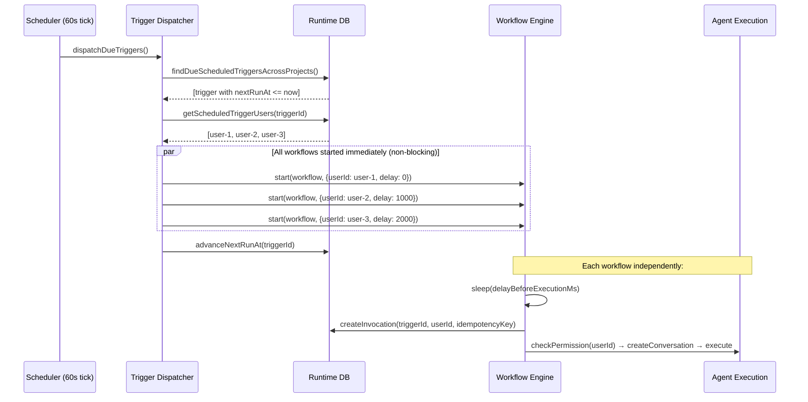

# Multi-User Scheduled Triggers

**Status:** Ready for Implementation
**Created:** 2026-03-31
**Author:** AI + Human collaborative spec

---

## 1. Problem Statement

**Situation:** Scheduled triggers allow automated, time-based execution of agents. Each trigger is configured with a `runAsUserId` that determines whose identity, permissions, and timezone are used during execution. The UI supports bulk-creating one trigger per user, but this creates N independent triggers.

**Complication:** The 1-trigger-per-user model creates management overhead at scale. A sales team of 10 wanting a daily meeting-prep agent requires 10 separate triggers. Updating the schedule/payload/template means 10 independent updates. Triggers can silently drift apart. Adding/removing team members requires creating/deleting individual triggers. Cascade-deleting a user removes their trigger with no visibility.

**Resolution:** Enable a single scheduled trigger to be associated with multiple users, producing N parallel executions (one per user) at each scheduled tick while maintaining centralized configuration management.

---

## 2. Goals

1. A single trigger definition can run as multiple users
2. Centralized management — update schedule/config once, applies to all users
3. Per-user execution tracking — independent invocation status, retry, and conversation history
4. Clean user lifecycle — adding/removing users from a trigger without affecting the trigger itself
5. Backward compatible — existing single-user triggers continue to work unchanged

## 3. Non-Goals

- Per-user payload or template customization (use separate triggers for that)
- Per-user scheduling (different cron per user)
- Trigger grouping or linking of separate triggers
- Changes to webhook triggers (only scheduled triggers)

---

## 4. Current State

See `evidence/current-system.md` for full details.

**Key facts:**
- `runAsUserId` is a scalar `varchar(256)` FK to `user.id` with CASCADE delete
- Dispatcher queries `WHERE enabled=true AND nextRunAt <= NOW()`, starts one workflow per trigger
- Each workflow creates one invocation with idempotency key `sched_{triggerId}_{scheduledFor}`
- Invocations have no `runAsUserId` field — resolved from trigger at execution time
- UI already has multi-user selection in create mode (admin only) but creates N separate triggers
- `deleteScheduledTriggersByRunAsUserId()` cascade-deletes all triggers for a removed user
- **Gap:** When a user is removed from a *project* (not org), no trigger cleanup happens. The system only cleans up on full org removal via `beforeRemoveMember` hook in auth.ts.

---

## 5. Target State

A scheduled trigger has a set of associated user IDs. When the trigger fires:
1. Dispatcher detects the trigger is due (same as today — single `nextRunAt` query)
2. Fan-out in dispatcher: one workflow per associated user
3. Each execution gets its own invocation record with per-user status tracking
4. Each execution performs permission checks and timezone resolution for its specific user
5. The trigger continues to exist even if individual users are removed
6. Configurable dispatch delay between user executions to avoid MCP rate limits

---

## 6. Proposed Design

### 6.1 Data Model: Join Table

**New table: `scheduled_trigger_users`**

```sql
CREATE TABLE scheduled_trigger_users (
  tenant_id     varchar(256) NOT NULL,
  scheduled_trigger_id varchar(256) NOT NULL,
  user_id       varchar(256) NOT NULL REFERENCES "user"(id) ON DELETE CASCADE,
  created_at    timestamptz NOT NULL DEFAULT NOW(),
  PRIMARY KEY (tenant_id, scheduled_trigger_id, user_id),
  FOREIGN KEY (tenant_id, scheduled_trigger_id)
    REFERENCES scheduled_triggers(tenant_id, id) ON DELETE CASCADE
);

CREATE INDEX sched_trigger_users_user_idx ON scheduled_trigger_users (user_id);
CREATE INDEX sched_trigger_users_trigger_idx ON scheduled_trigger_users (tenant_id, scheduled_trigger_id);
```

The composite FK `(tenant_id, scheduled_trigger_id) → scheduled_triggers(tenant_id, id)` ensures:
- Rows cannot reference a non-existent trigger
- Deleting a trigger cascade-deletes all its user associations

**Changes to `scheduled_triggers` table:**
- `runAsUserId` column: kept during transition, backfilled into join table, then deprecated
- New field on trigger: `dispatchDelayMs` (integer, optional) — delay between dispatching each user's workflow to avoid MCP rate limits

**Why join table over array column:**
- FK constraint to `user.id` with CASCADE delete (automatic cleanup when user deleted)
- Efficient queries in both directions (triggers for user, users for trigger)
- Indexable for performance
- Supports atomic add/remove of individual users
- Avoids JSONB array manipulation complexity
- Follows existing codebase patterns (evaluation suite config evaluator relations, dataset run config agent relations)

**Extensibility for future group/team support:**
- Keep `scheduled_trigger_users` as-is (direct user associations)
- When groups are added later, create a separate `scheduled_trigger_groups` table with FK to group entity
- At dispatch time, resolve both tables: direct users + expanded group members = final user set
- This preserves FK constraints on both tables (vs a polymorphic `targetType` + `targetId` which loses FK safety)
- A user can appear both directly and via a group — deduplication at dispatch time

### 6.2 Dispatch Fan-Out

**Where fan-out happens:** In `dispatchSingleTrigger()`, after the trigger is identified as due. (Decision 1: LOCKED)

**Current flow:**
```
trigger due → start 1 workflow → 1 invocation → 1 execution
```

**New flow:**
```
trigger due → resolve user list → start N workflows (1 per user, with optional delay) → N invocations → N executions
```

**Implementation:**
1. `dispatchSingleTrigger()` queries the join table for the trigger's users
2. If join table has users → start N workflows immediately (one per user, each with computed `delayBeforeExecutionMs`)
3. If join table is empty and `runAsUserId` is set → legacy single-user path (1 workflow, no delay)
4. If neither → **skip execution, log warning**. Empty user set = no-op. The trigger should already be disabled (Decision 2), but this guard prevents silent system-identity execution if a race or migration bug leaves an enabled trigger with no users.
5. `nextRunAt` is advanced once (not per user) — it's a trigger-level concept

**TriggerPayload change:**
```typescript
export type TriggerPayload = {
  tenantId: string;
  projectId: string;
  agentId: string;
  scheduledTriggerId: string;
  scheduledFor: string;
  ref: string;
  runAsUserId?: string;            // NEW: specific user for this fan-out execution
  delayBeforeExecutionMs?: number; // NEW: stagger delay (position × dispatchDelayMs)
};
```

**Idempotency key change:**
- Multi-user: `sched_{triggerId}_{userId}_{scheduledFor}`
- Legacy (no join table users): `sched_{triggerId}_{scheduledFor}` (unchanged)
- No collision possible — new format has extra segment

**Execution stagger (delay lives in runner workflow, not dispatcher):**

The dispatcher must remain non-blocking — it processes all due triggers in a single tick and cannot sleep between user dispatches. Instead:

1. Dispatcher starts all N workflows immediately (fire-and-forget, same as today)
2. Each workflow receives `delayBeforeExecutionMs` in its payload, computed from position:
   - User at position 0: `delayBeforeExecutionMs = 0`
   - User at position 1: `delayBeforeExecutionMs = dispatchDelayMs * 1`
   - User at position N: `delayBeforeExecutionMs = dispatchDelayMs * N`
3. Runner workflow sleeps for `delayBeforeExecutionMs` after invocation creation, before execution
4. Result: all workflows start concurrently but agent executions are staggered over time

This avoids blocking the dispatcher while achieving the same rate-limit-friendly staggering.

- `dispatchDelayMs` on trigger config (e.g., 1000ms = 1s between each user's execution)
- Max cap: 5000ms per user
- Default: 0 (no delay — all execute as soon as workflow starts)
- At 100 users × 5000ms cap = ~500s max stagger window (within default 780s timeout)

### 6.3 Invocation Tracking

**Add `runAsUserId` to invocations table:**
```sql
ALTER TABLE scheduled_trigger_invocations
ADD COLUMN run_as_user_id varchar(256);

CREATE INDEX sched_invocations_trigger_scheduled_for_idx
  ON scheduled_trigger_invocations (
    tenant_id,
    project_id,
    agent_id,
    scheduled_trigger_id,
    scheduled_for DESC
  );

CREATE INDEX sched_invocations_trigger_user_scheduled_for_idx
  ON scheduled_trigger_invocations (
    tenant_id,
    project_id,
    agent_id,
    scheduled_trigger_id,
    run_as_user_id,
    scheduled_for DESC
  );

CREATE INDEX sched_invocations_status_scheduled_for_idx
  ON scheduled_trigger_invocations (
    tenant_id,
    project_id,
    agent_id,
    status,
    scheduled_for ASC
  );
```

This enables:
- Per-user status tracking (query invocations by userId)
- Dashboard: show which users succeeded/failed for a given trigger tick
- Audit: who ran, when, what happened
- `run_as_user_id` is intentionally denormalized historical data: no FK to `user.id`, so old invocations remain intact even if the user is later deleted
- Index rationale:
  - `(tenant_id, project_id, agent_id, scheduled_trigger_id, scheduled_for DESC)` supports per-trigger history and `lastRunSummary` grouping by `(triggerId, scheduledFor)`
  - `(tenant_id, project_id, agent_id, scheduled_trigger_id, run_as_user_id, scheduled_for DESC)` supports per-user filtering within a trigger
  - `(tenant_id, project_id, agent_id, status, scheduled_for ASC)` supports upcoming/pending/running invocation queries

### 6.4 API Changes

**Create trigger:**
```typescript
// POST /scheduled-triggers
{
  name: "Daily Meeting Prep",
  cronExpression: "0 8 * * 1-5",
  cronTimezone: "America/New_York",
  messageTemplate: "Prepare briefings for today's meetings",
  runAsUserIds: ["user-1", "user-2", "user-3"],  // NEW: array field
  dispatchDelayMs: 1000,  // NEW: optional delay between user dispatches
  // runAsUserId: "user-1"  // DEPRECATED but accepted for backward compat
}
```

**Backward compatibility:**
- If `runAsUserId` (singular) is provided → writes to join table as single entry (after backfill migration, no longer writes to column)
- If `runAsUserIds` (plural) is provided → writes to join table
- Cannot provide both — validation error

**Response schema changes:**
- Add `runAsUserIds: string[]` to trigger response (populated from join table, or `[runAsUserId]` for legacy triggers)
- Keep `runAsUserId: string | null` in response (deprecated)
  - Legacy/single-user triggers: populated from the legacy column or the single associated user
  - True multi-user triggers (`runAsUserIds.length > 1`): return `null`
- Add `userCount: number` — count of associated users (0 if none)

**Run info changes for list endpoint** (`ScheduledTriggerWithRunInfo`):
```typescript
{
  // Existing (unchanged for single-user triggers, still useful as top-level fields)
  lastRunAt: string | null,           // most recent invocation timestamp
  nextRunAt: string | null,

  // New summary fields
  userCount: number,                  // total users on this trigger
  lastRunSummary: {                   // per-status counts for the most recent tick
    total: number,
    completed: number,
    failed: number,
    running: number,
    pending: number,
  } | null,
}
```

- Remove `lastRunStatus` and `lastRunConversationIds` from the run info — consumers derive status from `lastRunSummary` (e.g., `completed === total` → all succeeded, `failed > 0 && completed > 0` → partial)
- `lastRunAt` stays — it's a useful "when did this last fire" timestamp regardless of user count
- `lastRunSummary` is null if the trigger has never run

**Per-user detail:** The existing invocations endpoint (`GET /scheduled-triggers/{id}/invocations`) returns individual invocation records. With the new `runAsUserId` column, consumers can filter or group by user to get per-user `conversationIds`, status, etc. No new endpoint needed.

**Sub-resource endpoints for user management** (follows existing evaluator relation pattern):
```
PUT    /scheduled-triggers/{id}/users              { userIds: ["u1", "u2", "u3"] }  // set/replace
POST   /scheduled-triggers/{id}/users              { userId: "u4" }                  // add one
DELETE /scheduled-triggers/{id}/users/{userId}                                        // remove one
GET    /scheduled-triggers/{id}/users                                                 // list users
```

- All validate target users have project 'use' permission
- PUT uses delete-all + insert-new pattern (matches project GitHub access pattern)

**Authorization rules for `runAsUserIds` (create/update and sub-resource):**

| Scenario | Allowed? | Matches today's scalar rule? |
|----------|----------|------------------------------|
| Non-admin creates trigger with `runAsUserIds: [self]` | Yes | Yes — same as `runAsUserId: self` |
| Non-admin creates trigger with `runAsUserIds: [self, other]` | No — "any foreign user" requires admin | Yes — delegation is admin-only |
| Admin creates trigger with `runAsUserIds: [user-1, user-2]` | Yes — admin can delegate to any member with project 'use' | Yes |
| Non-admin updates trigger where array still only contains themselves | Yes | Yes |
| Non-admin adds another user via POST `/users` | No — admin-only | Yes |
| Non-admin removes themselves via DELETE `/users/{self}` | Yes — removing self is always allowed | New rule, sensible |
| Non-admin removes another user via DELETE `/users/{other}` | No — admin-only | New rule |

The rule is: **any `runAsUserIds` entry that is not the caller requires admin role**, matching today's `validateRunAsUserId` logic. `assertCanMutateTrigger` also applies — non-admins can only mutate triggers they created or that include them in the user list.

### 6.5 User Lifecycle

**User removed from project** (NEW cleanup hook):
- Hook added to `projectMembers.ts` DELETE endpoint: after `revokeProjectAccess()`, call `removeUserFromProjectScheduledTriggers()`
- Removes user's rows from `scheduled_trigger_users` for that project's triggers
- If this was the last user → auto-disable the trigger (`enabled = false`) (Decision 2: LOCKED)
- This is a new pattern — currently no cleanup happens on project access revocation (see `evidence/permission-change-gap.md`)

**User deleted from org:**
- FK CASCADE on `scheduled_trigger_users.userId → user.id` handles cleanup automatically
- Existing `beforeRemoveMember` hook continues to work for legacy `runAsUserId` column during transition
- After backfill: CASCADE on join table is sufficient

**User added to project:**
- No automatic trigger association — users must be explicitly added to triggers

### 6.6 UI Changes

**Create mode (admin):**
- Multi-select dropdown already exists → wire to `runAsUserIds` array instead of bulk-creating N triggers
- Single creation API call with array of user IDs
- Add `dispatchDelayMs` configuration (optional advanced setting)

**Edit mode (admin):**
- Show current user list with add/remove capabilities via sub-resource endpoints
- Add individual users via search
- Remove users via X button on badge

**Trigger list:**
- Show user count badge: "3 users" or list of avatars
- Expand to see per-user execution status

**Invocation history:**
- Filter by user
- Show per-user status in trigger detail view
- Per-user views are based on the trigger's current associated users
- Historical invocation rows remain the source of truth for what actually ran, but the UI does not snapshot or reconstruct past membership at dispatch time
- Therefore, if a user is later removed from the trigger, past runs may no longer display them in current per-user views even though their invocation rows remain in history

---

### 6.7 Manual Run and Rerun Semantics

Two existing endpoints bypass the scheduler and execute triggers immediately. Both currently read `trigger.runAsUserId` directly and must be updated.

**"Run Now" (`POST /{id}/run`)** — manually fires a trigger outside its schedule.
- For multi-user triggers without `userId`: fan out to all currently associated users (same user set resolution model as scheduled dispatch, but executed immediately)
- For multi-user triggers with `userId`: run only for that specific associated user
- If `userId` is provided but is not currently associated with the trigger: reject with 400
- Single-user triggers (legacy `runAsUserId` or single join table entry): continue to work without `userId` param
- All-users manual run is a trigger-level action; targeted manual run is an optional convenience
- Invocation(s) created with `runAsUserId` set, idempotency key: `manual-run-{triggerId}-{userId}-{timestamp}`
- Response shape: `{ success: true, invocationIds: string[] }`
  - Single-user run: one-element array
  - All-users run: one invocation ID per targeted user

**"Rerun Invocation" (`POST /{id}/invocations/{invocationId}/rerun`)** — reruns a specific past invocation.
- Reads the original invocation's `runAsUserId` (now stored on the invocation record) and reruns as that same user
- Does NOT fan out to all users — reruns the specific user's execution only
- `validateRunNowDelegation` must check the invocation's `runAsUserId`, not `trigger.runAsUserId`
- Invocation created with same `runAsUserId` as original, even if the trigger's current user membership has changed since the original run
- If the original user no longer has project access, rerun fails clearly; it does not substitute another user or fan out to the current trigger membership

**Authorization for both:**
- `validateRunNowDelegation()` currently checks `trigger.runAsUserId` — must be updated to accept the resolved `runAsUserId` values from either the current trigger membership / `userId` param (Run Now) or the original invocation (Rerun)
- Same rule: non-admins can only run as themselves; admins can run as any project member
- Therefore, all-users Run Now on a multi-user trigger is admin-only unless every targeted user is the caller

### 6.8 Run Info Grouping Model

The current `getScheduledTriggerRunInfoBatch()` (`scheduledTriggerInvocations.ts:446-495`) assumes one terminal invocation per trigger tick — it takes the latest `completed`/`failed` row ordered by `completedAt`. With multi-user fan-out, a single tick produces N invocations.

**Grouping key:** `(scheduledTriggerId, scheduledFor)` identifies all invocations from a single tick.

**Query change:**
1. Find the most recent `scheduledFor` value that has at least one terminal invocation (`completed` or `failed`)
2. Aggregate all invocations for that `(triggerId, scheduledFor)` pair
3. Build `lastRunSummary` from the aggregate: count by status
4. `lastRunAt` = max `completedAt` across the group
5. Filter to scheduled executions only (exclude `manual-run-*` and `manual-rerun-*` idempotency keys) so manual runs don't pollute the "last scheduled run" view

**Manual runs** should not appear in `lastRunSummary` — they're ad-hoc. They appear in the invocations list endpoint where they can be filtered separately.

### 6.9 Critical Implementation Notes (from adversarial review)

See `evidence/adversarial-review.md` for full details.

**1. Runner must use `payload.runAsUserId`, not `trigger.runAsUserId`**
- `scheduledTriggerRunner.ts` line 121 currently reads `trigger.runAsUserId` from the DB
- With multi-user, there's no single `runAsUserId` on the trigger — it comes from the join table via the dispatcher
- Fix: dispatcher passes `runAsUserId` in `TriggerPayload`; runner uses `payload.runAsUserId`

**2. One-time trigger disable must be idempotent**
- N workflows completing will each call `disableOneTimeTriggerStep()`
- Add `WHERE enabled = true` to prevent redundant updates
- Or: move one-time disable logic to dispatcher (it already sets `nextRunAt = null`)

**3. `dispatchSingleTrigger` changes**
- Currently: builds one payload, calls `start()` once
- New: queries join table users, builds N payloads (each with `runAsUserId` and `delayBeforeExecutionMs`), calls `start()` N times
- Advance `nextRunAt` happens once, after all workflows are started
- `Promise.allSettled` for the N `start()` calls (some may fail without blocking others)

**4. Runner workflow sleep step**
- After `createInvocationIdempotentStep`, before `executeScheduledTriggerStep`:
  ```
  if (payload.delayBeforeExecutionMs > 0) {
    await sleep(payload.delayBeforeExecutionMs);
  }
  ```

---

## 7. System Diagram



---

## 8. Migration Strategy

1. **Phase 1: Schema addition** — Add `scheduled_trigger_users` table, `run_as_user_id` column to invocations, `dispatch_delay_ms` to triggers. No behavior change.
2. **Phase 2: Backfill** — Migration script: for each trigger with `runAsUserId`, insert a row in `scheduled_trigger_users`. Verify data consistency.
3. **Phase 3: Dual-read dispatch** — Dispatcher reads join table. If populated, fan-out from join table. If empty, fall back to `runAsUserId` column (catches any triggers created between backfill and code deploy).
4. **Phase 4: API + UI** — New `runAsUserIds` array in create/update. Sub-resource endpoints. UI switches from bulk-create to single-create-with-users. New creates write to join table only.
5. **Phase 5: Deprecate column** — Stop writing to `runAsUserId` column. Mark as deprecated in API docs. Remove fallback read path after confirmation period.

---

## 9. Risks / Unknowns

| Risk | Impact | Mitigation |
|------|--------|------------|
| Fan-out blast radius — 100-user trigger creates 100 workflows | Workflow engine burst load | Stagger via `delayBeforeExecutionMs` in each workflow |
| MCP rate limits hit when N agents call same tool simultaneously | Agent execution failures | `dispatchDelayMs` staggers execution; per-user independent retry |
| Permission check N times per tick | SpiceDB load increase | Proactive cleanup on project removal reduces execution-time failures; sequential checks acceptable at 100-user scale |
| Cascade delete removes user from trigger silently | Admin doesn't know | Accepted risk — DB-level CASCADE doesn't produce app-level events. App-driven cleanup (Decision 7) covers the project-removal path. Org-deletion cascade is rare and acceptable without audit. |
| Backfill migration correctness | Data integrity | Verify row counts match; dry-run mode |
| One-time trigger: N workflows each try to disable | Redundant DB writes | Make `disableOneTimeTriggerStep` idempotent with `WHERE enabled = true` |
| Runner reads `trigger.runAsUserId` not payload | Multi-user broken | Must change runner to use `payload.runAsUserId` (see §6.7) |

---

## 10. Decision Log

| # | Decision | Status | Reversibility | Evidence |
|---|----------|--------|---------------|----------|
| 1 | Fan-out in dispatcher (Option A), not workflow | LOCKED | Reversible | Better isolation — each user's workflow is independent. One crash doesn't affect others. |
| 2 | Auto-disable trigger when last user removed | LOCKED | Reversible | Prevents empty triggers from consuming scheduler cycles. Admin can re-enable after adding users. |
| 3 | API: inline array on create + sub-resource endpoints for management | LOCKED | Reversible | Matches existing patterns (eval suite config evaluator relations, project GitHub access). |
| 4 | Backfill existing `runAsUserId` into join table, then deprecate column | DIRECTED | 1-way door | Clean migration. Dual-read during transition ensures zero downtime. |
| 5 | Join table for users (not array column) | LOCKED | 1-way door (schema) | FK constraints, efficient queries, matches codebase patterns. |
| 6 | Separate tables for future extensibility (users table now, groups table later) | DIRECTED | Reversible | Preserves FK constraints on both tables. Polymorphic targetType would lose FK safety. |
| 7 | Add cleanup hook when user removed from project | LOCKED | Reversible | Closes existing gap where no cleanup happens on project access revocation. |
| 8 | Add `dispatchDelayMs` to trigger config for MCP rate limit management | DIRECTED | Reversible | Configurable per-trigger; default 0 for backward compat. |
| 9 | No feature flag for project member removal cleanup | LOCKED | Reversible | Cleanup is correct behavior; scoped to join table triggers only. Legacy triggers unaffected. |
| 10 | Dispatch user list in insertion order (by `createdAt` in join table) | LOCKED | Reversible | Predictable, simple, natural ordering. |
| 11 | Stagger delay lives in runner workflow, not dispatcher | LOCKED | Reversible | Dispatcher stays non-blocking. Each workflow receives `delayBeforeExecutionMs` = position × `dispatchDelayMs`. Workflows sleep before executing. |
| 12 | `dispatchDelayMs` capped at 5000ms per user | DIRECTED | Reversible | At 100 users × 5s = 500s max stagger, within default 780s timeout. |
| 13 | Response: add `runAsUserIds` array alongside deprecated `runAsUserId` | LOCKED | 1-way door (API contract) | Non-breaking: new field added, old field kept. Consumers adopt at their pace. |
| 14 | List run info: add `lastRunSummary`, group by `(triggerId, scheduledFor)` | LOCKED | Reversible | Enables "8/10 succeeded" UI. Per-user detail via existing invocations endpoint. Exclude manual runs from summary. |
| 15 | Join table has composite FK back to `scheduled_triggers(tenant_id, id)` with CASCADE | LOCKED | 1-way door (schema) | Ensures referential integrity — deleting a trigger cascade-deletes its user associations. |
| 16 | Empty user set = no-op on dispatch (skip, log warning), not system-identity execution | LOCKED | Reversible | Prevents silent privilege escalation from migration bugs or cleanup races. Trigger should already be disabled (Decision 2). |
| 17 | "Run Now" fans out to all associated users by default; optional `userId` param for single-user | LOCKED | Reversible | Consistent with scheduled dispatch behavior. Targeted run is a convenience. |
| 18 | "Rerun Invocation" reruns as the original invocation's user only, never fans out | LOCKED | Reversible | Preserves original execution context. Uses invocation's `runAsUserId`, not current trigger membership. |
| 19 | Authorization: any `runAsUserIds` entry that is not the caller requires admin role | LOCKED | 1-way door (security) | Matches today's scalar `validateRunAsUserId` delegation rule. Non-admin can only include self. |
| 20 | Drop audit log for CASCADE removal — accepted risk | DIRECTED | Reversible | DB-level CASCADE can't produce app events. App-driven cleanup (Decision 7) covers the common path. |
| 21 | `scheduled_trigger_invocations.run_as_user_id` is denormalized historical data (no FK) | LOCKED | 1-way door (data contract) | Preserves historical auditability even if a user is later deleted. |
| 22 | Add invocation indexes for `(triggerId, scheduledFor)`, `(triggerId, userId, scheduledFor)`, and `(status, scheduledFor)` access patterns | LOCKED | Reversible | Matches run-info grouping, per-user filtering, and upcoming-runs queries. |
| 23 | Deprecated `runAsUserId` response field is `null` for true multi-user triggers | LOCKED | Reversible | Avoids implying a fake single-user identity to older consumers. |
| 24 | `POST /{id}/run` returns `invocationIds: string[]` | LOCKED | Reversible | Supports both single-user and all-users manual run with one consistent response shape. |

---

## 11. Open Questions

| # | Question | Type | Priority | Status |
|---|----------|------|----------|--------|
| 1 | ~~Join table vs array column~~ | Technical | P0 | RESOLVED → join table (Decision 5) |
| 2 | ~~Fan-out location~~ | Technical | P0 | RESOLVED → dispatcher (Decision 1) |
| 3 | ~~Last user removed behavior~~ | Product | P0 | RESOLVED → auto-disable (Decision 2) |
| 4 | ~~`runAsUserId` column fate~~ | Technical | P0 | RESOLVED → backfill + deprecate (Decision 4) |
| 5 | ~~Concurrency / rate limit handling~~ | Technical | P0 | RESOLVED → dispatchDelayMs (Decision 8) |
| 6 | ~~API shape~~ | Cross-cutting | P0 | RESOLVED → inline + sub-resource (Decision 3) |
| 7 | ~~Partial permission failures~~ | Product | P0 | RESOLVED → cleanup on project removal (Decision 7) |
| 8 | Invocation list UI: how to display per-user status | Product | P2 | DEFERRED |
| 9 | ~~Feature flag for cleanup~~ | Technical | P0 | RESOLVED → no flag (Decision 9) |
| 10 | ~~Dispatch ordering~~ | Technical | P0 | RESOLVED → insertion order (Decision 10) |
| 11 | ~~`dispatchDelayMs` cap and blocking concern~~ | Technical | P0 | RESOLVED → delay in workflow, 5s cap (Decisions 11, 12) |

---

## 12. Assumptions

| # | Assumption | Confidence | Verification |
|---|-----------|------------|-------------|
| 1 | Upper bound ~100 users per trigger | HIGH | Confirmed by user |
| 2 | All users in a multi-user trigger get identical config | HIGH | Confirmed by user |
| 3 | Existing workflow engine can handle 100 concurrent workflows per trigger tick | MEDIUM | Check workflow engine limits |
| 4 | SpiceDB can handle 100 sequential permission checks per trigger tick efficiently | MEDIUM | Test at scale |
| 5 | The `dispatchDelayMs` approach is sufficient for MCP rate limit management | MEDIUM | May need per-tool rate limit awareness in future |

---

## 13. Future Work

| Item | Maturity | Notes |
|------|----------|-------|
| User groups / teams as trigger targets | Explored | Design: separate `scheduled_trigger_groups` table with FK to group entity. Dispatcher resolves both tables, deduplicates. Join table approach is extensible to this without schema changes to existing table. |
| Per-user payload customization | Noted | If needed, users create separate triggers |
| Trigger templates / cloning | Noted | Related but orthogonal |
| Audit trail for cascade removal | Noted | DB-level CASCADE doesn't produce app events. Would require DB triggers or periodic reconciliation. Not needed now — app-driven cleanup covers the common path. |
| Per-tool rate limit awareness | Noted | More sophisticated than flat `dispatchDelayMs` |

---

## 14. Scope

**In Scope:**
- `scheduled_trigger_users` join table (with composite FK to triggers table)
- Dispatch fan-out in dispatcher (1 trigger → N workflows)
- `dispatchDelayMs` on trigger for rate limit management
- Per-user invocation tracking (`runAsUserId` on invocations)
- API: `runAsUserIds` array on create + sub-resource endpoints (GET/PUT/POST/DELETE)
- API: response schema changes (`runAsUserIds`, `userCount`, `lastRunSummary`)
- API: "Run Now" fan-out + optional `userId` targeting
- API: "Run Now" returns `invocationIds: string[]`
- API: "Rerun Invocation" uses original invocation's `runAsUserId`
- Authorization rules for multi-user create/update/sub-resource
- Run info grouping model: `(triggerId, scheduledFor)` keyed, exclude manual runs
- UI: multi-user management on single trigger (create + edit)
- Cleanup hook on project member removal
- Backfill migration from `runAsUserId` column to join table
- Backward compatibility during transition

**Out of Scope:**
- Per-user config customization
- User groups / teams (future work — design validated as extensible)
- Webhook trigger changes
- SDK builder for scheduled triggers
- Per-tool rate limit awareness

---

## 15. Agent Constraints

**SCOPE:** Files and systems to touch:
- `packages/agents-core/src/db/runtime/runtime-schema.ts` — new table + column additions
- `packages/agents-core/src/data-access/runtime/scheduledTriggers.ts` — new join table data access
- `packages/agents-core/src/data-access/runtime/scheduledTriggerInvocations.ts` — add runAsUserId
- `packages/agents-core/src/validation/schemas.ts` — new schemas for runAsUserIds, sub-resource
- `packages/agents-core/src/types/entities.ts` — new types
- `agents-api/src/domains/manage/routes/scheduledTriggers.ts` — API changes + new sub-resource routes
- `agents-api/src/domains/manage/routes/triggerHelpers.ts` — validation updates
- `agents-api/src/domains/manage/routes/projectMembers.ts` — cleanup hook
- `agents-api/src/domains/run/services/triggerDispatcher.ts` — fan-out logic
- `agents-api/src/domains/run/workflow/functions/scheduledTriggerRunner.ts` — TriggerPayload change
- `agents-api/src/domains/run/workflow/steps/scheduledTriggerSteps.ts` — use payload.runAsUserId
- `agents-manage-ui/src/components/scheduled-triggers/scheduled-trigger-form.tsx` — UI changes
- `drizzle/` — generated migrations

- `agents-api/src/__tests__/` — tests for new data access, API endpoints, dispatcher fan-out, cleanup hook

**EXCLUDE:**
- Webhook trigger system (manage-schema.ts triggers table)
- SDK builder patterns (agents-sdk)
- Auth/SpiceDB schema changes
- Documentation site

**STOP_IF:**
- Schema migration affects existing data integrity
- Changes to SpiceDB permission model are needed
- Workflow engine has hard limits on concurrent workflow starts

**ASK_FIRST:**
- Any changes to the `user` table or auth schema
- Any changes to the scheduler tick interval or scheduler workflow
- Any new indexes that could affect query performance on large tables
